五段式主线：

> Introduction → Methodology → Dataset Overview → Validation/Application → Conclusions

# SimPT60—A Traceable Public-Data-Derived Dataset of the Portuguese High-Voltage Power System with Time-Indexed Power-Flow Cases

# Abstract

公开可用的电网数据通常难以同时提供网络拓扑、设备参数、时间序列和可计算的潮流状态，这限制了葡萄牙电网风险分析、情景研究及算法比较。

本文提出 SimPT60，一个基于多源公开数据构建的葡萄牙大陆高压电网数据集。

该数据集将公开电网地图、发电与负荷资产、系统运行记录和跨境交换数据整合到统一的数据模型中，形成覆盖 60–400 kV 网络的静态拓扑以及连续15分钟运行接近整年的案例。

我们建立了一套生成基础数据集合的方法，用于完成来源归档、网络重建、资产—母线映射、时间对齐、节点功率分配和交流潮流求解。

作为验证，本文将 SimPT60 与未参与建模的 E-REDES 公开统计进行比较，检验负荷的时空分布、发电变化和功率平衡。全国负荷与外部观测在 31,388 个配对区间上的相关系数为 0.997；六个代表时点的全元件 N−1 实验完成 9,894 个交流潮流案例，其中 9,888 个在既定无功边界下收敛。结果表明，SimPT60 具有合理的时空一致性和计算可用性，可支持时序潮流、电网风险筛查、情景分析和机器学习研究。

   **Keywords：** power system dataset; Portugal; public data; grid reconstruction; power flow; time series; provenance; cross-source validation

------

   # 1. Introduction

研究葡萄牙电网的时序潮流和运行风险，需要同时获得本国网络拓扑、设备资产、运行时序和潮流状态。现有开放数据只覆盖了其中的部分需求：PyPSA-Eur 提供面向欧洲系统优化的输电网模型（Hörsch et al., 2018）；Xiong 等从开放数据重建了欧洲高压电网（Xiong et al., 2025），但主要覆盖 220 kV 及以上电压层级；SimBench 联合了多电压等级网络和时间序列（Meinecke et al., 2020），但表示的是德国代表性系统。因此，这些数据不能直接提供葡萄牙 60–400 kV 地理网络与 15 分钟运行状态之间的对应关系。

   ## 1.1 Motivation

葡萄牙正在通过可再生能源、储能、电气化和跨境互联推进能源转型。新技术、新设备和新政策会改变发电与负荷的时空分布，进而影响线路潮流、节点电压和系统运行风险。评估这些影响，需要同时描述电网结构和连续运行状态的数据基础。

葡萄牙已经公开了多类相关数据：E-REDES 提供高压配电网和变电站负荷，REN 提供全国负荷、发电和跨境交换记录，DGEG 和 ERSE 提供发电资产与电网规划资料，OpenStreetMap/Geofabrik 提供电力设施的地理记录，OpenInfraMap 用于地图对照。这些数据分散在不同平台，具有不同的空间范围、时间分辨率和字段定义。从这些记录获得可求解的潮流案例，还需要重建拓扑、补充电气参数、建立资产与母线的对应关系，并将聚合运行量分配到网络节点。

因此，本研究的目标是建立一个可追溯、可计算且带有连续时间案例的葡萄牙高压电网数据集，为时序潮流、电网风险筛查和方法比较提供统一的数据基础。

   ## 1.2 Introducing SimPT60

为弥补上述缺口，本文提出 SimPT60，一个基于多源公开数据重建的葡萄牙大陆高压电网数据集。建模范围覆盖 60、130、150、220 和 400 kV 网络，并保留表示葡西互联所需的边界节点。数据库分层存储原始来源、静态网络、时序输入、潮流结果和验证记录，使用者可以追踪关键字段的来源和处理规则。

SimPT60 的输入均来自可公开访问的来源，主要包括 E-REDES、REN、DGEG、ERSE、OpenStreetMap/Geofabrik 及公开技术文档。数据集保留这些记录的地理对应和来源信息；缺失的连接关系、电气参数和节点状态则依据公开技术资料和明确记录的推导规则补充。因此，SimPT60 是一个具有地理对应关系的可追溯研究数据集，而不是电网运营商内部模型的替代品。

SimPT60 不仅保存最终潮流结果，还保留原始记录、派生数据、处理规则和验证结果。同一套流程将公开地图、资产记录和运行时序转换为静态网络与 15 分钟潮流案例，并利用跨来源公开统计和功率平衡检查评估结果。允许使用者直接进行时序分析，也允许其回溯任一关键字段的证据和推导过程。

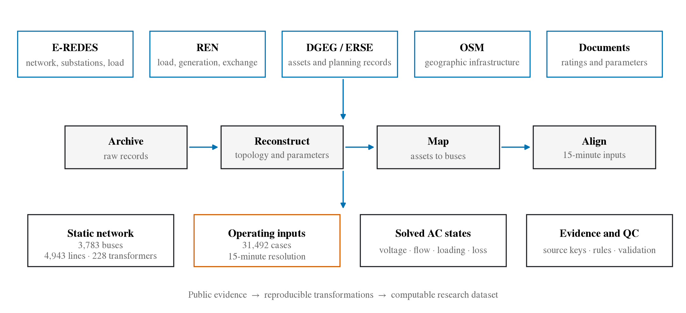

**Figure 1——SimPT60 数据集总览。** 三层关系依次表示多源公开记录，来源归档、拓扑重建、资产映射和时间对齐，以及由静态网络与 15 分钟输入生成的交流潮流状态、审计记录和风险分析数据。

本文其余部分如下：第 2 节介绍 SimPT60 的数据来源与构建方法；第 3 节概述静态网络、时序和潮流案例；第 4 节报告验证结果；第 5 节给出应用示例和 N−1 筛查；第 6 节总结本文。

------

# 2. Methodology

SimPT60 的构建包括五个步骤：归档并标准化公开数据；重建 60–400 kV 静态网络；将资产和运行记录映射到统一的 15 分钟时间轴；逐时生成并求解交流潮流；分层保存结果并执行质量检查。

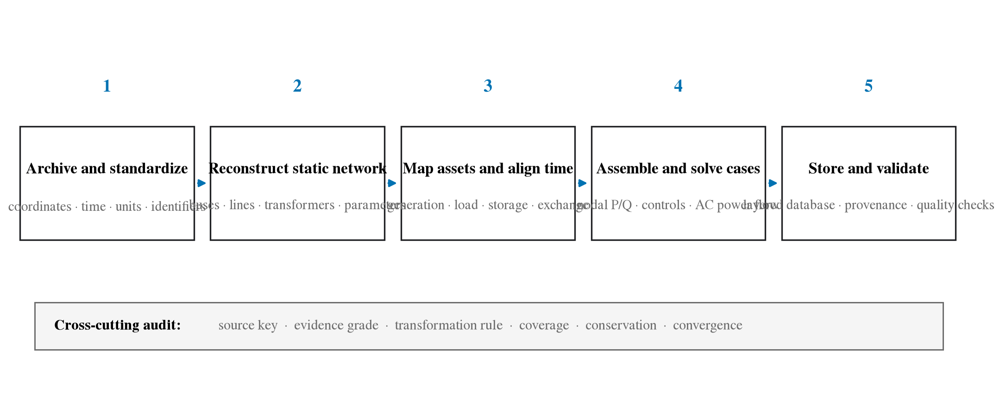

**Figure 2——SimPT60 数据处理流程。** 展示“公开数据—静态网络—时序输入—交流潮流—数据库与验证”五个步骤，以及贯穿全流程的来源追踪和质量控制。

## 2.1 Public Data Scope and Standardization

### 2.1.1 Scope and Sources

SimPT60 覆盖葡萄牙大陆及葡西互联边界端点，包含 60、130、150、220 和 400 kV 网络；岛屿和低于 60 kV 的网络不在本版范围内。时序范围由已归档且可同步的 E-REDES 与 REN 数据决定，为 2025 年 5 月 1 日至 2026 年 3 月 24 日，基本间隔为 15 分钟。

网络几何主要来自 E-REDES 和 OpenStreetMap/Geofabrik：前者提供 60/130 kV 线路与设施，后者提供 150/220/400 kV 网络及部分资产。DGEG、APA 和项目公告用于补充发电、储能及接入证据；REN 提供全国负荷、分能源发电、储能用电和跨境交换；E-REDES 提供变电站电量。ERSE/PDIRT、REN 与 REE 文档用于交付点、设备参数和互联清单。GISCO 用于大陆边界裁剪，E-REDES 辅助统计用于独立验证。OpenInfraMap 与 OSM 同源，仅用于显示核对。

**Table 2 文字占位——Public data sources, coverage and roles.** 列出发布机构、数据集、空间与时间范围、关键字段，以及“建模输入、辅助证据或外部验证”的角色。

### 2.1.2 Archiving and Standardization

原始文件按来源不可变归档，并保存来源链接、下载时间、文件大小和 SHA-256；处理流程只读访问原始层。坐标统一为 WGS 84，经距离运算时转换到葡萄牙国家投影；电压、功率、电量和距离分别统一为 kV、MW/Mvar、kWh 和 km。E-REDES 的 15 分钟电量按

\[
P_{\mathrm{MW}}=\frac{E_{\mathrm{kWh}}}{250}
\]

转换为区间平均功率。时间同时保存 Europe/Lisbon 本地值和 UTC 值，设备则使用来源编号生成稳定标识符。所有派生对象保留来源键和处理状态。

**Supplementary Table S1 文字占位——Raw-to-standard field dictionary.** 给出原始字段、标准字段、单位转换、缺失处理和来源键。

## 2.2 Static Network Reconstruction

静态网络表示为

\[
G=(B,L,T),
\]

其中 \(B\)、\(L\) 和 \(T\) 分别为母线、线路和变压器。连接按“来源关系—电压一致性—受限空间匹配”的顺序建立，避免把地图上的接近或交叉直接解释为电气连接。

### 2.2.1 Buses and Lines

60/130 kV 线路优先采用 E-REDES，150/220/400 kV 线路和设施主要采用 OSM，并与 REN 线路统计核对。重复 E-REDES 设施、与永久站相距 250 m 内的移动设施，以及同名共址的站点被规范化，并保留归并清单。

线路端点按电压分组，在 EPSG:3763 坐标中将 75 m 内的端点聚为同一节点；不同电压层不会合并。端点簇在同电压下匹配 250 m 内的设施，否则生成派生连接母线。OSM 线路只在 way 端点或显式共享节点处分段，几何交叉不形成连接；`circuit` 和 `line_section` 关系用于恢复回路身份。并行回路被保留，自环和非正长度支路进入阻断清单。

### 2.2.2 Transformers and Parameters

变压器按三类证据生成：OSM 显式变压器在 1 km 内匹配高低压母线；同一 OSM 变电站的相邻电压层生成共址变压器；RARI 边界名称与设施在 5 km 内匹配，必要时回退到高压站 1 km 内的 60 kV 端点。公开 `rating` 优先作为容量，其余容量和阻抗使用电压组合代理；分电压组合总容量不足时，以 REN 汇总容量向上校准，并保留校准系数。

线路参数包括 \(r\)、\(x\)、\(c\) 和 \(I_{\max}\)。可匹配 PDIRD 回路的 60 kV 支路以长度加权最短路径对应公开资料，仅接受拓扑长度与来源长度之比为 0.65–1.60 的路径；其余线路采用分电压参数库和电缆修正系数。每个参数分别标记为直接公开值、公开资料推导值、汇总校准值或工程代理值。

生成后检查设备键、端点、正长度、电压一致性、连通分量和葡西边界清单，并将 150/220/400 kV 线路长度与 REN 统计比较。参数完整表示模型可计算，不表示全部参数为运营商实测值。

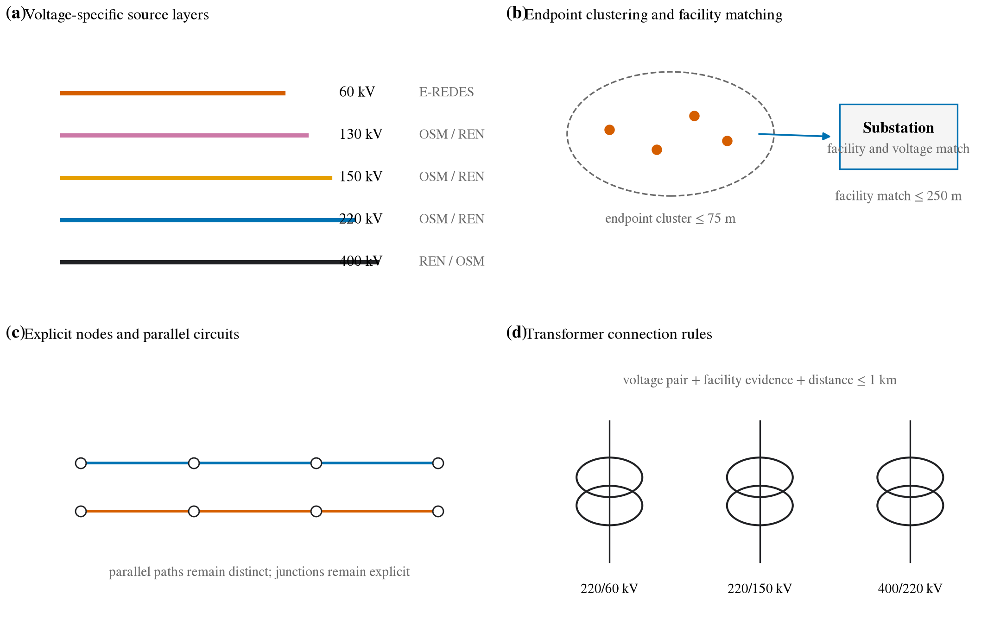

**Figure 3——静态网络重建。** 四个面板展示分电压来源、端点聚类与设施匹配、显式节点和并行回路，以及三类变压器连接。

**Table 3 文字占位——Topology rules and thresholds.** 汇总 75 m 端点聚类、250 m 设施匹配、1 km 变压器匹配及 RARI 边界规则。

**Supplementary Table S2 文字占位——Electrical parameter library.** 列出各电压等级线路参数、变压器参数、修正系数和证据等级。

## 2.3 Asset Mapping and Time-Series Alignment

### 2.3.1 Asset Mapping and Calendar

发电与储能清单由 OSM、DGEG 和项目证据构成。相距 3 km 内且容量一致的电厂—机组重复表示被合并；DGEG 风电替代不完整的 OSM 风电容量，未与 OSM 重复的 DGEG 光伏作为补充。资产优先采用公开接入证据，其次采用声明电压，最后进行受限空间匹配。未声明电压时，容量不低于 100 MW 的资产只搜索 150 kV 及以上母线，其余搜索 60 kV 及以上母线，最大距离为 20 km。超出范围的资产保留但不注入网络。投运日期晚于案例时点的资产不可用；日期缺失的资产视为可用并明确标记。

统一日历以 `interval_start_utc` 为时间键。REN 标签表示区间起点，E-REDES 标签表示区间终点：

\[
t_{\mathrm{E\text{-}REDES}}=t_{\mathrm{REN}}+15\ \mathrm{min}.
\]

日历按 Europe/Lisbon 自然日生成，因此夏令时开始日和结束日分别含 92 和 100 个区间。REN 日内序号可区分重复小时；E-REDES 无折叠标识，重复标签按变电站取平均并标记为歧义。缺失时点不插值。

### 2.3.2 Load, Generation and Storage

E-REDES 电量按设施代码映射到母线，并转换为节点负荷。全国未观测剩余量为

\[
R_t=P^{\mathrm{REN}}_{\mathrm{consumption},t}
-\sum_j P^{\mathrm{EREDES}}_{j,t}.
\]

\(R_t\) 按相应季节中最接近当时全国负荷的 PDIRT 公开参考剖面分配到已映射交付点：

\[
w_{j,t}=
\frac{P^{\mathrm{PDIRT}}_{j,r(t)}}
{\sum_{k\in\mathcal{M}}P^{\mathrm{PDIRT}}_{k,r(t)}},
\qquad
P^{\mathrm{res}}_{j,t}=w_{j,t}R_t.
\]

该剖面只提供空间权重，不改变 15 分钟时间分辨率。E-REDES 负荷在无无功观测时采用 0.97 功率因数，剩余负荷保留 PDIRT 的 \(Q/P\) 关系。抽水和电池充电按已映射储能容量分配，剩余量进入显式全国代理。节点负荷之和必须回到 REN 的 `Consumption + Storage`，容差为 0.11 MW。

REN 分能源发电量分配给能源类型一致、已映射且已投运的资产，并限制 \(0\le P_{g,t}\le P_g^{\mathrm{nameplate}}\)。水电和天然气采用确定性的容量优先规则，其余类别按可用容量分配。超过已映射容量的量作为 `UNMAPPED_NATIONAL_RESIDUAL_PROXY` 注入指定 400 kV 代理母线，不解释为缺失电厂的真实位置。

REN 进口与出口在同一日历上对齐，但作为留出验证量，不用于强制设置边界功率。求解前检查时间键、必需序列、映射完整性、负荷与发电守恒以及容量限制。

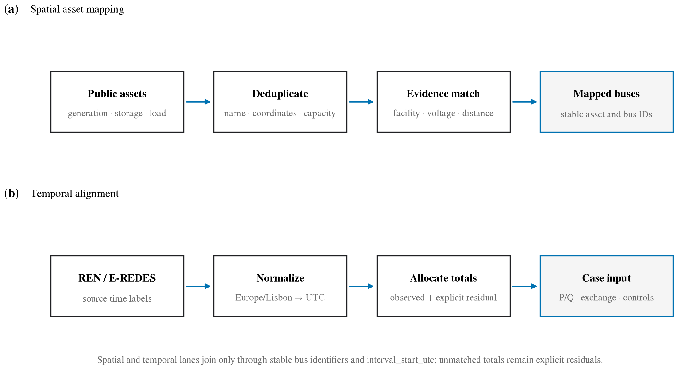

**Figure 4——资产映射与时间对齐。** 空间通道展示资产去重、证据匹配和母线映射；时间通道展示 REN/E-REDES 时间标签标准化、聚合量分配和 15 分钟案例输入。未被公开资产解释的聚合量作为显式剩余量保存。

**Table 4 文字占位——Asset and time-series transformation rules.** 汇总资产匹配、夏令时处理、负荷与发电分配、储能符号和跨境观测角色。

**Supplementary Table S3 文字占位——Mapping and allocation audit fields.** 定义匹配距离、映射规则、观测状态、分配权重和未映射剩余量等字段。

## 2.4 Time-Indexed Case Generation and AC Power Flow

每个 15 分钟时点构成一个稳态案例

\[
C_t=(G,\theta,X_t,S_t,U_t,B_t),
\]

其中静态网络 \(G\) 和参数 \(\theta\) 在案例间共享，\(X_t\)、设备状态 \(S_t\)、控制 \(U_t\) 和边界等值 \(B_t\) 随时间更新。SimPT60 不进行代表时点抽样。

### 2.4.1 Case Assembly and Solution

线路热定额相对夏季基准采用月度代理系数：5–9 月为 1.00，3–4 月和 10–11 月为 1.10，12–2 月为 1.15。非电池发电母线在已映射装机不低于 20 MW 且电压不低于 60 kV 时设为 PV 节点，目标为 1.0 p.u.，无功限值为总装机的 \(\pm50\%\)；其余采用 PQ 模式。负荷补偿以功率因数 0.98 为目标，单母线上限为 15 Mvar；五个 400 kV、150 Mvar 电抗器作为明确标记的代理设备。

初始葡西边界均设为 1.0 p.u.、\(0^\circ\) 的外部电网。第一次潮流得到模型初步净交换后，仅保留一个角度参考点，其余边界按

\[
\omega_i=V_iN_i,\qquad
P^{\mathrm{eq}}_{i,t}=
\frac{\omega_i}{\sum_j\omega_j}P_t^{(0)}
\]

转换为固定有功等值，其中 \(N_i\) 为公开回路数。REN 同期交换只用于求解后的误差计算。

交流潮流使用 pandapower Newton–Raphson 算法：直流初始化、最大 50 次迭代、容差 \(10^{-6}\) MVA，并执行无功限值。边界重构后再次求解，再以 1.25% 步长、\(-8\) 至 \(+8\) 档调整高压侧分接，使低压侧尽量保持在 0.985–1.015 p.u.，最多 16 轮。输出包括收敛状态、电压范围、线路和变压器负载率、模型交换和分范围损耗；REN 月度 RNT 损耗与交换均作为外部比较量。

### 2.4.2 Monthly Execution

案例按自然月并行计算。工作进程只读挂载输入 DuckDB，独立求解并生成临时压缩数组；父进程作为唯一写入者，在一个事务中保存案例摘要、状态数组和审计包。重新运行时跳过已完成案例并重算失败或缺失案例。

月度清单保存输入数据库、静态模型和资产表的 SHA-256，以及预期、完成和失败案例数。完整月份在本地 SSD 完成并检查点后，才复制到目标数据库；复制计数核对通过后原子发布。存在失败时保留已完成结果，但不发布为完整月份。

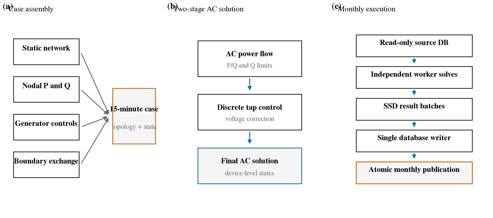

**Figure 5——案例组装、交流潮流与月度执行。** 展示单时点输入组装、两阶段潮流与分接控制，以及“多进程求解—SSD 批量暂存—单进程写库—原子发布”的月度执行方式。

**Table 5 文字占位——Case and solver settings.** 汇总季节定额、PV/PQ控制、补偿装置、边界权重、潮流和分接参数，并标明证据或假设状态。

## 2.5 Layered Storage, Provenance and Quality Control

### 2.5.1 Database and Provenance

主 DuckDB 按来源保存 `raw_eredes`、`raw_dgeg`、`raw_osm`、`raw_reference`、`raw_documents` 和 `raw_eredes_aux`；`grid` 与 `geo` 保存静态网络和几何，`scenario` 保存资产运行点，`main` 保存统一日历及运行时序，`provenance` 保存文件和实体血缘。

每个月使用独立结果库。`monthly_model.cases` 每时点一行，保存状态、时间、摘要指标和完整结果 JSON；`bus_order`、`line_order` 与 `state_arrays` 以固定设备顺序保存母线电压和线路负载率数组；`audit_bundles` 保存负荷、发电、边界、热点和损耗记录。展开视图可将数组恢复为设备长表。静态模型在月库中只复制一次，而不是随每个案例重复保存。

来源记录包含 URL、归档路径、文件大小和 SHA-256；`table_lineage`、`raw_record_locator` 和 `entity_evidence` 分别提供表级、记录级和证据级追踪。月度 `run_manifest` 保存输入文件指纹和案例计数。

### 2.5.2 Quality Control and Recovery

质量控制包括四层：静态层检查键、端点、电压、长度、连通性和边界清单；时序层检查时间对齐、来源完整性、负荷与发电守恒及容量限制；求解层检查收敛、电压、负载率和有功平衡

\[
\varepsilon_t=
P_t^{\mathrm{gen}}+P_t^{\mathrm{model,net}}
-P_t^{\mathrm{load}}-P_t^{\mathrm{loss}};
\]

外部层使用未参与节点建模的 E-REDES 全国、市镇、变电站、生产和注入统计，并结合 REN 交换与月度损耗进行比较。0.90–1.10 p.u. 和 100% 负载率仅作为风险筛查阈值，越限案例不会被删除。

一个案例的摘要、数组和审计包在同一事务内提交，失败则整体回滚并保留错误记录。月度正式发布前，来源和副本的完成案例数、数组数和审计包数必须一致。上述设计保证结果可恢复和可追溯，但外部比较只能支持现实合理性，不能证明模型等同于运营商真实网络。

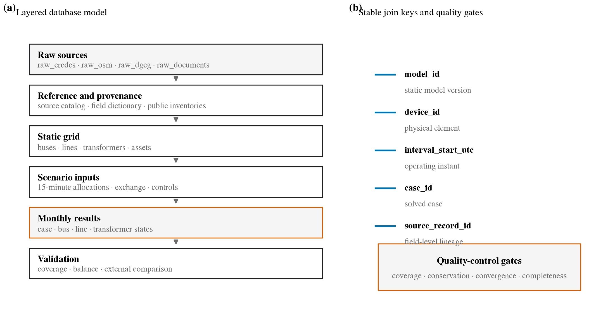

**Figure 6——数据库、来源追踪与质量控制。** 展示原始层、参考与来源层、静态网络层、时序情景层、月度结果层和验证层，并以 `model_id`、设备编号、`interval_start_utc`、`case_id` 和原始记录编号建立关联。

**Table 6 文字占位——Schemas, tables and join keys.** 列出主库、月度库和验证库的主要表、粒度、主键、关联键和用途。

**Supplementary Table S4 文字占位——Quality-control and failure rules.** 列出各项检查、阈值、严重程度、失败处理和输出位置。

------

# 3. Overview of the SimPT60 Dataset

SimPT60 由一个主数据库和 11 个按月组织的潮流结果库组成。主数据库保存静态网络、统一时序、来源记录和验证观测；月度数据库保存逐 15 分钟案例及其潮流状态。当前静态模型版本为 `PT60-v2.0.0`。

## 3.1 Static Network Data

静态网络包含 675 个设施、3,783 个母线、4,943 条线路、228 台变压器、1,190 个发电或储能单元、468 个负荷点和 7 个葡西互联边界端点。`grid.buses`、`grid.lines` 和 `grid.transformers` 给出网络连接与电气参数；`grid.generators`、`grid.load_points` 和 `grid.interconnectors` 给出资产与母线的对应关系。线路和设施几何分别保存在 `geo.line_geometries` 与 `geo.facility_geometries`，避免在电气表中重复存储空间对象。

各设备表同时保留 `source`、`source_status`、`parameter_status` 或映射规则等字段。因此，使用者既可以直接形成 pandapower 网络，也可以筛选仅含较高证据等级的设备，或识别采用公开资料推导和工程代理参数的部分。

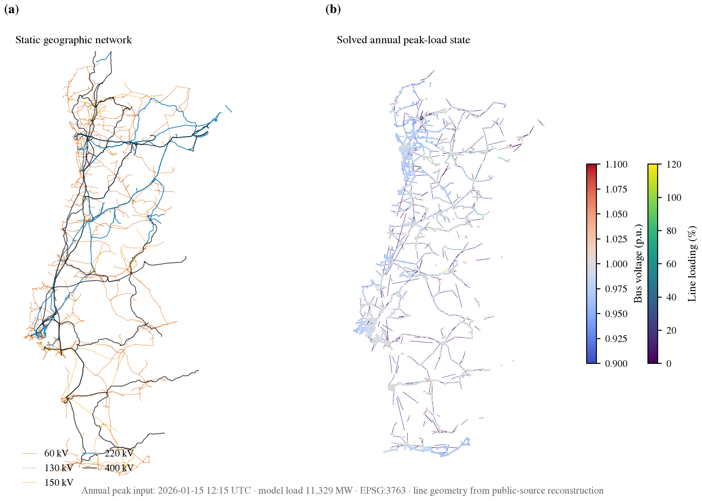

**Figure 7——地理网络与年度峰值状态。** (a) 使用 EPSG:3763 投影展示真实地理坐标下的静态线路，按 60、130、150、220 和 400 kV 区分；(b) 读取 2026 年 1 月 15 日 12:15 UTC 的 pandapower 年度峰值模型，在固定地理位置上以线路颜色表示负载率、以母线颜色表示电压。图中结果为公开数据重建模型的交流潮流状态，不是运营商遥测。

## 3.2 Time-Series Data

`main.interval_calendar` 是各类时序的共同索引，覆盖 2025 年 5 月 1 日至 2026 年 3 月 24 日的 328 个自然日，共 31,492 个本地 15 分钟区间。区间数量考虑 Europe/Lisbon 夏令时变化，因此月份不一定等于天数乘以 96。

`main.eredes_load` 保存 397 个变电站的 12,360,502 条负荷记录；原始记录延伸至 2026 年 3 月 25 日，但与其他输入共同可用的建模窗口截止于 3 月 24 日。`main.ren_dispatch` 含 472,380 条记录和 15 个全国运行序列，覆盖负荷、分能源发电、储能及跨境交换。`main.weather_hourly` 含里斯本、波尔图和法鲁三个位置的 23,616 条逐小时记录；`main.ren_rnt_balance` 含 11 个报告期的 660 条月度平衡记录。

此外，数据库归档了 14 个 E-REDES 辅助数据集，共 2,239,064 条记录，包括全国和市镇消费、合同功率、生产、配网注入、分布式自发自用、变电站季节性负荷、电能质量与供电连续性。这些表不参与节点功率构建，而作为第 4 节的独立验证观测。

## 3.3 Time-Indexed Power-Flow Cases

逐时结果按自然月拆分，以限制单个文件大小并支持选择性下载。11 个紧凑月库与统一日历一一对应，共包含 31,492 个案例；当前版本中全部案例完成交流潮流计算并标记为收敛。2025 年 10 月因夏令时结束含 2,980 个区间，2026 年 3 月仅覆盖前 24 天，含 2,304 个区间。

`monthly_model.cases` 每个案例一行，保存本地与 UTC 时间、收敛状态、观测负荷与发电、模型净交换、电压范围、最大线路与变压器负载率、损耗及错误信息。`monthly_model.state_arrays` 按 `bus_order` 和 `line_order` 的固定顺序保存 3,783 个母线电压和 4,943 条线路负载率，展开视图可恢复为设备长表。`monthly_model.audit_bundles` 则保存负荷分配、分能源发电、边界交换、线路热点和损耗等审计信息。该结构使静态设备顺序每月只保存一次，避免为每个时点重复完整网络对象。

主数据库还保存第 5 节的 N−1 应用结果。`scenario.annual_nminus1_snapshots` 记录六个代表时点，`scenario.annual_nminus1_results` 保存 9,894 条故障级结果，`scenario.annual_nminus1_overloads` 保存事故后越限回路明细；`scenario.nminus1_control_policy` 与 `provenance.annual_nminus1_runs` 分别记录控制搜索边界和实验来源。这些应用表与连续 15 分钟潮流案例分开，避免将抽样安全筛查误解为全时段运行观测。

## 3.4 Dataset Coverage and Composition

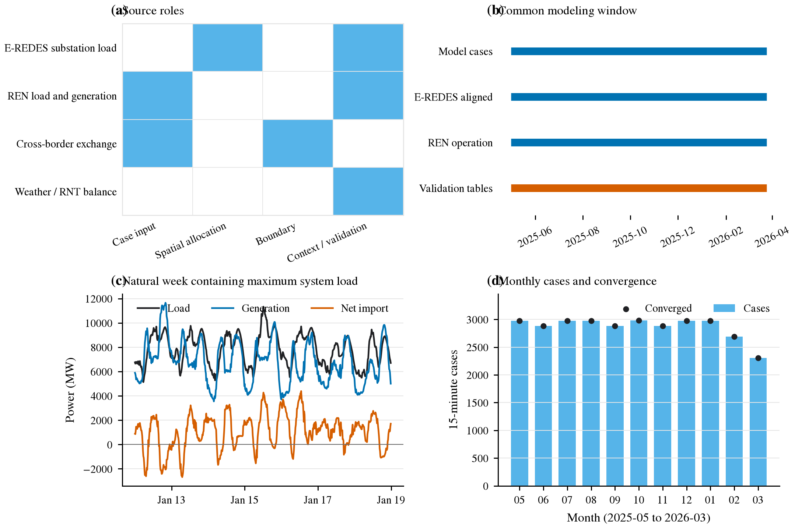

**Figure 8——时序内容、覆盖期和案例完整性。** (a) 归纳主要时序来源、分辨率和建模角色；(b) 展示共同建模窗口；(c) 展示包含最高负荷时点的完整自然周，说明数据保留连续变化而非峰、平、谷抽样；(d) 展示逐月案例数，2026 年 3 月为截至 3 月 24 日的部分月份。

**Table 7 — Headline statistics of SimPT60.**

| 类别 | 当前版本 |
|---|---:|
| 空间范围 | 葡萄牙大陆及葡西互联边界 |
| 电压等级 | 60、130、150、220、400 kV |
| 同步时序范围 | 2025-05-01 至 2026-03-24 |
| 自然日 / 15 分钟案例 | 328 / 31,492 |
| 已完成 / 已收敛案例 | 31,492 / 31,492 |
| 代表时点全元件 N−1 案例 / 主潮流收敛 | 9,894 / 9,888 |
| 设施 / 母线 / 线路 | 675 / 3,783 / 4,943 |
| 变压器 / 发电与储能单元 / 负荷点 | 228 / 1,190 / 468 |
| 互联边界端点 | 7 |
| 主 DuckDB 大小 | 317.5 MiB |
| 11 个紧凑月库合计 | 11.07 GiB |
| 原始与辅助 Parquet 归档 | 94 个文件，130.4 MiB |

## 3.5 File Organization and Distribution

正式发布包应从当前工作数据库生成清理后的只读快照，而不是直接复制运行目录。建议分为四部分：分析就绪的主数据库、逐月潮流结果、来源与复现材料，以及独立验证补充包。

**Table 8 — Recommended SimPT60 release package.**

| 发布部分 | 应包含的内容 | 作用 |
|---|---|---|
| 核心主库 | `grid`、`geo`、`scenario`、`main` 和 `provenance`；数据库结构、字段字典及代表时点 N−1 结果 | 查询静态网络、时序输入、应用结果及来源关系 |
| 月度结果 | 11 个 `*.compact.duckdb` 及每月 `run_manifest` | 提供全部 31,492 个案例、状态数组和审计结果 |
| 来源与复现材料 | 来源 URL、下载时间、相对路径、SHA-256、处理脚本、参数表和环境说明 | 重建数据并核验版本 |
| 验证补充包 | 14 个 E-REDES 辅助数据集的目录、允许再分发的快照、派生验证表和绘图脚本 | 复现第 4 节的跨来源验证 |

原始来源文件仅在其再分发条件允许时随包提供；否则发布来源元数据、哈希和自动下载脚本。由于辅助验证表是在潮流计算完成后加入工作主库，扩展后的主库文件指纹不同于月度清单记录的建模输入指纹。正式发布时应将建模输入与验证补充分成不可变版本，并增加关键表的规范化内容哈希；`run_manifest` 中的本机绝对路径则改为相对逻辑标识。未压缩的旧版月库、重复数据库、`._*` 系统文件、缓存、临时文件和执行日志不属于数据产品；其中未压缩的 2025 年 10 月结果与紧凑月库重复，应从发布包排除。

------

# 4. Validation

公开资料中不存在与 SimPT60 同期、同范围的运营商内部网络模型或逐支路状态估计。因此，本文不以设备级误差作为验证目标，而从网络结构、计算一致性、建模假设敏感性和外部公开观测四个层面检验数据集的现实合理性与研究可用性。

## 4.1 Validation Design and Evidence Levels

验证证据分为三类。第一类是外部公开观测：将 SimPT60 中由 REN 构造的全国消费和风电序列，与未参与节点分配的 E-REDES 全国消费和配电网风电注入记录进行比较。第二类是公开来源一致性和敏感性证据，包括分电压等级的网络长度、线路参数来源以及参数和空间分配扰动。第三类是内部计算证据，包括案例完整性、潮流收敛和交流功率闭合。三类证据的含义不同，不能将聚合序列一致或数值闭合解释为设备级真值。

为保证统计口径一致，全国负荷验证使用 REN 的 Consumption，不把抽水和电池充电计入 E-REDES 终端消费参考；潮流案例仍使用 Consumption + Storage 作为总电气负荷。发电验证不再直接比较全国发电总量，因为 E-REDES 的 DGM 部分来自 REN，且其生产总量具有会计平衡属性。风电采用同类序列直接比较；光伏和水电仅用于检验时间趋势和揭示接入范围差异。

E-REDES 的 15 分钟电量按 $P_{\mathrm{MW}}=E_{\mathrm{kWh}}/250$ 转换为区间平均功率。所有比较使用共同时间戳或地区代码；缺失观测成对排除，不进行插值、平滑或异常值删除。时间指标以自然日为块，空间指标以市镇或变电站为簇，进行 1000 次自助重采样并报告 95% 置信区间。

## 4.2 Structural and Computational Consistency

完整静态网络包含 3783 个母线、4943 条线路和 228 台变压器，其中 3664 个活动母线和 4787 条活动线路形成一个连通分量。简单图的环路秩为 501，节点度中位数和 95 分位数分别为 2 和 4。按 route-km 计算，60、130、150、220 和 400 kV 网络与公开背景长度之比分别为 0.992、1.090、0.817、0.819 和 1.033；其中 150、220 和 400 kV 使用 REN 汇总量，60/130 kV 结果不能解释为独立准确率。

线路参数是静态模型的主要不确定性。4240 条 60 kV 线路中，1517 条具有 PDIRT 回路路径的部分来源支撑，其余 2723 条采用电压等级工程代理；130–400 kV 线路均使用电压等级代理。该分类记录了参数证据强度，而不把工程代理解释为实测值。

11 个紧凑月库包含 31,492 个完成并收敛的 15 分钟案例。发电、边界交换、负荷与网损之间的交流闭合残差 MAE 为 $1.77\times10^{-6}$ MW，表明发布的状态和审计量在数值容差内一致。

**Figure 9——完整网络覆盖与参数证据。** (a) 按电压等级比较 SimPT60 route-km 与公开背景长度；(b) 展示各电压等级线路参数的证据类别。图注明确 60/130 kV 对照与建模来源并非独立。

**Table 9——网络结构、参数证据与计算完整性。** 列出分电压等级的母线数、线路数、route-km、背景长度和参数状态，并汇总案例完整率、收敛率和交流闭合残差。

## 4.3 Parameter and Spatial-Allocation Sensitivity

参数敏感性使用每个月最大系统负荷和最大风光出力两个时点，共 22 个运行状态；这只是验证抽样，不改变完整 15 分钟数据集。分别对线路 R/X/C、额定电流以及变压器容量和阻抗施加具有对称性的 $\pm20\%$ 扰动，154 个基准及参数案例全部收敛。线路阻抗扰动下，线路负载率排序的最小 Spearman 系数为 0.998，前 20 条高负载线路集合的最小 Jaccard 系数为 0.739；变压器扰动对应的最小值分别为 0.993 和 0.538。线路额定电流不改变潮流和线路排序，但使最大负载率最多变化 34.48 个百分点。因此，排序型风险筛查相对稳定，而绝对负载率和阈值超限对额定值假设较敏感。

空间实验保持全国负荷、分能源发电和边界交换总量不变，仅替换节点分配规则。负荷残差分别采用 PDIRT、均匀交付点和变压器容量权重；发电比较当前规则与同能源类型内按装机容量分配；边界交换比较电压—回路数、电压和均匀权重。110 个基准及替代空间案例全部收敛。

所有空间方案的线路负载率排序中位数均不低于 0.994，但局部风险集合更敏感：变压器容量权重的负荷方案使 Top-20 Jaccard 最低降至 0.429，边界均匀分配使最大线路负载率最多变化 17.37 个百分点。结果说明全国尺度趋势对空间规则较稳健，但具体高风险线路和边界附近潮流仍依赖分配假设。

**Figure 10——参数与空间分配敏感性。** 展示各替代场景的线路排序相关性、Top-20 Jaccard 和最大线路负载率变化。点表示 22 个运行状态的中位数，线段延伸至最不利状态；额定电流扰动仅改变负载率分母。

**Table 10——参数与空间分配敏感性。** 报告 264 个基准及替代案例的收敛率、线路排序相关性、Top-20 Jaccard、最大负载率变化和损耗变化。

## 4.4 External Temporal Agreement

全国负荷比较包含 31,388 个配对区间。SimPT60 消费序列与 E-REDES 公开消费的均值比为 1.003，按日块重采样的 95% 置信区间为 $[1.002,1.005]$；15 分钟 Pearson 系数为 0.997，区间为 $[0.996,0.999]$，MAE 为 30.9 MW。按日平均后，327 个配对日的 Pearson 系数为 0.995，归一化 RMSE 为 0.013。2025 年 10 月存在 E-REDES 缺失和局部偏差，但验证未删除该月份。

风电比较包含 31,484 个配对区间。SimPT60 与 E-REDES 配电网风电注入的均值比为 1.056，区间为 $[1.055,1.058]$；Pearson 系数为 0.9998，区间为 $[0.9997,0.9998]$。日平均序列的 Pearson 系数同样为 0.9998。光伏的时间相关系数为 0.982，但 SimPT60 全国光伏均值约为 E-REDES 配电网注入的 21.2 倍；水电相关系数为 0.536。后两项反映全国生产与配电网注入的范围差异，因此不作为绝对规模验证。

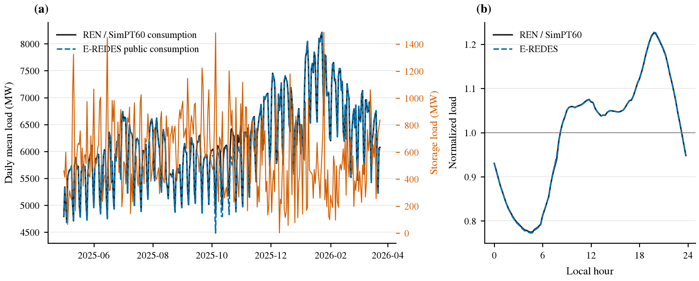

**Figure 11——负荷规模与日内变化。** 展示完整验证期的日平均负荷和归一化日内曲线，区分不含储能的消费与潮流案例使用的总电气负荷。

## 4.5 External Spatial Agreement

市镇尺度包含 2183 个市镇—月份配对，负荷份额的 Spearman 系数为 0.881，按 199 个市镇聚类重采样的 95% 置信区间为 $[0.841,0.910]$，覆盖同期计费电量的 94.8%。变电站尺度包含 792 个季节配对，Spearman 系数为 0.957，按 397 个变电站聚类的区间为 $[0.946,0.967]$；均值比为 1.044，MAE 为 2.45 MW。

市镇比较以变电站所在市镇近似供电区域，因此只提供弱空间证据。季节性变电站负荷来自 E-REDES 的另一数据产品，能够检验设施排序和规模，但与 15 分钟负荷图共享运营商来源，不能视为完全独立的节点真值。

**Figure 12——市镇和变电站空间一致性。** 展示市镇月度负荷份额和变电站季节峰值的散点分布、一比一参考线及聚类自助置信区间。

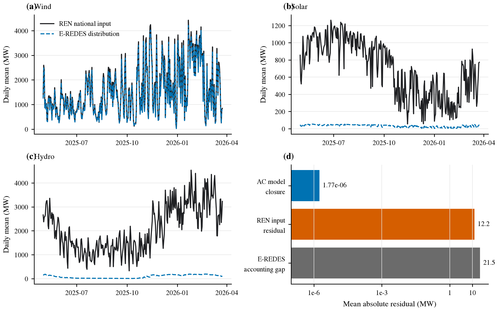

**Figure 13——分能源发电与功率平衡。** 展示风电、光伏和水电的时间变化，并区分外部统计边界、REN 输入平衡和模型交流闭合。

**Figure 14——SimPT60 与公开观测的直接比较。** (a) SimPT60 与 E-REDES 的日平均全国负荷；(b) 日平均风电；(c) 31,388 个 15 分钟负荷配对及一比一线；(d) 31,484 个风电配对及一比一线。两组曲线和散点分别展示时间变化、总体规模及逐时对应关系。该图验证聚合运行输入，不验证节点分配或具体支路潮流。

**Table 11——跨来源验证汇总。**

| 验证对象 | 样本或独立块 | 结果（95% CI） | 证据层级 |
|---|---:|---|---|
| 全国消费负荷 | 31,388 区间 / 327 日 | 均值比 1.003 $[1.002,1.005]$；$r=0.997$ $[0.996,0.999]$ | REN–E-REDES，同统计口径 |
| 风电 | 31,484 区间 / 328 日 | 均值比 1.056 $[1.055,1.058]$；$r=0.9998$ $[0.9997,0.9998]$ | REN–E-REDES 配网注入印证 |
| 光伏时间变化 | 31,484 区间 / 328 日 | $r=0.982$ $[0.979,0.984]$；绝对规模不可比 | 全国生产–配网注入，不同范围 |
| 市镇负荷份额 | 2183 配对 / 199 市镇 | $\rho=0.881$ $[0.841,0.910]$ | 同运营商跨数据集，弱空间代理 |
| 变电站季节峰值 | 792 配对 / 397 站 | $\rho=0.957$ $[0.946,0.967]$ | 同运营商跨数据集 |
| AC 功率闭合 | 31,492 案例 | MAE $1.77\times10^{-6}$ MW | 内部物理一致性 |

## 4.6 Validation Scope

验证结果表明，SimPT60 能够复现公开观测中的全国负荷规模、时间变化和风电运行趋势，市镇与变电站尺度也保持较强的空间排序一致性。参数与空间扰动实验进一步表明，系统级趋势和线路风险排序总体稳定，但绝对负载率、局部 Top-20 线路集合和边界附近潮流仍受工程代理与分配规则影响。

这些结果不能证明 SimPT60 与运营商内部网络逐设备一致，也不能给出具体线路潮流的真实误差。设备级验证仍需要同期节点电压、逐回路潮流、机组出力、开关状态和状态估计结果。因此，SimPT60 适合时序潮流、相对风险筛查、情景分析和机器学习研究，而不应作为运行调度或保护整定的数字孪生。

------

# 5. Application Example and Interactive Visualization

本节通过一个可复算的网络压力筛查案例说明 SimPT60 如何连接潮流计算、情景分析和交互式展示。计算层使用 pandapower 构造和求解交流潮流；结果层保存案例摘要及逐设备状态；展示层则将线路负载率、母线电压和风险设备叠加到 Web 地图。该应用用于证明数据集能够进入完整分析流程，而不是把网页界面本身作为独立方法贡献。

## 5.1 Analysis and Visualization Workflow

用户首先从 SimPT60 选择一个历史时刻或构造新的情景输入。静态网络、节点负荷、分能源发电和边界交换随后被转换为 pandapower 案例，并通过交流潮流得到母线电压、线路负载率、变压器负载率和网损。求解结果以稳定设备标识写入结果文件，Web 平台据此恢复地理图层和状态图层。使用者可以切换日期、时刻和空间分配方案，检索设备，并定位当前最高负载线路。

现有演示页面包含夏季周和冬季周各 168 个逐小时样本；每个样本对应一个 15 分钟区间，并提供主要空间分配方案及两个替代方案。网页展示的是 SimPT60 的交流潮流计算值，不是运营商遥测。完整的 31,492 个 15 分钟案例仍通过数据库和月度结果库提供，网页仅选取较小子集用于交互浏览。

**Figure 15——交互式结果展示入口。** 已发布的 Web 页面概括连续案例、外部验证和年度 N−1 结果，并连接到可选择案例时间和空间分配方案的交互地图。网页展示的是 SimPT60 的 pandapower 计算结果，不是运营商遥测。

## 5.2 Planning-Oriented Grid-Stress Scenario

应用案例选取 2026 年 1 月 20 日 19:45 UTC 的公开输入断面作为基准。该断面的模型负荷为 10,268.8 MW。为保持注入与用电结构不变，实验将节点负荷、分能源发电和跨境交换同时乘以比例系数

$$
s\in\{0.90,1.00,1.05,1.10,1.15\},
$$

并对每个情景独立执行交流潮流。这里的统一缩放只用于检验既定网络在不同系统压力下的响应，不代表对未来负荷、发电结构或交换计划的预测。五个情景均使用相同拓扑、季节额定值和节点分配规则，因此差异仅来自输入规模。

实验由 `paper/scripts/run_application_example.py` 生成。脚本保存每个情景的规范化输入、pandapower 求解结果、逐设备表、汇总表和面向 Web 的情景曲线。五个确定性情景全部收敛，没有进行随机重复，因此不报告统计置信区间。

## 5.3 Results and Interactive Presentation

在基准情景下，最高线路负载率为 96.10%，最高变压器负载率为 77.64%，最低母线电压为 0.933 p.u.。输入增加到 1.05 倍时，最高线路负载率达到 100.50%，并出现 3 条超过模型额定值的线路；在 1.10 和 1.15 倍情景下，最高线路负载率分别增至 104.94% 和 109.41%，超过额定值的线路均为 9 条。所有情景的最低母线电压仍高于 0.90 p.u.，最高变压器负载率在 1.15 倍情景下达到 90.84%。

**Figure 16——规划导向的网络压力敏感性。** (a) 五个统一输入缩放情景下的最高线路与变压器负载率，虚线表示 100% 模型额定值；(b) 同一情景下的最低和最高母线电压，虚线表示 0.90–1.10 p.u. 的筛查范围。每个点是一次确定性的 pandapower 交流潮流计算。统一缩放用于容量敏感性分析，不是负荷预测。

**Table 12——网络压力情景结果。**

| 输入比例 | 模型负荷（MW） | 最低电压（p.u.） | 最高线路负载率 | 超过100%的线路 | 最高变压器负载率 |
|---:|---:|---:|---:|---:|---:|
| 0.90 | 9,241.9 | 0.942 | 87.39% | 0 | 69.37% |
| 1.00 | 10,268.8 | 0.933 | 96.10% | 0 | 77.64% |
| 1.05 | 10,782.2 | 0.928 | 100.50% | 3 | 81.97% |
| 1.10 | 11,295.7 | 0.922 | 104.94% | 9 | 86.36% |
| 1.15 | 11,809.1 | 0.916 | 109.41% | 9 | 90.84% |

网页可以将该结果表示为基准与情景之间的切换：地图负责定位新增高负载线路，趋势面板展示负载率和电压随输入比例的变化，摘要卡片报告越限数量。相同接口也可接收外部预测模型产生的未来输入，但预测模型的训练和准确率验证不属于本文实验。

## 5.4 Audited Targeted N−1 Contingency Screening

为检验 SimPT60 对单一元件故障的计算能力，本文首先在第 5.2 节的基准断面上执行定向交流 N−1 筛查。故障集包含正常状态负载率较高的 50 个唯一物理线路回路和 20 台在运变压器。属于同一物理回路的串联模型分段同时停运；模型行表示多回线路时仅退出一回，并联变压器仅退出一台。筛查采用 0.90–1.10 p.u. 电压范围、60 kV 线路 110% 短时阈值、缺少公开事故额定值的高压线路 100% 保守阈值，以及变压器 120% 短时阈值。

静态网络核查重点覆盖 Deocriste–Lanheses、Lanheses–Feitosa 和 Vila Nova de Cerveira–Valença 三个北部 60 kV 回路。前两个回路构成彼此独立的进出线段，仅在 Lanheses 变电站连接；第三个回路包含不同导线截面的串联段，因此采用较小的 544 A 冬季限流。公开清册总长度按比例分配到模型分段后，三个回路的模型总长度分别为 6.75、12.55 和 10.14 km，均与公开记录一致，且不存在跨回路的模型线路重复。

修正后的 70 个案例均获得诊断性交流潮流解，其中 67 个在既定发电机无功边界下收敛。66 个案例通过全部筛查；3 个北部线路案例在既定无功边界下不收敛，但取消无功边界后的诊断潮流收敛并出现热越限；另有 1 个径向回路形成 0.81 MW 的实质失供孤岛。20 个变压器故障全部通过，其中 Estoi 一台变压器退出时仅移除三台并联设备中的一台，没有再出现整体退出造成的低电压假象。

**Figure 17——审计后的定向交流 N−1 筛查。** (a) 被停运元件在正常状态下的负载率与故障后最高线路负载率；(b) 故障后的最高线路负载率与最低母线电压；(c) 按结果类别统计线路和变压器案例。线路按物理回路而非地图分段停运；无功限值敏感案例仅将取消无功限值的解作为诊断，不计作通过。

**Table 13——审计后的定向 N−1 筛查结果。**

| 结果类别 | 线路停运 | 变压器停运 | 合计 |
|---|---:|---:|---:|
| 通过全部筛查 | 46 | 20 | 66 |
| 无功限值敏感并伴随热越限 | 3 | 0 | 3 |
| 实质失供孤岛 | 1 | 0 | 1 |
| 合计 | 50 | 20 | 70 |

## 5.5 Post-Contingency Control and Island Interpretation

为区分可由运行控制缓解的异常与结构性异常，本文对三个北部案例进一步执行有边界的事故后控制搜索。搜索保留既定无功边界，并组合测试 1.00–1.03 p.u. 发电机电压目标、附近变压器 ±2 档调压、已有电抗器投切、最大 200 MW 且保持总发电不变的有功重调度，以及 0–100 Mvar 候选并联补偿。候选补偿仅用于敏感性分析，不作为已安装设备写入静态网络；所有控制范围及其证据等级保存在 `scenario.nminus1_control_policy`。

三个案例均可在部分控制组合或扩大代理无功范围后获得数值解，但没有一个同时满足电压和热约束。Deocriste–Lanheses、Lanheses–Feitosa 和 Cerveira–Valença 分别至少需要将当前代理无功范围扩大至 4.0、3.0 和 1.5 倍才开始收敛。当无功范围扩大到足以恢复可接受电压时，最高线路负载率仍分别约为 175.4%、154.9% 和 128.3%。因此，这些异常不能仅通过放宽发电机无功边界解释，剩余差异更可能来自有功空间分配、实际开关状态、缺失并行路径或 60 kV 网络等值方式。

**Table 14——北部三个 60 kV 案例的控制与无功能力敏感性。**

| 停运回路 | 开始收敛的无功范围倍数 | 电压恢复后的最高线路负载率 | 最终判断 |
|---|---:|---:|---|
| Deocriste–Lanheses | 4.0× | 175.4% | 仍存在热越限 |
| Lanheses–Feitosa | 3.0× | 154.9% | 仍存在热越限 |
| Cerveira–Valença | 1.5× | 128.3% | 仍存在热越限 |

Godigana 案例采用公开变电站容量记录支持的 10 MW 配网转供能力。转供后，原压力断面仍有 0.81 MW 负荷位于径向孤岛，而公开记录给出的冬季自然峰值非保证负荷为 1.474 MW。本文因此保留该残余，并标记为“公开转供已应用后的非保证负荷”，而不通过删除负荷或虚构第二电源将其改为通过。在第 5.6 节的年度峰值断面中，该残余为 0.27 MW；其他五个代表时点为 0 MW。

## 5.6 Full-Element Annual N−1 Panel

定向实验便于解释重点案例，但不能代表整个网络。本文进一步从连续 15 分钟时序中按预先声明的规则选取六个代表时点：最大系统负荷、最低系统负荷、最大风电、最大光伏、最大净进口和最大净出口。每个时点均从归档输入重新构建交流潮流模型，并对 1,649 个具有基准电流、可恢复物理身份的带电元件进行逐一停运。没有基准电流的未带电地图支路不进入故障集。事故后补救控制在这一全量首轮中关闭，以保持各时点和元件之间的统一比较口径。

六个时点共形成 9,894 个交流 N−1 案例，其中 9,888 个在既定无功边界下收敛。按绝对电压、线路和变压器阈值判断，6,048 个案例通过。最大风电和最大负荷断面的 N−0 基准本身已存在代理额定值越限，因此仅使用绝对判据会把同一基准偏差重复计入大量故障。为此，数据库同时保存一个辅助的 N−0 增量指标：在要求主潮流收敛且不产生实质孤岛的前提下，9,064 个案例没有相对于本时点 N−0 状态新增电压或热违规。该指标用于定位故障引起的增量变化，不替代绝对安全判据。

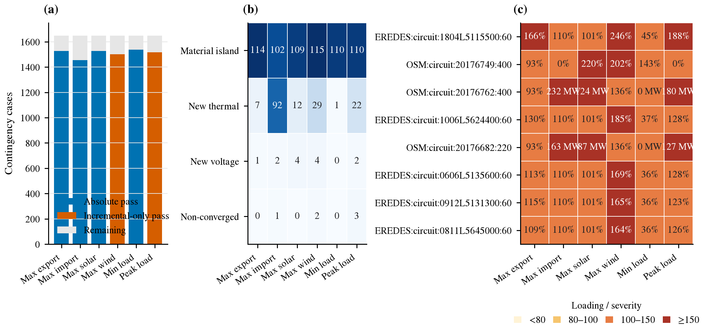

**Figure 18——代表时点全元件 N−1 结果。** (a) 六个时点的绝对通过、仅通过 N−0 增量诊断和其余案例；(b) 各时点实质孤岛、新增热违规、新增电压违规和不收敛数量；(c) 重点元件在六个时点的最高负载率或失供负荷。绝对判据和 N−0 增量诊断分别表达，后者不作为合规标准。

**Table 15——六个代表时点的全元件 N−1 结果。**

| 代表时点 | 案例数 | 主潮流收敛 | 绝对筛查通过 | 无新增违规且无实质孤岛 | 实质孤岛 |
|---|---:|---:|---:|---:|---:|
| 最大净出口 | 1,649 | 1,649 | 1,527 | 1,527 | 114 |
| 最大净进口 | 1,649 | 1,648 | 1,455 | 1,455 | 102 |
| 最大光伏 | 1,649 | 1,649 | 1,526 | 1,526 | 109 |
| 最大风电 | 1,649 | 1,647 | 0 | 1,502 | 115 |
| 最低负荷 | 1,649 | 1,649 | 1,538 | 1,538 | 110 |
| 最大负荷 | 1,649 | 1,646 | 2 | 1,516 | 110 |
| 合计 | 9,894 | 9,888 | 6,048 | 9,064 | 660 |

全量结果包含 116 个在至少一个时点产生实质孤岛的唯一元件、131 个产生新增热违规的唯一元件、6 个产生新增电压违规的唯一元件，以及 1 个产生新增变压器违规的唯一元件。部分大容量孤岛对应 Alqueva 和 Baixo Sabor 等径向电站或抽水负荷连接，不能直接解释为主网拓扑错误。另有两个 Alqueva–Ferreira do Alentejo 400 kV 案例在最大负荷和最大净进口时点的带限值与诊断潮流均不收敛，应作为后续拓扑和运行状态核查对象。

## 5.7 Interpretation and Scope

网络压力、定向 N−1 和年度全元件实验说明，SimPT60 能够把公开数据重建的运行断面转换为可复算的 pandapower 案例，并支持容量筛查、故障筛查和交互式结果解释。定向审计还表明，物理回路识别、公开额定值和事故后控制会显著改变异常数量，因此结果必须与参数证据和模型假设共同发布。

这些实验不证明葡萄牙真实电网存在相同数量的过载或孤岛。线路额定值、发电机 P–Q 能力曲线、开关状态、保护逻辑和运营商事故后措施仍不完整；60 kV 径向配网也不应与输电网采用相同的合规解释。SimPT60 适合比较运行状态、筛选候选风险和测试分析方法，但不适用于实时调度、保护整定、动态稳定或具体投资决策。正式的 N−1 合规评价仍需要运营商认可的网络模型、故障清单和设备能力数据。

------

   # 6. Conclusions

   结论集中回答：

   1. 建立了什么；
   2. 为什么稀缺；
   3. 有多少静态对象和时间案例；
   4. 如何验证；
   5. 可以用于哪些研究；
   6. 仍然不能证明什么。
