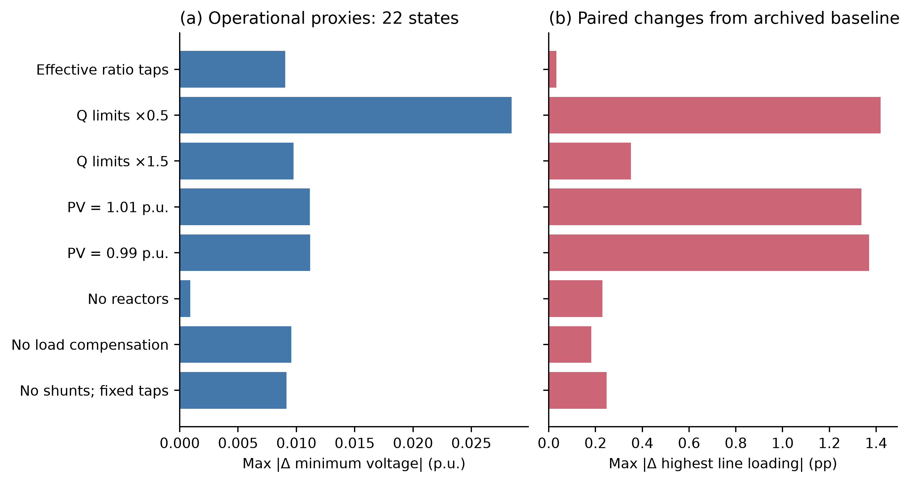
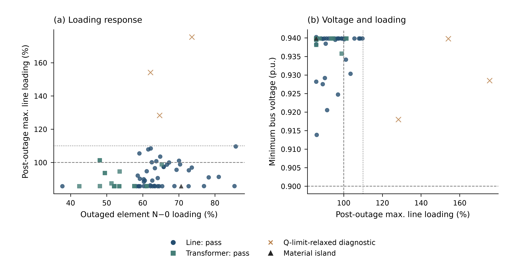

# PT60 Sep16 补充表

本文件配套 [正文](PT60_Sep16.MD)，参数和规则对应论文归档版本。

<a id="supplementary-table-s1"></a>

**Table S1——原始字段到标准语义。**

| 来源 / 原始字段 | 标准语义或目标字段 | 转换 / 处理 | 关联与缺失规则 |
| --- | --- | --- | --- |
| E-REDES energia | 节点 p_mw | 15 min kWh / 250 → MW | codigo_subestacao 匹配设施；不插值 |
| E-REDES datahora；data / hora | UTC 区间起点 | 终点标签减 15 min；Lisbon → UTC | 重复标签按站平均，记录歧义 |
| REN source_date + source_index | calendar.timestamp_utc | 按 Lisbon 自然日和日内序号建日历 | 序号区分重复小时 |
| REN series_name + value_mw | 分能源 / 负荷 / 储能全国量 | 保留 MW；类型内分配 | 缺失必需序列则案例失败 |
| rede_at_teste.properties.id / tensao_de | source_line_id / voltage_kv | 保留业务键；电压标准化为 kV | 限定本版电压层 |
| 原始 geometry / 坐标 | geo 几何；lon / lat | 存储 WGS 84；距离 EPSG:3763 | 无有效几何须记录 |
| OSM way / relation / power tags | source_id；回路身份；资产类型 | 显式节点分段；保留关系键 | 不以线条相交推定连接 |
| 公开装机与 rating | nameplate_mw / sn_mva | 功率 / 容量单位标准化 | 无公开值则代理并标证据 |
| 归档文件 URL / bytes / hash | provenance.raw_files | SHA-256；相对归档路径 | 保留原始文件定位信息 |

**表注。** 语义表不宣称每个源文件使用同一字段名。main.eredes_load / main.ren_dispatch / raw_eredes.rede_at_teste 字段已在工作主库只读核对；详细原始字段以来源归档为准。

<a id="supplementary-table-s2"></a>

**Table S2——电气参数库。**

| 电压（kV） | r（Ω/km） | x（Ω/km） | c（nF/km） | Imax（kA） | 性质 |
| --- | --- | --- | --- | --- | --- |
| 60 | 0.1093 | 0.368854 | 9.2 | 0.606 | 电压级工程代理 |
| 130 | 0.07 | 0.33 | 9.8 | 0.8 | 电压级工程代理 |
| 150 | 0.06 | 0.32 | 10.0 | 0.85 | 电压级工程代理 |
| 220 | 0.04 | 0.285 | 11.0 | 1.2 | 电压级工程代理 |
| 400 | 0.025 | 0.25 | 12.0 | 2.0 | 电压级工程代理 |

**表注。** 表内是夏季基准默认值，非所有线路的最终值；可匹配公开回路的线路使用逐字段来源覆盖。电缆修正系数 r ×0.65、x ×0.35、c ×20、Imax ×0.90。按季节再施加 Table 7 中的定额倍率。来源 model_config.json。

| 变压器电压组合（kV） | 默认 S（MVA） | vk（%） | vkr（%） |
| --- | --- | --- | --- |
| 400/220 | 450.0 | 12.0 | 0.3 |
| 400/150 | 450.0 | 12.0 | 0.3 |
| 400/60 | 170.0 | 12.0 | 0.35 |
| 220/150 | 250.0 | 12.0 | 0.35 |
| 150/130 | 140.0 | 12.0 | 0.45 |
| 220/60 | 170.0 | 12.0 | 0.4 |
| 150/60 | 170.0 | 12.0 | 0.45 |
| 130/60 | 126.0 | 12.0 | 0.45 |

**变压器表注。** 默认容量与阻抗为工程代理；公开容量优先，分电压组合总容量不足时以 REN 汇总向上校准并保留系数。档位参数见 Table 7；Estoi 等逐设备覆盖值不能被此默认表覆盖。

<a id="supplementary-table-s3"></a>

**Table S3——映射与分配审计字段。**

| 存储位置 | 实际字段 / 记录 | 含义 | 使用限制 |
| --- | --- | --- | --- |
| grid.generators | source_id；generator_id；bus_id | 来源资产及目标母线 | bus_id 缺失表示未映射 |
| grid.generators | match_distance_m；bus_assignment_rule | 匹配距离与规则 | 距离是证据指标，非连接证明 |
| grid.generators | hierarchy_dedup_status | 电厂—机组去重状态 | 保留归并依据 |
| grid.generators | available_from_utc；asset_evidence_source | 投运日期与资产证据 | 日期缺失按稿件规则可用并标记 |
| grid.buses | endpoint_match_distance_m；source_status | 端点—设施匹配距离与状态 | 派生母线不得标为直接测量 |
| grid.lines | parameter_status；r_status / x_status / c_status / max_i_status | 整体与逐参数证据 | 部分支撑不等于全部实测 |
| grid.transformers | match_distance_m；capacity_calibration_factor | 连接匹配与容量校准 | 校准不验证逐台容量 |
| main.interval_calendar | eredes_alignment_status；timestamp_utc | 时间对齐歧义与 UTC 起点 | 不抹去缺失或重复时段 |
| scenario.load_operating_points | observed_p_mw；ren_residual_p_mw；q_mvar | 直接负荷、残差与无功 | 区分观测与分配 |
| scenario.generator_operating_points | dispatch_fraction；dispatch_status；dispatch_target_source | 能源分配与来源角色 | 代理机组出力不能当作遥测 |
| monthly_model.audit_bundles | records 中的分配 / 边界 / 损耗记录 | 逐案例权重、剩余量与守恒检查 | 以包内键为准；不虚构统一 weight 列 |
| provenance.raw_record_locator | entity_type / entity_id；raw_table / raw_record_id | 派生实体回溯原始记录 | 需与归档版本共同使用 |

**表注。** 字段名经工作主库 schema 与月库建表代码核对；具体字段值随版本变化。

<a id="supplementary-table-s4"></a>

**Table S4——质量控制与失败处理。**

| 层级 / 检查 | 阈值或条件 | 严重程度 / 行为 | 记录位置 |
| --- | --- | --- | --- |
| 静态 / 标识与端点 | 设备键有效；端点存在 | 阻断无效连接 | 静态审计及 provenance |
| 静态 / 电压与长度 | 同电压连接；长度 >0；无自环 | 阻断无效支路 | 拓扑审计 |
| 静态 / 连通性 | 分量、孤立点、边界清单 | 记录；按范围解释孤立对象 | topology_summary.json |
| 时序 / 必需输入 | UTC 键一致；必需序列存在 | 失败保留错误；不插值 | monthly_model.cases.error |
| 时序 / 负荷守恒 | 节点和与 Consumption + Storage 差 ≤0.11 MW | 不满足则阻断案例 | 案例分配审计 |
| 时序 / 发电容量 | 已投运映射资产 0≤P≤装机 | 超出映射量记显式全国代理 | 发电分配审计 |
| 求解 / AC 收敛 | NR 容差 10⁻⁶ MVA；主流程最多 50 次 | 不收敛保留错误和失败状态 | monthly_model.cases |
| 求解 / 有功闭合 | 记录 Pgen + Pnet − Pload − Ploss | 数值残差报告，不充当外部真值 | audit_bundles；验证汇总 |
| 筛查 / 电压及热 | 0.90–1.10 p.u.；一般 100% 定额 | 标记风险；不删除已完成案例 | cases 与状态数组 |
| 外部 / 缺失与统计口径 | 共同时间 / 地区；成对排除缺失 | 保留异常月份；报告样本数 | 外部比较结果与 CI |
| 写库 / 原子性 | 摘要、数组和审计包同事务 | 失败整体回滚，保留错误 | 月库事务与错误记录 |
| 发布 / 完整性 | 预期、完成、数组、审计包计数一致 | 有失败不发布为完整月份 | run_manifest；文件哈希 |

**表注。** N−1 的电压、线路和变压器阈值另见正文第 5.4 节；主案例质量控制与事故筛查不可混用。


\newpage

# Supplementary Notes and Extended Analyses

## Supplementary Note S1 — Database Schema

<a id="supplementary-table-s5"></a>

**Table S5——主要数据表、粒度与关联字段。**

| 存储层 / 表 | 粒度 | 实际标识或关联字段 | 用途 |
| --- | --- | --- | --- |
| provenance.raw_files | 每归档文件 | artifact_id；source_id；sha256 | 来源与文件指纹 |
| raw_* | 每来源记录 | raw_record_id；来源业务键 | 保留原始证据 |
| grid.buses / lines / transformers | 每模型设备 | model_id；bus_id / line_id / transformer_id | 电气网络 |
| grid.generators / load_points | 每资产或负荷点 | model_id；generator_id / load_id；bus_id | 资产—母线映射 |
| geo.line_geometries / facility_geometries | 每几何对象 | 设备或设施标识 | 空间表达 |
| main.interval_calendar | 每 15 min 区间 | local_date + source_index；timestamp_utc | 统一时间索引 |
| main.ren_dispatch | 每全国序列区间 | source_date + source_index + series_name | 15 个运行序列 |
| main.eredes_load | 每站原始电量记录 | codigo_subestacao；datahora | 终点时间标签的电量输入 |
| scenario.*_operating_points | 快照设备运行点 | model_id；设备标识；适用的时间字段 | 节点输入与边界 |
| monthly_model.cases | 每案例 | case_id（主键）；run_id；timestamp_utc | 案例状态、摘要、结果 JSON |
| monthly_model.state_arrays | 每案例数组 | case_id（主键）；timestamp_utc | bus_vm_pu / line_loading_percent |
| monthly_model.bus_order / line_order | 每设备位置 | position（主键）；bus_id / line_id（唯一） | 恢复数组设备顺序 |
| monthly_model.audit_bundles | 每案例审计包 | case_id（主键）；records | 分配与平衡审计 |
| monthly_model.run_manifest | 每月运行 | run_id（主键）；源文件哈希 | 预期 / 完成 / 失败计数 |
| provenance.table_lineage / raw_record_locator / entity_evidence | 表 / 记录 / 实体 | derived_table；entity_id；raw_record_id 等 | 三层来源追踪 |
| raw_eredes_aux；scenario.annual_nminus1_* | 验证记录 / 故障案例 | 地区、设施或时点—元件键 | 外部比较与 N−1 应用 |

**表注。** 主库字段经只读 DESCRIBE 核对；月库约束见 run_monthly_15min.py。除显式标为主键 / 唯一的月库字段外，本表所列均为逻辑标识，不宣称数据库已施加唯一约束。


## Supplementary Note S2 — Frozen Release and Model-Version Reconciliation

论文唯一发布标识为 **SimPT60-2026.09.21-r1**，固定入口为 [GitHub Release](https://github.com/MingLeiZhou/PortugueseOPD/releases/tag/SimPT60-2026.09.21-r1)。发布由一个复现核心包、11 个不可变月库压缩文件、论文 PDF、`release.json` 和 `SHA256SUMS` 共同构成。`release.json` 给出完整代码提交号、环境、输入与输出哈希；月库清单同时保存压缩前后的 SHA-256、案例数和原 run manifest，避免只有压缩包名称而不能验证内容。代码提交是本次复现与审计实现的提交，不冒充未保存的原始计算提交；原计算使用的模型和发电资产文件则由原 run manifest 的哈希固定。环境完整锁定于 `requirements-lock.txt`，本次校验使用 Python 3.13 与 pandapower 3.5.2。

CORE-3783 保留 31,492 个历史案例所用的 3,783 母线、4,943 线路、228 变压器；静态模型 SHA-256 为 `57f3be5e9488bfad43e9c3504c5d703885a14457f0bcbde21994dff942225013`，发电清单为 `3cc22e06f28c35c3d80e530e898a34808eb3e17c6685029c9d0953063e7326bc`。正文第 3、4 节及原参数/分配扰动均对应此核心；第 5.4–5.6 节使用明确单列的 N1-3787 修正模型，六个时点分别归档其完整已求解基准 JSON。

工作库多出的 4 行不是新变电站，而是 Lanheses–Feitosa 的 `PUBLIC_LANHESES_PI_TOPOLOGY_SPLIT` 派生节点：原 `BUS:JUNCTION:60:00479`、`00480`、`00481`、`02655` 分别复制出带 `:PI_FEITOSA` 后缀的同址节点。该操作把此前因共用几何节点而并接的两条回路拆开，使 Deocriste–Lanheses 与 Lanheses–Feitosa 只在 Lanheses 站连接。五行线路 LINE:003195、004799、004800、004820、004821 的八个端点字段改接到新节点；线路数量不增加。发布的 `model_field_diff.csv` 给出每个新增母线和每个改接字段的前后值、经纬度及来源状态。

母线差异并非工作库全部变化：逐字段比较还发现 1,457 个 `max_i_ka`、15 个长度、6 个并联数及 Estoi 接入/容量字段变化。具体而言，N1-3787 将 CORE-3783 中 Estoi 的 1 个 378 MVA 合并变压器对象拆分为 3 个并联的 126 MVA 等值单位，使变压器表由 228 行增至 230 行（净增 2 行）；三个对称单位在 N−1 中仍合并为 1 个变压器故障组。该拆分是模型表示，不能证明每个案例时点三台物理设备均同时在运。完整差异表同时保留状态和证据标签变更。上述改动没有回写历史月库；任何使用者均须选择明确变体，不能用 3,787 母线的工作库替代核心模板重算并声称与全部历史结果相同。

最小复现命令（解压核心包后，在包根目录执行）为：

```bash
python3.13 -m venv .venv
.venv/bin/pip install -r requirements-lock.txt
.venv/bin/python replay.py
```

重算程序禁止网络请求，从冻结输入库读取数据，比较电压极值、最大线路负载率和净进口；容差为 \(1\times10^{-5}\)（分别采用对应字段单位）。`--case-index 0` 至 `21` 可重算全部 22 个验证断面。本次 22 个基线回归与原存档在上述字段的差值均为 0，另外在提取出的发布包中执行离线单例复现成功。完整月库可直接解压查询；新增审计和消融的协议、脚本、逐案例结果与失败配置记录一并发布。


## Supplementary Note S3 — Operational-Proxy Ablations

新增消融固定使用与原敏感性实验完全相同的 22 个时点，每月最大负荷及最大风光合计各一，执行 11 种配置、合计 242 个交流潮流案例。无功限值、PV 目标、负荷补偿、电抗器和分接控制分别扰动；其余注入、线路参数、外边界和求解器保持一致。PV 调整只作用于不与外部平衡源共址的发电机，以免同一母线出现互相冲突的电压目标。全部有效配置均在强制无功限值下收敛；初次设置全部 PV 目标导致的 44 个约束配置冲突保留于 `invalid_configuration_audit`，不算作电网不收敛，也不进入 242 个有效配置统计。

归档模板的 228 台变压器 `tap_changer_type` 为空。在 pandapower 3.5.2 中，只改变 `tap_pos` 的旧调压代理未改变变比，因此“关闭旧分接控制”产生近零变化不能证明物理调压无影响。额外启用 Ratio 类型再运行相同档位搜索，作为独立修正实验；该结果未回写旧案例。基准及固定中性档的可重复性与新的有效控制须分开解释。
<a id="supplementary-table-s6"></a>

**Table S6——运行代理消融；最大绝对变化取 22 个成对时点。**

| 配置 | 收敛/尝试 | 最低电压 Δ（p.u.） | 最高线路负载 Δ（百分点） | 最高变压器负载 Δ（百分点） |
| --- | --- | --- | --- | --- |
| 基线 | 22/22 | 0.00000 | 0.000 | 0.000 |
| 旧模型固定中性档 | 22/22 | 0.00000 | 0.000 | 0.000 |
| 停用补偿/电抗器且固定档位 | 22/22 | 0.00917 | 0.248 | 0.892 |
| 停用负荷补偿 | 22/22 | 0.00956 | 0.182 | 0.890 |
| 停用 5 个电抗器 | 22/22 | 0.00090 | 0.229 | 0.176 |
| PV 目标 0.99 | 22/22 | 0.01120 | 1.370 | 0.762 |
| PV 目标 1.01 | 22/22 | 0.01117 | 1.337 | 0.740 |
| 无功限值 ×1.5 | 22/22 | 0.00975 | 0.351 | 0.489 |
| 无功限值 ×0.5 | 22/22 | 0.02845 | 1.419 | 0.423 |
| 有效 Ratio 分接器及调压 | 22/22 | 0.00903 | 0.032 | 4.305 |
| 有效 Ratio 分接器但固定中性档 | 22/22 | 0.00000 | 0.000 | 0.000 |

无功限值减半使最低电压最大改变 0.02845 p.u.；有效 Ratio 分接控制使最大变压器负载率改变 4.305 个百分点。此处为正常运行断面的局部消融，不能否定补充材料 Note S4 故障状态下更强的无功敏感性，也不证明这些代理范围等于运营商控制能力。



**Figure S1——运行代理消融的成对响应。** 两面板分别表示相对同一时点归档基线的最低电压和最大线路负载率的最大绝对变化，采用 22 个时点与固定的扰动幅度。Table S6 给出全部配置及变压器结果；分接器启用是显式独立变体。


## Supplementary Note S4 — Targeted N−1 Audit and Post-Contingency Controls

为检验 SimPT60 对单一元件故障的计算能力，本文首先在第 5.2 节的基准断面上执行定向交流 N−1 筛查。故障集包含正常状态负载率较高的 50 个唯一物理线路回路和 20 台在运变压器。属于同一物理回路的串联模型分段同时停运；模型行表示多回线路时仅退出一回，并联变压器仅退出一台。筛查采用 0.90–1.10 p.u. 电压范围、60 kV 线路 110% 短时阈值、缺少公开事故额定值的高压线路 100% 保守阈值，以及变压器 120% 短时阈值。上述阈值用于本研究的代理筛查，不作为运营商事故定额或合规标准。

静态网络核查重点覆盖 Deocriste–Lanheses、Lanheses–Feitosa 和 Vila Nova de Cerveira–Valença 三个北部 60 kV 回路。前两个回路构成彼此独立的进出线段，仅在 Lanheses 变电站连接；第三个回路包含公开限流值不同的串联段，因此采用较小的 544 A 冬季限流 ([E-REDES and ERSE, 2020](#ref-EREDESPDIRD2020AnnexB))。公开清册总长度按比例分配到模型分段后，三个回路的模型总长度分别为 6.75、12.55 和 10.14 km，均与公开清册一致（PDIRD-E 2020 Annex B，PDF 第 93–95 页），且不存在跨回路的模型线路重复。该清册是规划资料，不表示案例时点的设备状态。

修正后的 70 个案例均获得诊断性交流潮流解，其中 67 个在既定发电机无功边界下收敛。66 个案例通过全部筛查；3 个北部线路案例在既定无功边界下不收敛，但取消无功边界后的诊断潮流收敛并出现热越限；另有 1 个径向回路形成 0.81 MW 的实质失供孤岛。20 个变压器故障全部通过，其中 Estoi 一台变压器退出时仅移除三台并联设备中的一台，没有再出现整体退出造成的低电压假象。上述计划库存依据 REN PDIRT 2016–2025 附件 6（PDF 第 50、56 页）；实际同时在运状态及并联等值的限制见第 2.2.3 节 ([REN, 2015](#ref-REN2015Estoi))。

设备级响应与主解、诊断解和孤岛类别的区分见 Figure S2。



**Figure S2——审计后的定向交流 N−1 响应。** (a) 被停运元件 N−0 负载率与事故后最高线路负载率；(b) 事故后最高负载率与最低电压。圆点与方点分别为通过筛查的线路和变压器停运案例；叉号为取消无功限值后的诊断解，不计作通过；三角形为实质孤岛。虚线表示 100% 连续定额和 0.90 p.u. 电压下限，点线为仅适用于相应 60 kV 线路的 110% 应急参考，不能据全网最大值单独重判案例类别。70 个案例中 67 个主解收敛，3 个仅有诊断解；数量汇总见 Table S7。归档结果包含 2 个负荷调整、1 个风电削减及 1 个基于公开容量的转供代理案例，不是完全无操作的 N−1 实验。

<a id="supplementary-table-s7"></a>

**Table S7——审计后的定向 N−1 筛查结果。**

| 结果类别 | 线路停运 | 变压器停运 | 合计 |
|---|---:|---:|---:|
| 通过全部筛查 | 46 | 20 | 66 |
| 无功限值敏感并伴随热越限 | 3 | 0 | 3 |
| 实质失供孤岛 | 1 | 0 | 1 |
| 合计 | 50 | 20 | 70 |

### Post-Contingency Control and Island Interpretation

为区分可由运行控制缓解的异常与结构性异常，本文对三个北部案例进一步执行有边界的事故后控制搜索。搜索保留既定无功边界，并组合测试 1.00–1.03 p.u. 发电机电压目标、附近变压器 ±2 档调压、已有电抗器投切、最大 200 MW 且保持总发电不变的有功重调度，以及 0–100 Mvar 候选并联补偿。候选补偿仅用于敏感性分析，不作为已安装设备写入静态网络；所有控制范围及其证据等级保存在 `scenario.nminus1_control_policy`。

三个案例均可在部分控制组合或扩大代理无功范围后获得数值解，但没有一个同时满足电压和热约束。Deocriste–Lanheses、Lanheses–Feitosa 和 Cerveira–Valença 分别至少需要将当前代理无功范围扩大至 4.0、3.0 和 1.5 倍才开始收敛。当无功范围扩大到足以恢复可接受电压时，最高线路负载率仍分别约为 175.4%、154.9% 和 128.3%。因此，放宽无功代理边界不足以消除这些模型异常。有功空间分配、实际开关状态、缺失并行路径及 60 kV 网络等值方式仍是未辨识因素，当前实验不能区分各因素的贡献。

<a id="supplementary-table-s8"></a>

**Table S8——北部三个案例的无功代理范围敏感性。**

| 停运回路 | 首次收敛倍数 | 首次电压合格倍数 | 该次最低电压（p.u.） | 该次最高负载率 | 判断 |
| --- | --- | --- | --- | --- | --- |
| Deocriste–Lanheses | 4.0× | 6.0× | 0.928 | 175.4% | 仍有热越限 |
| Lanheses–Feitosa | 3.0× | 4.0× | 0.921 | 154.9% | 仍有热越限 |
| Cerveira–Valença | 1.5× | 4.0× | 0.911 | 128.3% | 仍有热越限 |

**表注。** 仅在所测试离散倍数集合中识别“首次”；不推断连续精确临界值。开始数值收敛与满足 0.90–1.10 p.u. 电压范围不同。来源 nminus1_controls_v17/nminus1_results.csv 的 q_capability_sensitivity_trials_json；扩大代理限值不代表真实机组能力。

Godigana 案例依据公开容量记录中的 10 MW 保证容量，设定 10 MW 配网转供上限代理 ([E-REDES, n.d.-a](#ref-EREDESSubstationCapacity))；该记录本身不能确认实际备用路径或可执行的转供能力。应用此代理后，压力断面仍有 0.81 MW 负荷位于径向孤岛。公开记录的冬季自然峰值非保证负荷为 1.474 MW，与该模型残余属于不同口径。本文保留 0.81 MW 残余，并将归档结果中的“公开转供已应用”解释为转供代理已应用，不据此认定实际转供完成。在代表时点全元件面板的年度峰值断面中，相应残余为 0.27 MW；其他五个代表时点为 0 MW。


\newpage

## Supplementary Note S5 — Detailed Full-Element N−1 Definitions and Diagnostics

<a id="supplementary-table-s9"></a>

**Table S9——六个代表时点共同的 N−1 故障集合与排除规则。**

| 层次 | 数量 | 规则 |
| --- | --- | --- |
| 原模型线路分段 | 4,943 | 保留几何串联分段，不能按行等同物理回路 |
| 停运线路排除 | 156 | in_service=False |
| 活动站内母排排除 | 2 | Rio Maior 两条 OSM 母排不是独立输电回路 |
| 活动非母排且无有效基准结果 | 14 | 缺失/NaN 负载结果；并非数值为零 |
| 入选线路模型分段 | 4,771 | 在运、非母排且结果有限；本面板恰有 0 行严格零电流 |
| 线路故障组 | 1,421 | 1,356 来源回路 ID；58 仅 OSM way 分段；7 其他身份 |
| 含并行等值的线路故障组 | 282 | 单回退出：parallel 减 1；串联分段按同组操作 |
| 变压器故障等值组 | 228 | 0 停运、0 缺失结果；并联组 1 个 |
| 变压器单位数（等值） | 230 | Estoi 3 台以 1 个对称故障代表，其他 227 台各 1 |
| 每时点故障数 | 1,649 | 1,421 + 228；不将对称并联单位重复加权 |

“无基准电流”应理解为无有效求解结果，不能与“零电流”或“未带电”画等号：零值是合法状态；是否带电还需在运标记、端点状态、供电连通性和解状态共同判断。归档筛选器实际按非缺失结果筛选，14 行的具体 ID 和端点状态见 `nminus1_exclusions.csv`。58 个 OSM way 组及 7 个其他身份组仍缺少运营商完整回路确认，因此不用“全部物理回路身份已恢复”的措辞。串联分段同时退出；等值并行元件每次仅减一回/一台。六个时点使用相同成员，停运操作并不意味着整个等值并行组退出。

定向实验便于解释重点案例，但不能代表整个网络。本文进一步从连续 15 分钟时序中按预先声明的规则选取六个代表时点：最大系统负荷、最低系统负荷、最大风电、最大光伏、最大净进口和最大净出口。每个时点使用归档 N1-3787 修正基准，对同一组 1,649 个可求解候选元件逐一停运。故障集合的精确成员 SHA-256 在六个时点均为 `d9edd18f63382b16f967a090661b35fbc462e17fea565631ba3554724af44ce8`，不只是案例数量相同。这里的“全元件”严格指下述规则得到的可建模集合，不表示完整运营商物理故障清单。额外的事故后补救控制搜索在这一全量首轮中关闭；Note S4 所述转供代理仍须随结果解释。这里的“年度”指共同窗口内代表时点的面板，不表示完整日历年或全部区间的 N−1 覆盖。

六个时点共形成 9,894 个交流 N−1 案例，其中 9,888 个在既定无功边界下收敛。按绝对电压、线路和变压器阈值判断，6,048 个案例通过。最大风电和最大负荷断面的 N−0 基准本身已存在代理额定值越限，因此仅使用绝对判据会把同一基准偏差重复计入大量故障。为此，数据库同时保存一个辅助的 N−0 增量指标：在要求主潮流收敛且不产生实质孤岛的前提下，9,064 个案例没有相对于本时点 N−0 状态新增电压或热违规。该历史指标只识别新出现的违规，不能排除已有违规恶化；下文给出判定公式和新增恶化统计，不替代绝对安全判据。

绝对判据与增量诊断的差别及跨时点重点元件见 Figure S3。


**Figure S3——代表时点全元件 N−1 筛查。** (a) 绝对通过、仅通过相对 N−0 增量诊断及其余案例；(b) 非互斥的实质孤岛、新增线路热违规、新增电压违规、新增变压器违规及主解失败计数；(c) 按主潮流收敛解最大线路负载率选出的前五个停运元件（%）；(d) 按失供负荷最大值选出的前五个停运元件（MW）。后两面板各自排序、分别着色，NA 表示该元件—时点无主潮流收敛值，不等于零。ER 与 OSM 为来源前缀缩写，完整 ID 与单元格值保存在随图数据中。数值按整数显示，总量见 Table S10；增量诊断不替代绝对安全判据。

<a id="supplementary-table-s10"></a>

**Table S10——六个代表时点的全元件 N−1 结果。**

| 代表时点 | 案例数 | 主潮流收敛 | 绝对筛查通过 | 无新增违规且无实质孤岛 | 实质孤岛 |
|---|---:|---:|---:|---:|---:|
| 最大净出口 | 1,649 | 1,649 | 1,527 | 1,527 | 114 |
| 最大净进口 | 1,649 | 1,648 | 1,455 | 1,455 | 102 |
| 最大光伏 | 1,649 | 1,649 | 1,526 | 1,526 | 109 |
| 最大风电 | 1,649 | 1,647 | 0 | 1,502 | 115 |
| 最低负荷 | 1,649 | 1,649 | 1,538 | 1,538 | 110 |
| 最大负荷 | 1,649 | 1,646 | 2 | 1,516 | 110 |
| 合计 | 9,894 | 9,888 | 6,048 | 9,064 | 660 |

全量结果包含 116 个在至少一个时点产生实质孤岛的唯一元件、131 个产生新增热违规的唯一元件、6 个产生新增电压违规的唯一元件，以及 1 个产生新增变压器违规的唯一元件。部分大容量孤岛对应 Alqueva 和 Baixo Sabor 等径向电站或抽水负荷连接，不能直接解释为主网拓扑错误。另有两个 Alqueva–Ferreira do Alentejo 400 kV 案例在最大负荷和最大净进口时点的带限值与诊断潮流均不收敛，应作为后续拓扑和运行状态核查对象。

### Incremental Criterion and Worsening of Existing Violations

令 L(c,t) 为物理回路 c 的各在运分段最大负载率，门限 τ(c) 对 60 kV 为 110%，其余为 100%。基准违规集 O₀(t)={c:L₀(c,t)>τ(c)}，故障 k 的新增热违规数为 |Oₖ(t)\O₀(t)|。原增量通过还要求主潮流收敛、无实质孤岛；当基准电压全部在 0.90–1.10 p.u. 内时，故障电压亦须在范围内；当基准最大变压器负载 ≤120% 时，故障值亦须 ≤120%。若基准电压或变压器已经违规，原相应布尔指标不会识别恶化。六个时点的基准电压及变压器值均合格，因此本面板的实际盲点是既有线路热越限。

对主解收敛案例，新增指标为 W(k,t)=max{max[0,Lₖ(c,t)−L₀(c,t)]:c∈O₀(t)}，单位为负载率百分点；不存在原违规回路时定义为 0，主解失败为 NA。这是同一物理回路的成对变化，不是全网最大值相减。被停运或故障后下降到 100% 以下的原违规回路不会产生正恶化；归档超过 100% 的逐回路结果足以精确恢复正 W。另输出电压/变压器的极值越限幅度，但它们仅为全网包络，不能冒充逐设备恶化统计。
<a id="supplementary-table-s11"></a>

**Table S11——已有线路违规的恶化；百分点阈值为研究诊断容差。**

| 时点 | 原违规回路 | W>1 pp 案例 | 最大 W（pp） | 旧增量通过但 W>1 pp | 增量通过且 W≤1 pp |
| --- | --- | --- | --- | --- | --- |
| 最大净出口 | 0 | 0 | 0.000 | 0 | 1527 |
| 最大净进口 | 0 | 0 | 0.000 | 0 | 1455 |
| 最大光伏 | 0 | 0 | 0.000 | 0 | 1526 |
| 最大风电 | 3 | 23 | 114.924 | 17 | 1485 |
| 最低负荷 | 0 | 0 | 0.000 | 0 | 1538 |
| 最大负荷 | 1 | 20 | 15.023 | 15 | 1501 |

最大风电断面原有 3 条违规回路，故障后的最大恶化达 114.924 个百分点；23 个主解案例恶化超过 1 个百分点，其中 17 个曾被旧增量指标判为通过。最大负荷断面对应 1 条、15.023 个百分点、20 个案例和 15 个旧通过案例。加上 W≤1 pp 条件后，辅助通过数由 9,064 降为 9,032；阈值 0.1/1/5 pp 的完整计数随 CSV 报告。该辅助指标仍不替代绝对通过数 6,048，更不代表在既有过载下安全运行。
