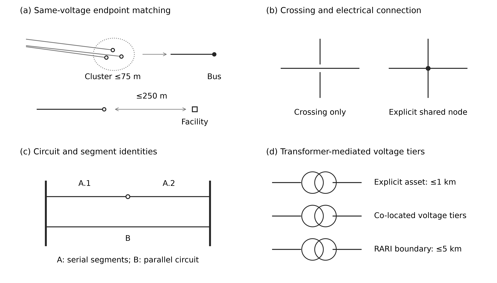
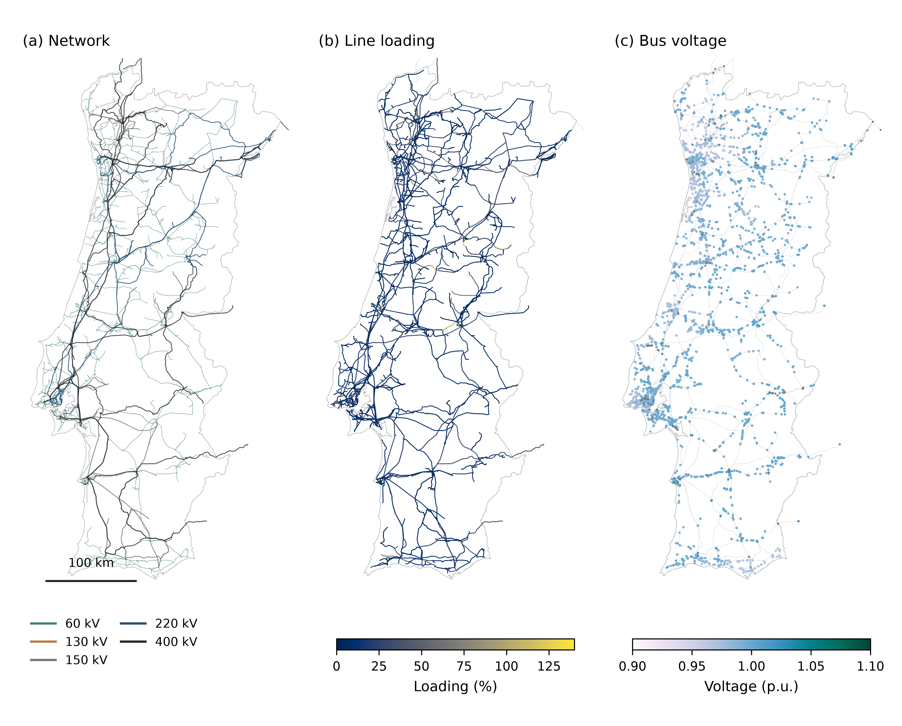
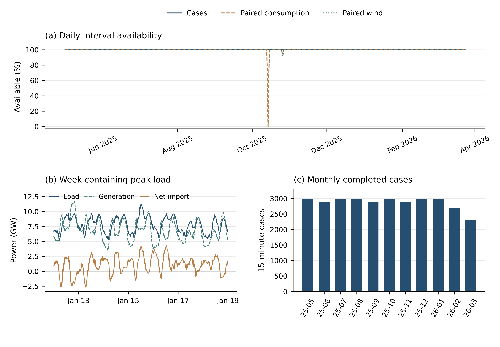
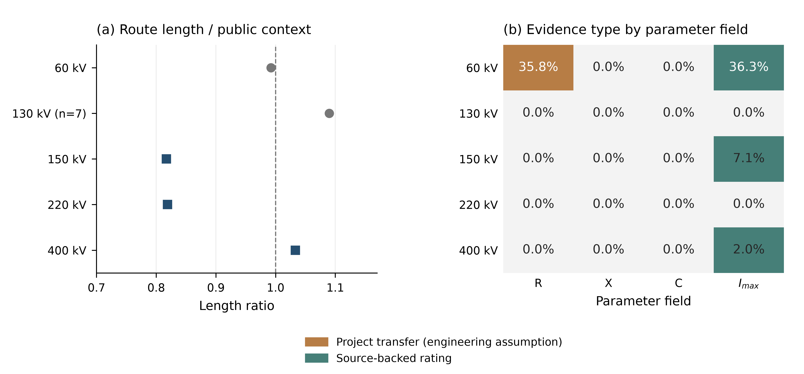
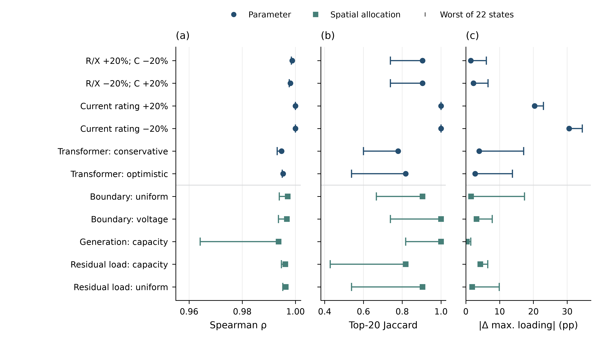
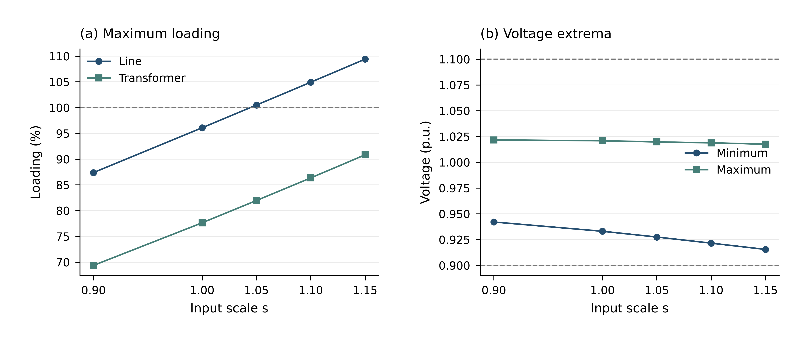
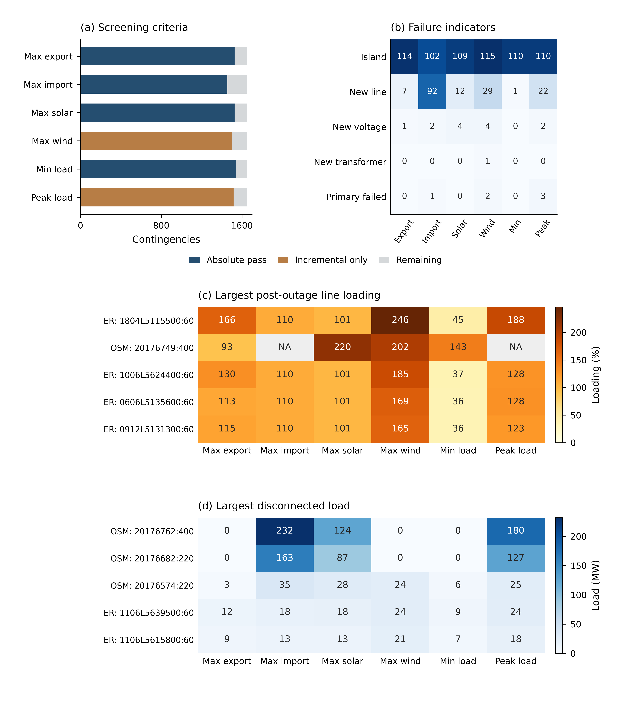

# SimPT60—A Traceable Public-Data-Derived Dataset of the Portuguese High-Voltage Power System with Time-Indexed Power-Flow Cases

# Abstract

公开电网数据往往分别提供网络几何、设备属性或聚合运行量，难以直接形成连续的潮流案例。本文构建 SimPT60，将多源记录整合为覆盖葡萄牙大陆 60–400 kV 网络及葡西互联边界的研究数据集。通过来源归档、网络重建、资产—母线映射、时间对齐和节点功率分配，生成 2025-05-01 至 2026-03-24 的 31,492 个 15 分钟交流潮流案例，并保存输入、处理规则和结果之间的关联。

外部比较使用未参与节点功率构建的 E-REDES 辅助数据产品，检验聚合时间变化和空间分布。全国负荷在 31,388 个配对区间上的 Pearson 系数为 0.997；六个代表时点的全元件 N−1（单一元件故障）实验完成 9,894 个案例，其中 9,888 个在既定无功边界下收敛。这些结果支持数据集的聚合时空一致性和计算可用性，为时序潮流、相对风险筛查及情景分析提供数据基础，但不构成设备级准确性验证。

**Keywords:** power system dataset; Portugal; public data; grid reconstruction; power flow; time series; provenance; cross-source validation

------

# 1. Introduction

研究葡萄牙电网的时序潮流和运行风险，需要同时获得网络拓扑、设备资产、运行时序和潮流状态。现有开放数据满足了其中的部分需求：PyPSA-Eur 提供面向欧洲系统优化的输电网模型 ([Hörsch et al., 2018](#ref-Horsch2018))；已有欧洲高压电网重建研究主要覆盖 220 kV 及以上交流网络 ([Xiong et al., 2025](#ref-Xiong2025))；SimBench 联合多电压等级网络和时间序列，但表示的是德国代表性系统 ([Meinecke et al., 2020](#ref-Meinecke2020))。这些数据仍不能直接提供葡萄牙 60–400 kV 地理网络与 15 分钟运行状态之间的对应关系。

现有模型与 SimPT60 在覆盖范围、时间组织、可计算性和来源追踪方面的差异见 Table 1。

**Table 1——与既有公开模型的范围及可追溯性比较。**

| 维度 | PyPSA-Eur | SimBench | SimPT60 |
| --- | --- | --- | --- |
| 地理对象 | 欧洲输电系统运营商联盟（European Network of Transmission System Operators for Electricity, ENTSO-E）区域真实网络重建 | 德国代表性基准网络 | 葡萄牙大陆及葡西边界重建 |
| 电压范围 | 交流 ≥220 kV；高压直流输电（high-voltage direct current, HVDC） | 低压至超高压，多电压等级 | 60、130、150、220、400 kV |
| 时间组织 | 小时级需求/可再生可用率；可聚合 | 全年 15 min 负荷/发电剖面 | 2025-05-01—2026-03-24；15 min |
| 可计算性 | PyPSA 优化与运行研究模型 | 潮流基准与标准化算例 | 31,492 个归档交流潮流案例 |
| 参数证据 | 公开网络/资产与类型假设；流程公开 | 代表性网络设计与类型参数 | 逐字段区分直接来源、转用和工程代理 |
| 来源追踪 | 数据源、版本和构建工作流 | 文档、网络代码、剖面标识 | 原始文件哈希、稳定对象 ID、案例审计包 |
| 用途边界 | 欧洲系统规划；不覆盖葡萄牙 60 kV 配网 | 可比性基准；不表示葡萄牙真实地理 | 聚合一致性与代理筛查；不等于设备遥测 |

**表注。** 比较依据原论文及官方文档：PyPSA-Eur ([Hörsch et al., 2018](#ref-Horsch2018); [官方说明](https://pypsa-eur.readthedocs.io/en/latest/))；SimBench ([Meinecke et al., 2020](#ref-Meinecke2020); [文档 v1.0.0](https://simbench.de/wp-content/uploads/2020/01/simbench_documentation_en_1.0.0.pdf))。官方网页核对日期为 2026-09-21；本表比较用途与数据组织，不作“首次”或完整性排名。

## 1.1 Motivation

葡萄牙能源和地质总局（Direção-Geral de Energia e Geologia, DGEG）的能源与气候规划将可再生能源、储能、电气化和跨境互联列为转型路径 ([DGEG, 2024](#ref-DGEGPNEC2030Revision2024))。新技术、新设备和新政策会改变发电与负荷的时空分布，进而影响线路潮流、节点电压和系统运行风险。评估这些影响，需要同时描述电网结构和连续运行状态的数据基础。

葡萄牙的相关记录分散在 E-REDES、葡萄牙国家能源网络公司（Redes Energéticas Nacionais, REN）、DGEG、能源服务监管局（Entidade Reguladora dos Serviços Energéticos, ERSE）和开放地理数据平台，来源及用途见第 2.1 节与 Table 3。不同来源的空间范围、时间分辨率和字段定义并不一致；形成可求解案例还需要重建拓扑、补充电气参数、连接资产与母线，并把聚合运行量分配到节点。

因此，本研究的目标是建立一个可追溯、可计算且带有连续时间案例的葡萄牙高压电网数据集，为时序潮流、电网风险筛查和方法比较提供统一的数据基础。

## 1.2 Introducing SimPT60

为弥补上述缺口，本文提出 SimPT60，一个基于多源公开数据重建的葡萄牙大陆高压电网数据集。建模范围覆盖 60、130、150、220 和 400 kV 网络，并保留表示葡西互联所需的边界节点。数据库分层存储原始来源、静态网络、时序输入、潮流结果和验证记录，使用者可以追踪关键字段的来源和处理规则。

SimPT60 的核心贡献是把葡萄牙大陆 60–400 kV 的可追溯公开数据网络，与 31,492 个连续、可复算的 15 分钟交流潮流状态连接在同一版本化数据产品中。原始记录、派生对象及验证结果分层保存，支持回溯关键字段的证据；其适用边界集中见第 4.7 节。数据集的覆盖范围、核心数据产品与解释边界汇总于 Table 2。

**Table 2——SimPT60 的范围与数据产品。**

| 维度 | 范围或产品 | 解释边界 |
| --- | --- | --- |
| 空间 | 葡萄牙大陆；葡西边界端点 | 不含岛屿及低于 60 kV 的配网 |
| 电压 | 60、130、150、220、400 kV | 多来源公开数据重建 |
| 时间 | 2025-05-01 至 2026-03-24；15 min | Europe/Lisbon 自然日；协调世界时（Coordinated Universal Time, UTC）对齐 |
| 静态网络 | 母线、线路、变压器、资产和几何 | 公开连接证据与工程代理并存 |
| 运行案例 | 31,492 个稳态交流潮流案例 | 模型计算状态，不是设备遥测 |
| 分发与追踪 | 主库、11 个月库、原始记录定位与来源哈希 | 来源许可与发布快照需分别管理 |
| 验证与应用 | 外部时空比较、扰动实验、压力情景及 N−1 | 聚合一致性不能证明设备级真值 |

**表注。** 范围、构建规则与数据产品分别见第 1–3 节。

本文其余部分如下：第 2 节介绍 SimPT60 的数据来源与构建方法；第 3 节概述静态网络、时序和潮流案例；第 4 节报告验证结果；第 5 节给出应用示例和 N−1 筛查；第 6 节总结本文。

------

# 2. Methodology

SimPT60 的构建包括五个步骤：归档并标准化公开数据；重建 60–400 kV 静态网络；将资产和运行记录映射到统一的 15 分钟时间轴；逐区间生成并求解交流潮流；分层保存结果并执行质量检查。

## 2.1 Public Data Scope and Standardization

### 2.1.1 Scope and Sources

空间、电压与时间范围见 Table 2。网络几何主要由 E-REDES 的 60/130 kV 网络和 OSM/Geofabrik 的 150/220/400 kV 网络构成 ([Geofabrik GmbH, n.d.](#ref-GeofabrikPortugal2026))；DGEG 与 APA 补充发电、储能和接入证据 ([DGEG, n.d.](#ref-DGEGGeo2026); [APA, 2021](#ref-APA3403); [APA, n.d.-a](#ref-APAPPA421); [APA, n.d.-b](#ref-APAPPA407))；REN 提供全国 15 分钟运行序列，E-REDES 提供变电站电量；PDIRT/PDIRD 提供交付点剖面及部分设备参数 ([E-REDES, n.d.-f](#ref-EREDESRND2026); [OpenStreetMap contributors, n.d.](#ref-OSM2026); [REN, n.d.](#ref-RENDataHub2026); [REN, 2024](#ref-ERSEPDIRT2024))。GISCO 用于大陆边界裁剪 ([Eurostat GISCO, 2024](#ref-GISCO2024))，REN/REE 资料用于输电和互联背景核对；与 OSM 同源的 OpenInfraMap 只作显示核对，不作为独立证据 ([OpenInfraMap contributors, n.d.](#ref-OpenInfraMap2026))。

数据来源、覆盖和建模角色汇总于 Table 3。共同窗口由可同步的 E-REDES 与 REN 时序决定；静态资料版本、案例日期和历史可用性分别记录，不能将共同窗口解释为全部设备的观测日期。

**Table 3——公开数据来源、覆盖范围与角色。**

| 发布方 / 产品 | 空间或时间覆盖 | 关键内容 | 本研究角色 |
| --- | --- | --- | --- |
| E-REDES / RND AT | 大陆 60/130 kV；归档快照 | 线路、设施、代码、几何 | 网络构建 |
| OSM / Geofabrik | 大陆及葡西边界；归档快照 | 150/220/400 kV 设施与回路 | 网络与资产构建 |
| DGEG；APA；项目公告 | 电厂、储能及接入记录 | 位置、能源、装机、投运线索 | 资产补充及证据 |
| REN / Data Hub | 共同窗口内 15 min；15 序列 | 消费、发电、储能、进口及出口 | 输入与留出比较 |
| E-REDES / 变电站电量 | 397 站；15 min | 设施代码、区间结束标签、kWh | 直接节点负荷 |
| ERSE / PDIRT；PDIRD | 规划与设备清册 | 交付点剖面、回路和额定信息 | 残差权重与参数证据 |
| REN / REE | 输电网络与葡西互联 | 回路、长度和容量汇总 | 清单、校准和背景对照 |
| GISCO | 葡萄牙大陆 | 国家边界几何 | 空间裁剪与制图 |
| E-REDES 辅助统计 | 14 数据集；多时间粒度 | 全国、市镇、注入和季节负荷 | 外部比较，不参与节点构建 |

**表注。** 建模共同窗口为 2025-05-01 至 2026-03-24；来源入口、归档版本和文件指纹见数据文档及 release manifest。

### 2.1.2 Archiving and Standardization

原始文件按来源不可变归档，并保存来源链接、下载时间、文件大小和 SHA-256；处理流程只读访问原始层。坐标统一为世界大地测量系统 1984（World Geodetic System 1984, WGS 84），经距离运算时转换到葡萄牙国家投影；电压、功率、电量和距离分别统一为 kV、MW/Mvar、kWh 和 km。E-REDES 的 15 分钟电量按

\[
P_{\mathrm{MW}}=\frac{E_{\mathrm{kWh}}}{250}
\]

转换为区间平均功率。时间同时保存 Europe/Lisbon 本地值和 UTC 值，设备则使用来源编号生成稳定标识符。所有派生对象保留来源键和处理状态。

数据源原始字段与标准语义的映射关系详见补充材料 [Table S1](SimPT60_supplement_lean.md#supplementary-table-s1)。

## 2.2 Static Network Reconstruction

静态网络表示为

\[
G=(B,L,T),
\]

其中 \(B\)、\(L\) 和 \(T\) 分别为母线、线路和变压器。连接按“来源关系—电压一致性—受限空间匹配”的顺序建立，避免把地图上的接近或交叉直接解释为电气连接。

### 2.2.1 Buses and Lines

60/130 kV 线路优先采用 E-REDES，150/220/400 kV 线路和设施主要采用 OSM，并与 REN 线路统计核对。重复 E-REDES 设施、与永久站相距 250 m 内的移动设施，以及同名共址的站点被规范化，并保留归并清单。

线路端点按电压分组，在 EPSG:3763 坐标中将 75 m 内的端点聚为同一节点；不同电压层不会合并。端点簇在同电压下匹配 250 m 内的设施，否则生成派生连接母线。OSM 线路只在 way 端点或显式共享节点处分段，几何交叉不形成连接；`circuit` 和 `line_section` 关系用于恢复回路身份。并行回路被保留，自环和非正长度支路进入阻断清单。

### 2.2.2 Transformers and Parameters

变压器按三类证据生成：OSM 显式变压器在 1 km 内匹配高低压母线；同一 OSM 变电站的相邻电压层生成共址变压器；RARI（Regulamento do Acesso às Redes e às Interligações do Setor Elétrico，电网及互联接入规章）边界名称与设施在 5 km 内匹配，必要时回退到高压站 1 km 内的 60 kV 端点。公开 `rating` 优先作为容量，其余容量和阻抗使用电压组合代理；分电压组合总容量不足时，以 REN 汇总容量向上校准，并保留校准系数 ([REN, n.d.](#ref-RENDataHub2026))。

线路参数包括 \(r\)、\(x\)、\(c\) 和 \(I_{\max}\)。60 kV 支路以长度加权最短路径匹配 PDIRD 公开回路清册 ([E-REDES and ERSE, 2020](#ref-EREDESPDIRD2020AnnexB))，仅接受拓扑长度与来源长度之比为 0.65–1.60 的路径；其余线路采用分电压参数库和电缆修正系数。每个参数分别标记为直接公开值、公开资料推导值、汇总校准值或工程代理值。其中，电阻的部分来源支撑来自导线类型对应的技术参数推导 ([EDP Distribuição, 2019](#ref-Tocha2019))。

生成后检查设备键、端点、正长度、电压一致性、连通分量和葡西边界清单，并将 150/220/400 kV 线路长度与 REN 统计比较。参数完整表示模型可计算，不表示全部参数为运营商实测值。

Figure 1 示意连接判定，Table 4 汇总阈值与未匹配处理。

**Figure 1——静态网络重建中的连接规则。** (a) 同电压端点聚类与设施匹配；(b) 区分几何交叉和显式共享节点；(c) 保留串联分段与并行回路身份；(d) 根据显式资产、同址设施和 RARI 边界证据连接不同电压层。图为抽象电气示意，不表示真实设备坐标；距离阈值及回退规则见 Table 4。

**Table 4——拓扑规则与阈值。**

| 对象 / 步骤 | 规则或阈值 | 约束 / 未匹配处理 |
| --- | --- | --- |
| 距离坐标 | EPSG:3763；单位 m | 经纬度存储采用 WGS 84 |
| 端点聚类 | 同电压内 75 m | 不同电压不合并 |
| 设施绑定 | 同电压设施 250 m | 未匹配则生成派生连接母线 |
| 设施归并 | 重复设施、同名共址；移动设施距永久站 250 m 内 | 保留归并记录 |
| OSM 分段 | way 端点或显式共享节点 | 几何交叉不自动形成连接 |
| 回路身份 | circuit / line_section；保留并行回路 | N−1 按物理回路处理串联分段 |
| 显式变压器 | 高低压母线在 1 km 内匹配 | 保持电压层一致性 |
| 共址变压器 | 同一 OSM 站内相邻电压层 | 派生连接；保留证据等级 |
| RARI 边界 | 名称与设施在 5 km 内匹配 | 可回退到高压站 1 km 内 60 kV 端点 |
| PDIRD 参数路径 | 长度加权最短路；模型 / 来源长度 0.65–1.60 | 路径不符合则使用电压级代理 |
| 阻断检查 | 自环、非正长度、端点或电压冲突 | 记录并阻断无效支路 |

**表注。** 依据第 2.2 节与 model_config.json。所有距离均为投影平面距离；这些是重建规则，非运营商公开精度保证。

各电压等级的默认电气参数与覆盖规则详见补充材料 [Table S2](SimPT60_supplement_lean.md#supplementary-table-s2)。

### 2.2.3 Evidence Applicability and Historical Availability

静态来源日期与运行案例日期分别版本化。只有存在明确投运日期的资产才按时点切换；普通线路、变压器和互联设施在缺少同期状态记录时保留冻结静态状态。项目文件对接入和参数的支撑按适用设备及字段记录，不能由规划资料推断实际开关状态；导线电阻的截面缩放和向其他导线族转用仍属于工程假设。证据页码、设备 ID 和逐字段判断保存在 `citation_evidence_ledger.csv`，版本处理汇总于 Table 5。

**Table 5——来源版本、有效日期与案例处理。**

| 对象 | 日期或状态证据 | 案例处理与限制 |
| --- | --- | --- |
| 普通线路及变压器 | 多数缺少逐设备历史状态 | 使用冻结静态状态；不解释为历史网络完整重演 |
| Minho–Galicia 新互联 | REE 公告 2026-07-02 | 在全部研究案例中停用 |
| 其他葡西互联 | 缺少检修和开关历史 | 固定边界等值；历史地图只核对走廊名称 ([REE, 2012](#ref-REE2012)) |
| 发电与储能 | 366 个资产有日期，824 个缺失 | 已知日期门控；未知按可用并标记 |
| PDIRT/PDIRD 及项目证据 | 规划清册、季节剖面或项目文件 | 用于参数、权重和接入证据；不推断实时投运 |

**表注。** N1-3787 中 Estoi 三台并联等值由规划清册支持容量与电压组合，但同时可用和同参数仍是模型假设 ([REN, 2015](#ref-REN2015Estoi))。

## 2.3 Asset Mapping and Time-Series Alignment

### 2.3.1 Asset Mapping and Calendar

发电与储能清单由 OSM、DGEG 和项目证据构成。相距 3 km 内且容量一致的电厂—机组重复表示被合并；DGEG 风电替代不完整的 OSM 风电容量，未与 OSM 重复的 DGEG 光伏作为补充。资产优先采用公开接入证据，其次采用声明电压，最后进行受限空间匹配。未声明电压时，容量不低于 100 MW 的资产只搜索 150 kV 及以上母线，其余搜索 60 kV 及以上母线，最大距离为 20 km。超出范围的资产保留但不注入网络。投运日期晚于案例时点的资产不可用；日期缺失的资产视为可用并明确标记。

统一日历以 `interval_start_utc` 为时间键。REN 标签表示区间起点，E-REDES 标签表示区间终点：

\[
t_{\mathrm{E\text{-}REDES}}=t_{\mathrm{REN}}+15\ \mathrm{min}.
\]

日历按 Europe/Lisbon 自然日生成，因此夏令时开始日和结束日分别含 92 和 100 个区间。REN 日内序号可区分重复小时；E-REDES 无折叠标识，重复标签按变电站取平均并标记为歧义。缺失时点不插值。

### 2.3.2 Load, Generation and Storage

E-REDES 电量按设施代码映射到母线，并转换为节点负荷。全国未观测剩余量为

\[
R_t=P^{\mathrm{REN}}_{\mathrm{consumption},t}
-\sum_j P^{\mathrm{EREDES}}_{j,t}.
\]

\(R_t\) 按相应季节中最接近当时全国负荷的 PDIRT 公开参考剖面分配到已映射交付点 ([REN, 2024](#ref-ERSEPDIRT2024))：

\[
w_{j,t}=
\frac{P^{\mathrm{PDIRT}}_{j,r(t)}}
{\sum_{k\in\mathcal{M}}P^{\mathrm{PDIRT}}_{k,r(t)}},
\qquad
P^{\mathrm{res}}_{j,t}=w_{j,t}R_t.
\]

该剖面只提供空间权重，不改变 15 分钟时间分辨率。E-REDES 负荷在无无功观测时采用 0.97 功率因数，剩余负荷保留 PDIRT 的 \(Q/P\) 关系。抽水和电池充电按已映射储能容量分配，剩余量进入显式全国代理。节点负荷之和必须回到 REN 的 `Consumption + Storage`，容差为 0.11 MW。

REN 分能源发电量分配给能源类型一致、已映射且已投运的资产，并限制 \(0\le P_{g,t}\le P_g^{\mathrm{nameplate}}\)。水电和天然气采用确定性的容量优先规则，其余类别按可用容量分配。超过已映射容量的量作为 `UNMAPPED_NATIONAL_RESIDUAL_PROXY` 注入指定 400 kV 代理母线，不解释为缺失电厂的真实位置。

REN 进口与出口在同一日历上对齐，但作为留出验证量，不用于强制设置边界功率。求解前检查时间键、必需序列、映射完整性、负荷与发电守恒以及容量限制。

资产映射、时间对齐和守恒处理的可执行规则汇总于 Table 6。

**Table 6——资产映射与时序转换规则。**

| 处理对象 | 规则 | 审计或保守处理 |
| --- | --- | --- |
| 资产去重 | 3 km 内且容量一致的电厂—机组归并 | 保留层级去重状态 |
| 母线映射 | 公开接入 → 声明电压 → 受限最近母线 | 最大距离 20 km；超出保留但不注入 |
| 无电压声明的资产 | 容量 ≥100 MW 搜索 ≥150 kV；其余 ≥60 kV | 不把空间接近当作连接真值 |
| 投运状态 | 投运日期晚于时点则停用 | 缺失日期视为可用并标记 |
| 时间标签 | REN 为起点；E-REDES 为终点，减去 15 min | 共同逻辑键：UTC 区间起点 |
| 夏令时 / 缺失 | Lisbon 自然日 92 / 96 / 100 区间 | 重复 E-REDES 标签按站平均并标记；不插值 |
| 电量转功率 | P(MW)=E(kWh)/250 | 15 min 区间平均值 |
| 直接负荷与残差 | E-REDES 观测 + PDIRT 加权 REN 消费差额 | 无功缺测时 pf=0.97；残差保留 Q/P |
| 抽水与电池充电 | 正值作为电气负荷；按映射储能容量分配 | 总负荷回到 Consumption + Storage |
| 能源发电分配 | 同能源、已映射、已投运且受装机上限约束 | 水电 / 燃气容量优先；其余容量比例 |
| 未映射发电剩余量 | 显式全国代理母线注入 | 不得解释为真实缺失电厂位置 |
| 跨境交换 | REN 进口 / 出口仅作求解后比较 | 边界注入由初次模型求解确定 |

**表注。** 依据第 2.3–2.4 节。实际 calendar / monthly 字段名是 timestamp_utc；interval_start_utc 是本文对时间语义的描述。

资产映射、功率分配及来源回溯所使用的审计字段详见补充材料 [Table S3](SimPT60_supplement_lean.md#supplementary-table-s3)。

## 2.4 Time-Indexed Case Generation and Alternating-Current (AC) Power Flow

每个 15 分钟时点构成一个稳态案例

\[
C_t=(G,\theta,X_t,S_t,U_t,B_t),
\]

其中静态网络 \(G\) 和参数 \(\theta\) 在案例间共享，\(X_t\)、设备状态 \(S_t\)、控制 \(U_t\) 和边界等值 \(B_t\) 随时间更新。主数据集逐区间生成案例；第 4–5 节的敏感性与应用实验另行选择代表时点。

### 2.4.1 Case Assembly and Solution

每个时点更新负荷、发电、设备状态、季节定额和边界等值。初始边界潮流用于确定模型净交换，随后仅保留一个角度参考点，其余边界按公开电压与回路数分配固定有功等值；REN 同期交换只用于求解后比较。

交流潮流采用 pandapower Newton–Raphson 算法和 DC 初始化 ([Thurner et al., 2018](#ref-Thurner2018))。主流程执行无功限值，并在边界重构后进行一次重新求解和有限分接搜索。季节定额、PV/PQ 规则、补偿、电抗器、边界权重和数值设置汇总于 Table 7；这些统一设置是可计算代理，不代表运营商控制策略。

### 2.4.2 Monthly Execution

案例按自然月并行计算，工作进程只读输入并独立求解，父进程在单一事务中写入摘要、状态数组和审计包。重新运行跳过完整案例并重算失败项；只有预期数、完成数、数组数和审计包数一致的月份才标记为完整。主案例设置见 Table 7。

**Table 7——案例与求解器设置。**

| 项目 | 数值或规则 | 性质 |
| --- | --- | --- |
| 季节线路定额 | 5–9 月 ×1.00；3–4、10–11 月 ×1.10；12–2 月 ×1.15 | 夏季基值上的工程代理 |
| PV 门槛 | 非电池；装机 ≥20 MW 且电压 ≥60 kV | 其余 PQ |
| PV 电压 / 无功 | 1.0 p.u.；±0.50 × 装机 MW（Mvar） | 统一代理 |
| 负荷补偿 | 目标 pf=0.98；单母线上限 15 Mvar | 工程代理 |
| 并联电抗器 | 5 × 150 Mvar；400 kV | 明确标记的代理设备 |
| 边界 | 单一角度参考；其余按电压 × 回路数分配 | 不以 REN 实测交换校准 |
| AC 算法 | Newton–Raphson；DC 初始化；执行 Q 限值 | 最大 50 次；容差 10⁻⁶ MVA |
| 变压器分接 | 高压侧 ±8 档；每档 1.25%；最多 16 轮 | 目标 0.985–1.015 p.u. |
| 一般筛查 | 电压 0.90–1.10 p.u.；负载率 100% | 越限保留；N−1 另行定义 |

**表注。** 配置来自冻结的 `model_config.json` 和月度执行程序。

## 2.5 Layered Storage, Provenance and Quality Control

### 2.5.1 Database and Provenance

主 DuckDB 按来源保存 `raw_eredes`、`raw_dgeg`、`raw_osm`、`raw_reference`、`raw_documents` 和 `raw_eredes_aux`；`grid` 与 `geo` 保存静态网络和几何，`scenario` 保存资产运行点，`main` 保存统一日历及运行时序，`provenance` 保存文件和实体血缘。

每个月使用独立结果库。`monthly_model.cases` 每时点一行，保存状态、时间、摘要指标和完整结果 JSON；`bus_order`、`line_order` 与 `state_arrays` 以固定设备顺序保存母线电压和线路负载率数组；`audit_bundles` 保存负荷、发电、边界、热点和损耗记录。展开视图可将数组恢复为设备长表。静态模型在月库中只复制一次，而不是随每个案例重复保存。

来源记录包含 URL、归档路径、文件大小和 SHA-256；`table_lineage`、`raw_record_locator` 和 `entity_evidence` 分别提供表级、记录级和证据级追踪。月度 `run_manifest` 保存输入文件指纹和案例计数。数据库分层、粒度与关联字段的完整清单详见补充材料 [Table S5](SimPT60_supplement_lean.md#supplementary-table-s5)。

### 2.5.2 Quality Control and Recovery

质量控制包括四层：静态层检查键、端点、电压、长度、连通性和边界清单；时序层检查时间对齐、来源完整性、负荷与发电守恒及容量限制；求解层检查收敛、电压、负载率和有功平衡

\[
\varepsilon_t=
P_t^{\mathrm{gen}}+P_t^{\mathrm{model,net}}
-P_t^{\mathrm{load}}-P_t^{\mathrm{loss}};
\]

外部层使用未参与节点建模的 E-REDES 全国、市镇、变电站、生产和注入统计，并结合 REN 交换与月度损耗进行比较。0.90–1.10 p.u. 和 100% 负载率仅作为风险筛查阈值，越限案例不会被删除。

一个案例的摘要、数组和审计包在同一事务内提交，失败则整体回滚并保留错误记录。月度正式发布前，来源和副本的完成案例数、数组数和审计包数必须一致。上述事务与清单机制支持结果恢复及来源追踪。

质量控制阈值、失败行为和记录位置详见补充材料 [Table S4](SimPT60_supplement_lean.md#supplementary-table-s4)。

------

# 3. Overview of the SimPT60 Dataset

SimPT60 由一个主数据库和 11 个按月组织的潮流结果库组成。主数据库保存静态网络、统一时序、来源记录和验证观测；月度数据库保存逐 15 分钟案例及其潮流状态。当前静态模型版本为 `PT60-v2.0.0`。

## 3.1 Static Network Data

静态网络包含 675 个设施、3,783 个母线、4,943 条线路、228 台变压器、1,190 个发电或储能单元、468 个负荷点和 7 个葡西互联边界端点。`grid.buses`、`grid.lines` 和 `grid.transformers` 给出网络连接与电气参数；`grid.generators`、`grid.load_points` 和 `grid.interconnectors` 给出资产与母线的对应关系。线路和设施几何分别保存在 `geo.line_geometries` 与 `geo.facility_geometries`，避免在电气表中重复存储空间对象。

各设备表同时保留 `source`、`source_status`、`parameter_status` 或映射规则等字段。因此，使用者既可以直接形成 pandapower 网络，也可以筛选仅含较高证据等级的设备，或识别采用公开资料推导和工程代理参数的部分。

网络空间结构与一个归档运行状态见 Figure 2。地理图件的投影处理与绘制使用 GeoPandas ([Fleischmann et al., 2026](#ref-GeoPandas2026))。

**Figure 2——地理网络与年度峰值求解状态。** (a) 3,783 个母线、4,943 条线路对应的 60–400 kV 地理网络；(b) 线路负载率；(c) 母线电压。三幅地图使用相同 EPSG:3763 投影、空间比例和范围，保留全部原始线路几何及葡西边界端点，比例尺为 100 km。运行状态来自归档的 2026-01-15 12:15 UTC 年度峰值模型（负荷 11,329.2 MW），通过稳定设备 ID 连接；缺失求解状态保留灰色、不填补。色标保留超过 100% 的负载率。结果为模型潮流，不是遥测。

## 3.2 Time-Series Data

`main.interval_calendar` 是各类时序的共同索引，覆盖 2025 年 5 月 1 日至 2026 年 3 月 24 日的 328 个自然日，共 31,492 个本地 15 分钟区间。区间数量考虑 Europe/Lisbon 夏令时变化，因此月份不一定等于天数乘以 96。

`main.eredes_load` 保存 397 个变电站的 12,360,502 条负荷记录；原始记录延伸至 2026 年 3 月 25 日，但与其他输入共同可用的建模窗口截止于 3 月 24 日。`main.ren_dispatch` 含 472,380 条记录和 15 个全国运行序列，覆盖负荷、分能源发电、储能及跨境交换。`main.weather_hourly` 含里斯本、波尔图和法鲁三个位置的 23,616 条逐小时记录；`main.ren_rnt_balance` 含 11 个报告期的 660 条月度平衡记录。

此外，数据库归档了 14 个 E-REDES 辅助数据集，共 2,239,064 条记录，包括全国和市镇消费、合同功率、生产、配网注入、分布式自发自用、变电站季节性负荷、电能质量与供电连续性。这些表不参与节点功率构建，作为第 4 节未参与节点构建的外部公开观测。

## 3.3 Time-Indexed Power-Flow Cases

逐区间结果按自然月拆分，以限制单个文件大小并支持选择性下载。11 个紧凑月库与统一日历一一对应，共包含 31,492 个案例；当前版本中全部案例完成交流潮流计算并标记为收敛。2025 年 10 月因夏令时结束含 2,980 个区间，2026 年 3 月仅覆盖前 24 天，含 2,304 个区间。

每个案例保存摘要、设备状态数组及分配审计包，字段和关联方式见补充材料 [Table S5](SimPT60_supplement_lean.md#supplementary-table-s5)。状态数组通过固定的 `bus_order` 和 `line_order` 恢复为设备长表；静态设备顺序每月只保存一次。

主数据库还保存第 5 节的 N−1 应用结果。`scenario.annual_nminus1_snapshots` 记录六个代表时点，`scenario.annual_nminus1_results` 保存 9,894 条故障级结果，`scenario.annual_nminus1_overloads` 保存事故后越限回路明细；`scenario.nminus1_control_policy` 与 `provenance.annual_nminus1_runs` 分别记录控制搜索边界和实验来源。这些应用表与连续 15 分钟潮流案例分开，避免将抽样安全筛查误解为全时段运行观测。

## 3.4 Dataset Coverage and Composition

区间可用性、峰值周变化及月度完整性见 Figure 3。

**Figure 3——时间覆盖与案例完整性。** (a) 每日案例、全国消费配对及风电配对的可用区间比例，分母按 Lisbon 自然日及夏令时计算，显示缺测而不插值；(b) 含最大系统负荷的完整自然周，分别给出总电气负荷、发电及 REN 净进口；(c) 逐月已完成且收敛的 15 分钟案例数，合计 31,492。共同窗口为 2025-05-01 至 2026-03-24；10 月包含夏令时重复小时，3 月为截至 24 日的部分月份。

静态网络、时间序列、验证和应用数据的核心规模见 Table 8。

**Table 8——数据集主要统计。**

| 类别 | 对象 | 数量 | 统计口径 |
| --- | --- | --- | --- |
| 静态 | 设施 | 675 | 归档模型清单 |
| 静态 | 母线 | 3,783 | 2026-09-16 拓扑验证快照 |
| 静态 | 线路 | 4,943 | 分电压覆盖表 |
| 静态 | 变压器 | 228 | 拓扑验证快照 |
| 静态 | 发电 / 储能单元 | 1,190 | 资产清单 |
| 静态 | 负荷点 | 468 | 负荷清单 |
| 静态 | 葡西边界端点 | 7 | 互联清单 |
| 活动网络 | 母线 / 线路 | 3,664 / 4,787 | 连通性统计 |
| 时序 | 共同日期 / 区间 | 328 日 / 31,492 | 统一日历 |
| 时序 | 变电站电量 | 397 站 / 12,360,502 条 | 原始记录延伸至 2026-03-25 |
| 时序 | REN 全国序列 | 15 类 / 472,380 条 | 15 min |
| 上下文 | 天气 | 3 地点 / 23,616 条 | 逐小时 |
| 上下文 | REN 月度平衡 | 11 报告期 / 660 条 | 月度 |
| 验证 | E-REDES 辅助产品 | 14 类 / 2,239,064 条 | 多时间粒度 |
| 潮流 | 紧凑月库 / 案例 | 11 / 31,492 | 完成且收敛 |
| 应用 | 全元件 N−1 | 6 时点 / 9,894 案例 | 1,649 元件 / 时点 |

**表注。** 本表为发布的 CORE-3783 变体；N−1 使用 N1-3787 变体。两者的对象级差异、适用章节和固定哈希见第 3.6 节，不将工作库当作论文唯一网络。

## 3.5 File Organization and Distribution

冻结发布由分析就绪主库、11 个逐月结果库、来源/provenance 记录以及验证与应用结果组成。主库以稳定 model ID 连接静态网络和统一时间轴，月库以 case ID 和固定设备顺序连接摘要、状态数组与审计包；许可允许时分发原始文件，否则分发来源元数据和下载脚本。数据层级与关联键见补充材料 [Table S5](SimPT60_supplement_lean.md#supplementary-table-s5)，文件哈希、环境和复现入口由 `release.json`、`SHA256SUMS` 与 release README 管理。

## 3.6 Frozen Release and Model-Version Reconciliation

论文冻结 **SimPT60-2026.09.21-r1**。31,492 个历史案例及第 3–4 节验证使用 CORE-3783（3,783 buses、4,943 lines、228 transformers）；第 5.2 节 N−1 演示使用 N1-3787，其中四个同址连接节点修正 Lanheses–Feitosa 拓扑，Estoi 的一个合并对象拆为三个并联等值单位，使变压器表增至 230 行，但仍构成一个对称故障组。两种变体不能互换后声称结果来自同一模型；必要差异见补充材料 [Note S2](SimPT60_supplement_lean.md#supplementary-note-s2)，逐字段差异和哈希保存在 release manifest。

# 4. Validation

本研究未获得与 SimPT60 同期、同范围的运营商内部网络模型或逐支路状态估计。因此，本文不以设备级误差作为验证目标，而从网络结构、计算一致性、建模假设敏感性和外部公开观测四个层面检验数据集的现实合理性与研究可用性。

## 4.1 Validation Design and Evidence Levels

验证分为三层：公开结构资料和建模假设敏感性检验网络表示；未参与节点功率构建的 E-REDES 产品检验聚合时间与空间行为；案例完整性、收敛和功率闭合检验内部计算一致性。比较按共同时间戳或地区成对进行，不插值、不删除异常月份，并按自然日或空间实体聚类重采样获得 95% 置信区间。

这些证据的范围不同。REN 与 E-REDES 的消费、发电产品并非完全相同的会计边界，市镇和变电站统计也不是线路潮流真值；因此验证目标是研究层面的合理性和可用性，而非设备级误差。

## 4.2 Structural and Computational Consistency

完整静态网络包含 3,783 个母线、4,943 条线路和 228 台变压器，其中 3,664 个活动母线和 4,787 条活动线路形成一个连通分量。简单图的环路秩为 501，节点度中位数和 95 分位数分别为 2 和 4。按 route-km 计算，60、130、150、220 和 400 kV 网络与公开背景长度之比分别为 0.992、1.090、0.817、0.819 和 1.033；其中 150、220 和 400 kV 使用 REN 汇总量，60/130 kV 结果不能解释为独立准确率。130 kV 仅有 7 条模型线路，长度比 1.090 的样本量很小，仅供参考，不能据此判断该电压层整体精度。

线路参数是静态模型的主要不确定性。在 4,240 条 60 kV 线路中，1,517 条具有 PDIRD 回路路径的部分来源支撑，其余 2,723 条采用电压等级工程代理。130–400 kV 线路在线路级 `parameter_status` 分类中均为代理；这一整体分类与逐参数字段的来源支撑不同，后者见 Figure 4。

11 个紧凑月库包含 31,492 个完成并收敛的 15 分钟案例。发电、边界交换、负荷与网损之间的交流闭合残差的平均绝对误差（mean absolute error, MAE）为 $1.77\times10^{-6}$ MW，表明发布的状态和审计量在数值容差内一致。

跨电压等级的覆盖模式与各参数字段的来源支撑见 Figure 4。

**Figure 4——结构覆盖与逐参数来源支撑。** (a) 各电压等级的模型 route-km / 公开背景长度比值，虚线为 1；灰色圆点对应非独立 OSM 背景，蓝色方点对应 REN 背景。route-km 与回路长度口径不同，比值不是准确率。(b) 按字段区分项目电阻转用（橙色，工程假设）与有来源定额（绿色），单元格给出对应比例；灰色表示全为工程代理。R 的 35.8% 不是直接参数观测，不能与电流定额的证据等级合并；X、C 均为代理。130 kV 仅 7 条线路，长度比仅供参考。线路级部分支撑计数仍见 Table 9。

网络覆盖、参数证据和计算完整性的汇总指标见 Table 9。

**Table 9——网络结构、参数证据与计算完整性。**

| kV | 母线 | 线路 | route-km | 背景 km | 比值 | 线路级参数证据 |
| --- | --- | --- | --- | --- | --- | --- |
| 60 | 3,236 | 4,240 | 9,668.4 | 9,742.0 | 0.992 | 1,517 部分 / 2,723 代理 |
| 130 | 8 | 7 | 41.6 | 38.2 | 1.090 | 7 代理 |
| 150 | 132 | 156 | 2,054.1 | 2,514.0 | 0.817 | 156 代理 |
| 220 | 214 | 294 | 3,206.9 | 3,916.0 | 0.819 | 294 代理 |
| 400 | 193 | 246 | 3,579.5 | 3,465.0 | 1.033 | 246 代理 |

**表注。** 130 kV 仅 7 条线路，样本量小，1.090 比值仅供参考。背景长度：60/130 kV 为非独立 OSM 上下文；150/220/400 kV 为 REN 汇总。route-km 与回路长度口径不同，比值不是准确率。活动网络为 1 个连通分量、简单图环路秩 501、节点度中位数 2、95 分位数 4。31,492/31,492 案例完成并收敛（100%）；区间加权 AC 闭合 MAE = 1.77e-06 MW。线路级“部分来源支撑”不代表全部参数可观测；X、C 均为代理。来源：topology_coverage_by_voltage.csv、parameter_evidence_by_voltage.csv、topology_summary.json 和 scope_matched_validation_timeseries.csv。

## 4.3 Parameter and Spatial-Allocation Sensitivity

敏感性实验在 22 个代表时点扰动线路 R/X、C、额定电流、变压器容量/阻抗以及负荷、发电和边界空间分配；去除共享基准后共 264 个案例，全部收敛。线路阻抗扰动的最小 Spearman 系数为 0.998，变压器扰动为 0.993；额定电流假设使最大负载率最多变化 34.48 个百分点。空间方案的全网排序仍较稳定，但残差按变压器容量分配时 Top-20 Jaccard 最低降至 0.429，表明具体热点比系统级排序更依赖假设。

Figure 5 汇总排序、热点集合和最大负载率响应；完整成对结果见补充材料 [Table S6](SimPT60_supplement_lean.md#supplementary-table-s6)。热点 persistence 进一步显示，没有线路在全年所有时点和配置中稳定进入 Top-20，详见补充材料 [Figure S1](SimPT60_supplement_lean.md#supplementary-figure-s1)。无功限值、PV 目标、补偿、电抗器和分接控制的消融见补充材料 [Table S7](SimPT60_supplement_lean.md#supplementary-table-s7)。

**Figure 5——参数与空间分配敏感性。** (a) 线路负载率排序的 Spearman 系数；(b) Top-20 Jaccard；(c) 最大负载率变化绝对值。标记表示 22 个运行状态的中位数，线段延伸至最不利值；154 个参数案例与 132 个空间案例共享 22 个基准。

## 4.4 External Temporal Agreement

全国负荷比较包含 31,388 个配对区间。SimPT60 消费序列与 E-REDES 公开消费的均值比为 1.003，按日块重采样的 95% 置信区间为 $[1.002,1.005]$；15 分钟 Pearson 系数为 0.997，区间为 $[0.996,0.999]$，MAE 为 30.9 MW。按日平均后，327 个配对日的 Pearson 系数为 0.995，归一化均方根误差（root mean square error, RMSE）为 0.013。2025 年 10 月存在 E-REDES 缺失和局部偏差，但验证未删除该月份 ([E-REDES, n.d.-b](#ref-EREDESNationalConsumption))。

风电比较包含 31,484 个配对区间。SimPT60 与 E-REDES 配电网风电注入的均值比为 1.056，区间为 $[1.055,1.058]$；Pearson 系数为 0.9998，区间为 $[0.9997,0.9998]$。日平均序列的 Pearson 系数同样为 0.9998。光伏的时间相关系数为 0.982，但 SimPT60 全国光伏均值约为 E-REDES 配电网注入的 21.2 倍；水电相关系数为 0.536。后两项反映全国生产与配电网注入的范围差异，因此不作为绝对规模验证 ([E-REDES, n.d.-c](#ref-EREDESDistributionInjection); [E-REDES, n.d.-d](#ref-EREDESNationalProduction))。

成对日均、区间密度和日内形状共同展示时间一致性（Figure 6）。

**Figure 6——聚合输入的外部时间验证。** (a–b) 全国消费与风电的成对日平均；(c–d) 对应 31,388 与 31,484 个 15 分钟配对，六边形密度共用对数计数色标，虚线为一比一线，r 为 Pearson 系数；(e) 同一消费配对集合按 Lisbon 当地时刻聚合后、各自除以日内均值的曲线。各比较仅排除所需字段缺失的区间，不删除异常月份、不平滑或插值。消费不含抽水和电池充电，与案例总电气负荷区分；风电为全国生产与配网注入的跨范围印证。该图验证聚合输入，不验证节点分配或支路潮流；重采样置信区间（confidence interval, CI）见 Table 10。

## 4.5 External Spatial Agreement

市镇尺度以 E-REDES 月度计费消费为参考 ([E-REDES, n.d.-e](#ref-EREDESMunicipalityConsumption))，包含 2,183 个市镇—月份配对，负荷份额的 Spearman 系数为 0.881，按 199 个市镇聚类重采样的 95% 置信区间为 $[0.841,0.910]$，覆盖同期计费电量的 94.8%。变电站尺度包含 792 个季节配对，Spearman 系数为 0.957，按 397 个变电站聚类的区间为 $[0.946,0.967]$；均值比为 1.044，MAE 为 2.45 MW。

市镇比较以变电站所在市镇近似供电区域，因此只提供弱空间证据。季节性变电站负荷来自 E-REDES 的容量与负荷数据产品 ([E-REDES, n.d.-a](#ref-EREDESSubstationCapacity))，能够检验设施排序和规模，但与 15 分钟负荷图共享运营商来源，不能视为完全独立的节点真值。

空间配对的分布与偏离一比一关系的结构见 Figure 7。

**Figure 7——市镇与变电站空间一致性。** (a) 2,183 个市镇—月份负荷份额配对；(b) 792 个变电站季节峰值配对。坐标等比例，虚线为一比一线。标注为 Spearman 系数及归档的 1,000 次聚类自助重采样 95% CI，分别使用 199 个市镇和 397 个变电站簇，不是回归带。市镇归属是供电区的弱代理；同运营商的跨数据产品证据不等同于完全独立的节点真值。

跨来源验证的样本量、区间估计和证据层级汇总于 Table 10。

**Table 10——跨来源验证汇总。**

| 验证对象 | 样本或独立块 | 结果（95% CI） | 证据层级 |
|---|---:|---|---|
| 全国消费负荷 | 31,388 区间 / 327 日 | 均值比 1.003 $[1.002,1.005]$；$r=0.997$ $[0.996,0.999]$ | REN–E-REDES 消费比较；参考含网损 |
| 风电 | 31,484 区间 / 328 日 | 均值比 1.056 $[1.055,1.058]$；$r=0.9998$ $[0.9997,0.9998]$ | REN–E-REDES 配网注入印证 |
| 光伏时间变化 | 31,484 区间 / 328 日 | $r=0.982$ $[0.979,0.984]$；绝对规模不可比 | 全国生产–配网注入，不同范围 |
| 市镇负荷份额 | 2,183 配对 / 199 市镇 | $\rho=0.881$ $[0.841,0.910]$ | 同运营商跨数据集，弱空间代理 |
| 变电站季节峰值 | 792 配对 / 397 站 | $\rho=0.957$ $[0.946,0.967]$ | 同运营商跨数据集 |
| AC 功率闭合 | 31,492 案例 | MAE $1.77\times10^{-6}$ MW | 内部物理一致性 |

### 4.5.1 Station-Held-Out Spatial Reconstruction Test

整站留出实验将 394 个可匹配站按固定规则分为五折，并在 22 个时点比较全局容量比例、地理邻站和重建网络邻站三种预测，共形成 8,541 个观测对。Table 11 显示网络邻站法的 MAE 比全局容量比例低约 9.9%，但没有优于地理邻站法，且置信区间重叠。因此，重建连接包含有用邻近信息，却不能单独恢复精确节点负荷；完整 fold、距离权重和 bootstrap 协议见补充材料 [Note S3](SimPT60_supplement_lean.md#supplementary-note-s3)。

**Table 11——整站留出的空间分配结果。**

| 方法 | 站数/观测对 | MAE（MW）及 95% CI | RMSE（MW） | WAPE |
| --- | --- | --- | --- | --- |
| 容量比例 | 394/8541 | 4.729 [4.412, 5.063] | 6.357 | 38.4% |
| 地理距离 5 邻站 | 394/8541 | 4.249 [3.972, 4.544] | 5.675 | 34.5% |
| 网络路径 5 邻站 | 394/8541 | 4.262 [3.971, 4.545] | 5.702 | 34.6% |

## 4.6 Generation Scope and Quantified Dependence on Spatial Proxies

消费侧直接观测负荷的月度份额为 67.93%–74.93%，其余 25.07%–32.07% 由 PDIRT 参考剖面分配。全国发电代理只占月度发电的 0.010%–0.063%，但这一全国平均掩盖了小能源类别：2025 年 5 月电池和其他火电的代理份额分别达到 90.58% 和 11.07%。因此，聚合平衡并不等同于局部资产位置可靠。

所有非舍入发电代理集中注入同一 400 kV 接收母线，该位置只表示模型平衡点。Figure 8 同时展示消费残差、类别级发电代理和按纬度带汇总的空间分布；逐月八能源类型、逐区间标记和母线级明细作为 CSV 发布。

**Figure 8——观测与代理功率的时间和空间分布。** (a) 消费侧观测与 PDIRT 残差；(b) 电池和其他火电的类别级代理份额；(c) 接收母线按纬度分带后的负荷残差份额。三个面板使用不同分母，区域表示模型分配位置，不表示缺失资产真实位置。

## 4.7 Limitations

验证支持 SimPT60 的聚合时间一致性、空间排序合理性和数值自洽性；参数与分配扰动也表明系统级趋势总体稳定。现有公开资料仍不足以检验逐设备拓扑、支路潮流、开关状态和机组能力，因此本文不把相关性、收敛性或筛查计数解释为运营商网络的设备级准确率。SimPT60 的适用范围是可复算的研究案例、相对风险比较和方法测试；实时调度、保护整定和正式合规评价需要运营商认可的同期模型与运行记录。

# 5. Application

两个简洁实验用于证明数据集可支持确定性情景比较和批量故障计算；它们是模型用途展示，不构成运行预测或正式合规评价。

## 5.1 Deterministic Grid-Stress Scenario

以 2026-01-20 19:45 UTC 为基准，将节点负荷、分能源发电和边界交换共同缩放为 0.90–1.15 倍并独立求解。五个情景全部收敛：基准最高线路负载率为 96.10%，1.05 倍时达到 100.50% 并出现 3 条越限线路，1.15 倍时达到 109.41%；最低电压始终高于 0.90 p.u.。Figure 9 展示负载率和电压响应，精确逐情景结果随仓库 CSV 发布。

**Figure 9——确定性网络压力响应。** (a) 最高线路与变压器负载率；(b) 最低与最高母线电压。虚线为 100% 线路定额和 0.90–1.10 p.u. 筛查范围；连接线只引导阅读。

## 5.2 Representative-Time Full-Element N−1 Demonstration

从连续时序预先选取最大/最低负荷、最大风电、最大光伏、最大净进口和最大净出口六个时点，并在 N1-3787 上使用同一组 1,649 个故障：1,421 个线路回路组和 228 个变压器组。串联模型分段共同退出，并联等值每次退出一个单位；完整选择和排除规则见补充材料 [Table S8](SimPT60_supplement_lean.md#supplementary-table-s8)。

六个时点共形成 9,894 个案例，9,888 个主潮流收敛；6,048 个通过绝对筛查，9,064 个没有相对 N−0 新增违规且无实质孤岛。后者是辅助诊断，不能识别所有已有越限恶化，也不能替代绝对判据。Figure 10 和 Table 12 给出结果；完整成员和逐案例输出保存在仓库。

**Figure 10——代表时点全元件 N−1 筛查。** (a) 绝对和增量诊断；(b) 实质孤岛、新增违规及主解失败；(c–d) 最高事故后线路负载率和最大失供负荷对应元件。完整判据及已有越限恶化见补充材料 [Note S4](SimPT60_supplement_lean.md#supplementary-note-s4)。

**Table 12——六个代表时点的全元件 N−1 结果。**

| 代表时点 | 案例数 | 主潮流收敛 | 绝对筛查通过 | 无新增违规且无实质孤岛 | 实质孤岛 |
|---|---:|---:|---:|---:|---:|
| 最大净出口 | 1,649 | 1,649 | 1,527 | 1,527 | 114 |
| 最大净进口 | 1,649 | 1,648 | 1,455 | 1,455 | 102 |
| 最大光伏 | 1,649 | 1,649 | 1,526 | 1,526 | 109 |
| 最大风电 | 1,649 | 1,647 | 0 | 1,502 | 115 |
| 最低负荷 | 1,649 | 1,649 | 1,538 | 1,538 | 110 |
| 最大负荷 | 1,649 | 1,646 | 2 | 1,516 | 110 |
| 合计 | 9,894 | 9,888 | 6,048 | 9,064 | 660 |

**表注。** “绝对筛查通过”“无新增违规且无实质孤岛”和“实质孤岛”是分别计算的指标，不构成互斥且完备的分类，因而不能直接横向相加。最大净出口时点除 1,527 个无新增违规且无实质孤岛案例和 114 个实质孤岛案例外，另有 8 个非孤岛新增违规案例，其中 7 个为线路热违规、1 个为电压违规，三类合计为 1,649 个案例。

**表注。** 三个结果列分别计算，不构成互斥且完备的分类。最大净出口另有 8 个非孤岛新增违规案例（7 个热违规、1 个电压违规）。

这些应用支持相对情景和诊断性故障筛查；设备级解释仍受 §4.7 的参数、状态和控制证据限制。

# 6. Conclusions

SimPT60 将葡萄牙大陆 60–400 kV 公开网络重建与 31,492 个连续 15 分钟 AC 潮流状态连接在同一可追溯、版本化的数据产品中。CORE-3783 包含 3,783 个母线、4,943 条线路和 228 个变压器对象，并以稳定标识连接来源、分配规则和求解结果。

验证支持聚合时空一致性与数值自洽性：全国负荷和风电的时间相关系数分别约为 0.997 和 0.9998，市镇与变电站空间排序的 Spearman 系数为 0.881 和 0.957，整站留出实验显示重建网络邻近性优于全局容量比例但未优于地理邻近性。参数和分配扰动下系统级排序总体稳定，具体热点和绝对负载率仍对代理假设敏感。

压力情景和六个代表时点的 9,894 个 N−1 案例展示了数据集支持情景分析与批量故障计算的能力。相关结果用于比较模型状态和定位待核查元件，不构成安全认证。

SimPT60 是 public-data-derived research dataset，不是运营商内部模型、状态估计或数字孪生。进一步设备级验证需要同期设备状态、机组 P–Q 能力、开关配置和事故后措施。

------

# References

APA (2021). [Sobreequipamento do Parque Eólico de Trancoso: Parecer da Comissão de Avaliação, AIA 3403](https://siaia.apambiente.pt/AIADOC/AIA3403/parecerca_3403202192134944.pdf). July; PDF p. 5.

APA (n.d.-a). [PPA 421: Sub-Parque Eólico de Sernancelhe e ligação a Moimenta](https://siaia.apambiente.pt/PosAvaliacao/DetalhesPosAvaliacao/421). AIA 2009; project-name and operation-date fields; archived 2026-09-21.

APA (n.d.-b). [PPA 407: Ligação do Douro Sul à Subestação de Armamar e Subestação de Moimenta](https://siaia.apambiente.pt/PosAvaliacao/DetalhesPosAvaliacao/407). AIA 2009; archived 2026-09-21.

DGEG (2024). [Portugal: Plano Nacional Energia e Clima 2021–2030, atualização/revisão](https://www.dgeg.gov.pt/media/54fldci3/pnec2030_para_aprov_ar.pdf). DGEG.

DGEG (n.d.). [Informação Geográfica de Energia Elétrica](https://www.dgeg.gov.pt/pt/servicos-online/setor-energetico/). Official geographic data portal. Accessed 2026-09-21.

EDP Distribuição (2019). [Memória Descritiva e Justificativa: Linha a 60 kV PE Tocha II–Tocha](https://siaia.apambiente.pt/AIADOC/AIA3274/projeto%20linha%20eletrica%20pe%20tocha%20ii2019729153214.pdf). 19 February; process 2800-19C007374; PDF pp. 3, 5.

E-REDES; Entidade Reguladora dos Serviços Energéticos (2020). [PDIRD-E 2020, Anexo B](https://www.erse.pt/media/340hrot0/proposta-pdird-e-2020_anexo_b.pdf). ERSE. July version; northern circuit records: PDF pp. 93–95.

E-REDES (n.d.-a). [Carga na subestação](https://e-redes.opendatasoft.com/explore/dataset/carga-na-subestacao/). E-REDES Open Data Portal. Accessed 2026-09-21.

E-REDES (n.d.-b). [Consumo total nacional](https://e-redes.opendatasoft.com/explore/dataset/consumo-total-nacional/). E-REDES Open Data Portal. Accessed 2026-09-21.

E-REDES (n.d.-c). [Energia injetada na rede de distribuição](https://e-redes.opendatasoft.com/explore/dataset/energia-injetada-na-rede-de-distribuicao/). E-REDES Open Data Portal. Accessed 2026-09-21.

E-REDES (n.d.-d). [Energia produzida total nacional](https://e-redes.opendatasoft.com/explore/dataset/energia-produzida-total-nacional/). E-REDES Open Data Portal. Accessed 2026-09-21.

E-REDES (n.d.-e). [Monthly consumption by municipality](https://e-redes.opendatasoft.com/explore/dataset/3-consumos-faturados-por-municipio-ultimos-10-anos/). E-REDES Open Data Portal. Accessed 2026-09-21.

E-REDES (n.d.-f). [Rede Nacional de Distribuição: Dados da Rede AT e Cargas de Subestação](https://e-redes.opendatasoft.com/pages/rnd/). Open data portal. Accessed 2026-09-21.

Eurostat GISCO (2024). [Countries 2024: Portugal Boundary, 1:1 Million, EPSG:4326](https://gisco-services.ec.europa.eu/distribution/v2/countries/). Geospatial dataset. Accessed 2026-09-21.

Fleischmann, Martin; Van den Bossche, Joris; Jordahl, Kelsey; Richards, Matthew John; McBride, James; Wasserman, Jacob; Ward, Brendan; Wolf, Levi John (2026). [GeoPandas: Fundamental Data Structures for Vector Spatial Data in Python](https://doi.org/10.1016/j.compenvurbsys.2026.102495). *Computers, Environment and Urban Systems*, 130, 102495. Author/year/DOI verified against the official GeoPandas CITATION.md and Crossref on 2026-09-21; assigned issue December 2026, not asserted as the online publication date.

Geofabrik GmbH (n.d.). [OpenStreetMap Data Extract for Portugal](https://download.geofabrik.de/europe/portugal.html). Geospatial data extract. Accessed 2026-09-21.

Hörsch, Jonas; Hofmann, Fabian; Schlachtberger, David; Brown, Tom (2018). [PyPSA-Eur: An Open Optimisation Model of the European Transmission System](https://doi.org/10.1016/j.esr.2018.08.012). *Energy Strategy Reviews*, 22, 207-215.

Meinecke, Steffen; Sarajlić, Džanan; Drauz, Simon Ruben; Klettke, Annika; Lauven, Lars-Peter; Rehtanz, Christian; Moser, Albert; Braun, Martin (2020). [SimBench—A Benchmark Dataset of Electric Power Systems to Compare Innovative Solutions Based on Power Flow Analysis](https://doi.org/10.3390/en13123290). *Energies*, 13(12), 3290.

OpenInfraMap contributors (n.d.). [OpenInfraMap](https://openinframap.org/about). Web map of infrastructure data derived from OpenStreetMap. Accessed 2026-09-21.

OpenStreetMap contributors (n.d.). [OpenStreetMap](https://www.openstreetmap.org/copyright). Collaborative geospatial database. Accessed 2026-09-21.

Red Eléctrica de España (2012). [Interconexiones eléctricas: un paso para el mercado único de la energía en Europa](https://www.ree.es/sites/default/files/jgk4byy3ukct.pdf). September; PDF p. 10.

REN (2015). [PDIRT 2016–2025, Anexo 6: Equipamento em serviço previsto em finais de 2016, 2018, 2020 e 2025](https://www.erse.pt/media/b1edmm30/proposta_pdirt_e_2015_anexos.pdf). Proposal archive; PDF pp. 50, 52, 54, 56. Year follows archive label, not a newly inferred issue date.

REN (2024). [PDIRT 2025–2034, Proposta Inicial, Volume I, Anexos 1 a 16](https://www.erse.pt/media/lx5n5kao/pdirt-2025-2034-proposta-inicial-vol-i-anexos-1-a-16.pdf). ERSE (public consultation archive). December 2024 proposal; archived by ERSE.

REN (n.d.). [Electrical Grid Data Hub](https://datahub.ren.pt/en/networks/electrical-grid/). Official data portal. Accessed 2026-09-21.

Thurner, Leon; Scheidler, Alexander; Schäfer, Florian; Menke, Jan-Hendrik; Dollichon, Julian; Meier, Friederike; Meinecke, Steffen; Braun, Martin (2018). [pandapower—An Open-Source Python Tool for Convenient Modeling, Analysis, and Optimization of Electric Power Systems](https://doi.org/10.1109/TPWRS.2018.2829021). *IEEE Transactions on Power Systems*, 33(6), 6510-6521.

Xiong, Bobby; Fioriti, Davide; Neumann, Fabian; Riepin, Iegor; Brown, Tom (2025). [Modelling the High-Voltage Grid Using Open Data for Europe and Beyond](https://doi.org/10.1038/s41597-025-04550-7). *Scientific Data*, 12(1), 277.
