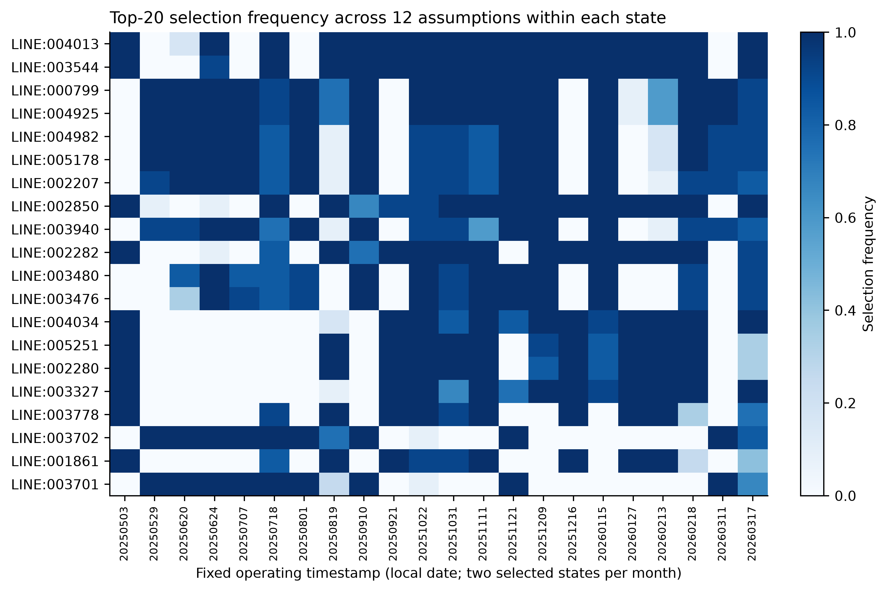

# SimPT60 Supplementary Material — Lean Version

本文件配套 [精简正文](SimPT60_lean.md)。机器可读字段、逐设备审计、完整故障成员、哈希和 replay 命令由仓库数据字典、CSV/JSON 与 release manifest 提供。

**Table S1——原始字段到标准语义。**

| 来源 / 原始字段 | 标准语义或目标字段 | 转换 / 处理 | 关联与缺失规则 |
| --- | --- | --- | --- |
| E-REDES energia | 节点 p_mw | 15 min kWh / 250 → MW | codigo_subestacao 匹配设施；不插值 |
| E-REDES datahora；data / hora | UTC 区间起点 | 终点标签减 15 min；Lisbon → UTC | 重复标签按站平均，记录歧义 |
| REN source_date + source_index | calendar.timestamp_utc | 按 Lisbon 自然日和日内序号建日历 | 序号区分重复小时 |
| REN series_name + value_mw | 分能源 / 负荷 / 储能全国量 | 保留 MW；类型内分配 | 缺失必需序列则案例失败 |
| rede_at_teste.properties.id / tensao_de | source_line_id / voltage_kv | 保留业务键；电压标准化为 kV | 限定本版电压层 |
| 原始 geometry / 坐标 | geo 几何；lon / lat | 存储 WGS 84；距离 EPSG:3763 | 无有效几何须记录 |
| OSM way / relation / power tags | source_id；回路身份；资产类型 | 显式节点分段；保留关系键 | 不以线条相交推定连接 |
| 公开装机与 rating | nameplate_mw / sn_mva | 功率 / 容量单位标准化 | 无公开值则代理并标证据 |
| 归档文件 URL / bytes / hash | provenance.raw_files | SHA-256；相对归档路径 | 保留原始文件定位信息 |

**表注。** 语义表不宣称每个源文件使用同一字段名。main.eredes_load / main.ren_dispatch / raw_eredes.rede_at_teste 字段已在工作主库只读核对；详细原始字段以来源归档为准。

**Table S2——电气参数库。**

| 电压（kV） | r（Ω/km） | x（Ω/km） | c（nF/km） | Imax（kA） | 性质 |
| --- | --- | --- | --- | --- | --- |
| 60 | 0.1093 | 0.368854 | 9.2 | 0.606 | 电压级工程代理 |
| 130 | 0.07 | 0.33 | 9.8 | 0.8 | 电压级工程代理 |
| 150 | 0.06 | 0.32 | 10.0 | 0.85 | 电压级工程代理 |
| 220 | 0.04 | 0.285 | 11.0 | 1.2 | 电压级工程代理 |
| 400 | 0.025 | 0.25 | 12.0 | 2.0 | 电压级工程代理 |

**表注。** 表内是夏季基准默认值，非所有线路的最终值；可匹配公开回路的线路使用逐字段来源覆盖。电缆修正系数 r ×0.65、x ×0.35、c ×20、Imax ×0.90。按季节再施加 Table 7 中的定额倍率。来源 model_config.json。

| 变压器电压组合（kV） | 默认 S（MVA） | vk（%） | vkr（%） |
| --- | --- | --- | --- |
| 400/220 | 450.0 | 12.0 | 0.3 |
| 400/150 | 450.0 | 12.0 | 0.3 |
| 400/60 | 170.0 | 12.0 | 0.35 |
| 220/150 | 250.0 | 12.0 | 0.35 |
| 150/130 | 140.0 | 12.0 | 0.45 |
| 220/60 | 170.0 | 12.0 | 0.4 |
| 150/60 | 170.0 | 12.0 | 0.45 |
| 130/60 | 126.0 | 12.0 | 0.45 |

**变压器表注。** 默认容量与阻抗为工程代理；公开容量优先，分电压组合总容量不足时以 REN 汇总向上校准并保留系数。档位参数见 Table 7；Estoi 等逐设备覆盖值不能被此默认表覆盖。

**Table S3——关键映射与证据字段。**

| 存储位置 | 关键字段 | 解释用途 |
| --- | --- | --- |
| grid.generators | source_id；bus_id；bus_assignment_rule；available_from_utc | 资产来源、母线映射与投运处理 |
| grid.buses | endpoint_match_distance_m；source_status | 区分来源和派生母线 |
| grid.lines | parameter_status；r/x/c/max_i_status | 逐字段参数证据 |
| scenario.load_operating_points | observed_p_mw；ren_residual_p_mw；q_mvar | 区分观测负荷与空间分配残差 |
| monthly_model.audit_bundles | allocation、boundary、loss records | 逐案例分配与守恒审计 |
| provenance.raw_record_locator | entity_id；raw_table；raw_record_id | 派生实体回溯原始记录 |

**表注。** 完整 schema 和字段字典随数据库及 repository documentation 发布。

**Table S4——质量控制与失败处理。**

| 层级 / 检查 | 阈值或条件 | 严重程度 / 行为 | 记录位置 |
| --- | --- | --- | --- |
| 静态 / 标识与端点 | 设备键有效；端点存在 | 阻断无效连接 | 静态审计及 provenance |
| 静态 / 电压与长度 | 同电压连接；长度 >0；无自环 | 阻断无效支路 | 拓扑审计 |
| 静态 / 连通性 | 分量、孤立点、边界清单 | 记录；按范围解释孤立对象 | topology_summary.json |
| 时序 / 必需输入 | UTC 键一致；必需序列存在 | 失败保留错误；不插值 | monthly_model.cases.error |
| 时序 / 负荷守恒 | 节点和与 Consumption + Storage 差 ≤0.11 MW | 不满足则阻断案例 | 案例分配审计 |
| 时序 / 发电容量 | 已投运映射资产 0≤P≤装机 | 超出映射量记显式全国代理 | 发电分配审计 |
| 求解 / AC 收敛 | NR 容差 10⁻⁶ MVA；主流程最多 50 次 | 不收敛保留错误和失败状态 | monthly_model.cases |
| 求解 / 有功闭合 | 记录 Pgen + Pnet − Pload − Ploss | 数值残差报告，不充当外部真值 | audit_bundles；验证汇总 |
| 筛查 / 电压及热 | 0.90–1.10 p.u.；一般 100% 定额 | 标记风险；不删除已完成案例 | cases 与状态数组 |
| 外部 / 缺失与统计口径 | 共同时间 / 地区；成对排除缺失 | 保留异常月份；报告样本数 | 外部比较结果与 CI |
| 写库 / 原子性 | 摘要、数组和审计包同事务 | 失败整体回滚，保留错误 | 月库事务与错误记录 |
| 发布 / 完整性 | 预期、完成、数组、审计包计数一致 | 有失败不发布为完整月份 | run_manifest；文件哈希 |

**表注。** N−1 的电压、线路和变压器阈值另见正文第 5.4 节；主案例质量控制与事故筛查不可混用。

# Supplementary Notes

## Supplementary Note S1 — Data Layers and Joins

**Table S5——主要数据层、粒度与连接键。**

| 数据层 | 粒度 | 主要连接键 | 用途 |
| --- | --- | --- | --- |
| provenance.raw_files / raw_* | 文件 / 来源记录 | artifact_id；raw_record_id | 原始证据与文件指纹 |
| grid.* | 设备 | model_id；设备 ID；bus_id | 静态网络与资产映射 |
| geo.* | 几何对象 | 设备或设施 ID | 空间表达 |
| main.interval_calendar / ren_dispatch / eredes_load | 15 min 区间或原始记录 | timestamp_utc；来源时间键 | 统一时序输入 |
| scenario.*_operating_points | 时点—设备 | model_id；设备 ID；时间键 | 节点输入与边界 |
| monthly_model.cases / state_arrays | 案例 / 案例数组 | case_id；timestamp_utc | 状态摘要与设备结果 |
| monthly_model.audit_bundles / run_manifest | 案例 / 月度运行 | case_id；run_id | 分配审计与完整性 |
| raw_eredes_aux / scenario.annual_nminus1_* | 验证或故障案例 | 地区、设施或时点—元件键 | 外部验证与应用 |

**表注。** 本表只给出逻辑关联。完整表结构、约束和字段类型以发布数据库与 data dictionary 为准。

## Supplementary Note S2 — Release and Model-Version Reconciliation

唯一发布快照为 **SimPT60-2026.09.21-r1**。CORE-3783 固定 31,492 个历史案例使用的 3,783 buses、4,943 lines 和 228 transformers；正文第 3–4 节及参数/空间扰动均对应此模型。N1-3787 仅用于正文 §5.2 和本补充材料的故障分析。

N1-3787 增加四个同址连接节点以拆分 Lanheses–Feitosa 的拓扑表示，五条线路的端点随之改接，线路总数不变。它还将 CORE-3783 中 Estoi 的一个 378 MVA 合并对象拆为三个 126 MVA 并联等值单位，使变压器表由 228 行增至 230 行；三个单位在 N−1 中仍作为一个对称故障组。该表示不证明三个物理设备在所有案例时点同时在运。

版本差异没有回写历史月库。使用者必须按结果选择明确模型变体；完整字段差异、静态和资产文件 SHA-256、环境锁、最小 replay 命令及 22 个回归断面的结果保存在 `release.json`、`SHA256SUMS`、release README 和 `model_field_diff.csv`。

## Supplementary Note S3 — Additional Validation and Sensitivity

参数与空间分配实验使用 22 个代表时点。完整成对统计见 Table S6；主文 Figure 5 只展示排序、Top-20 集合和最大负载率响应。

**Table S6——参数与空间分配敏感性。**

| 方案 | 收敛 / 案例 | ρ 中位 / 最小 | Jaccard 中位 / 最小 | 最大 Δ负载率绝对值（pp） | 损耗率 Δ绝对值中位（pp） |
| --- | --- | --- | --- | --- | --- |
| 共同基准 | 22 / 22 | 1.000 / 1.000 | 1.000 / 1.000 | 0.00 | 0.000 |
| R/X +20%；C −20% | 22 / 22 | 0.9988 / 0.9985 | 0.905 / 0.739 | 6.08 | 0.284 |
| R/X −20%；C +20% | 22 / 22 | 0.9981 / 0.9977 | 0.905 / 0.739 | 6.56 | 0.278 |
| 额定电流 +20% | 22 / 22 | 1.0000 / 1.0000 | 1.000 / 1.000 | 22.98 | 0.000 |
| 额定电流 −20% | 22 / 22 | 1.0000 / 1.0000 | 1.000 / 1.000 | 34.48 | 0.000 |
| 变压器 S −20%、Z +20% | 22 / 22 | 0.9948 / 0.9931 | 0.779 / 0.600 | 17.10 | 0.087 |
| 变压器 S +20%、Z −20% | 22 / 22 | 0.9954 / 0.9950 | 0.818 / 0.538 | 13.78 | 0.058 |
| 边界均匀权重 | 22 / 22 | 0.9971 / 0.9939 | 0.905 / 0.667 | 17.37 | 0.183 |
| 边界电压权重 | 22 / 22 | 0.9967 / 0.9936 | 1.000 / 0.739 | 7.81 | 0.089 |
| 同能源容量分配 | 22 / 22 | 0.9937 / 0.9642 | 1.000 / 0.818 | 1.49 | 0.023 |
| 残差按变压器容量 | 22 / 22 | 0.9962 / 0.9947 | 0.818 / 0.429 | 6.50 | 0.096 |
| 残差按交付点均匀 | 22 / 22 | 0.9963 / 0.9952 | 0.905 / 0.538 | 9.91 | 0.086 |

**表注。** 每个方案 22 个时点。参数组含基准为 154 个，空间组含同一基准为 132 个；去除重复基准后合计 264 个，全部收敛。损耗率定义为网损 / 模型负荷，其变化单位是百分点（pp），并非网损 MW 的相对变化。R/X 与 C 反向扰动，见 parameter_scenarios.json；数值来源 sensitivity_summary.csv。

热点 persistence 在每个时点的 12 个配置中分别计算 Top-20 入选频率。4,943 条线路中 74 条至少入选一次，56 条在至少一个时点的频率达到 0.8；最高跨实验入选率为 207/264=78.4%，不存在跨全部时点和配置稳定入选的线路。

**Figure S1——热点线路在不同假设下的入选频率。** 每格表示一个时点的 12 个配置中进入 Top-20 的比例；完整成员及频率保存在发布 CSV。

整站留出实验以变电站为折分单元，固定五折，比较全局容量比例、五个地理邻站和五个网络邻站。邻站权重为距离倒数，网络距离使用在运线路长度并为变压器边赋极小正值；置信区间对变电站进行簇 bootstrap。完整 fold assignment、逐对预测和复算脚本在 repository validation package 中。

运行代理消融在同一 22 个时点分别改变无功限值、PV 目标、负荷补偿、电抗器和分接控制，共 242 个有效案例。Table S7 报告相对归档基线的最大成对变化。

**Table S7——运行代理消融；最大绝对变化取 22 个成对时点。**

| 配置 | 收敛/尝试 | 最低电压 Δ（p.u.） | 最高线路负载 Δ（百分点） | 最高变压器负载 Δ（百分点） |
| --- | --- | --- | --- | --- |
| 基线 | 22/22 | 0.00000 | 0.000 | 0.000 |
| 旧模型固定中性档 | 22/22 | 0.00000 | 0.000 | 0.000 |
| 停用补偿/电抗器且固定档位 | 22/22 | 0.00917 | 0.248 | 0.892 |
| 停用负荷补偿 | 22/22 | 0.00956 | 0.182 | 0.890 |
| 停用 5 个电抗器 | 22/22 | 0.00090 | 0.229 | 0.176 |
| PV 目标 0.99 | 22/22 | 0.01120 | 1.370 | 0.762 |
| PV 目标 1.01 | 22/22 | 0.01117 | 1.337 | 0.740 |
| 无功限值 ×1.5 | 22/22 | 0.00975 | 0.351 | 0.489 |
| 无功限值 ×0.5 | 22/22 | 0.02845 | 1.419 | 0.423 |
| 有效 Ratio 分接器及调压 | 22/22 | 0.00903 | 0.032 | 4.305 |
| 有效 Ratio 分接器但固定中性档 | 22/22 | 0.00000 | 0.000 | 0.000 |

## Supplementary Note S4 — Detailed Contingency Diagnostics

定向诊断在一个压力断面上筛查 50 个高负载物理线路回路和 20 个在运变压器。67/70 个案例在既定无功边界下收敛，66 个通过全部筛查；3 个北部线路案例只在放宽无功边界后获得诊断解并伴随热越限，1 个径向回路形成实质失供孤岛。该实验用于核查故障建模和结果类别，不替代正文六时点全元件面板。

**Figure S2——定向交流 N−1 响应。** 圆点和方点为通过筛查的线路与变压器案例，叉号为仅有诊断解的案例，三角形为实质孤岛；虚线表示连续定额和电压筛查边界。

正文全元件面板在六个时点使用相同的 1,649 个故障组。选择与排除规则见 Table S8；完整 ID、成员哈希、端点状态和逐案例输出保存在 `nminus1_exclusions.csv` 及结果库。

**Table S8——代表时点 N−1 故障集合。**

| 层次 | 数量 | 规则 |
| --- | ---: | --- |
| 原模型线路分段 | 4,943 | 保留串联分段，不按行等同物理回路 |
| 排除线路 | 172 | 156 停运、2 站内母排、14 无有效基准结果 |
| 入选线路分段 | 4,771 | 在运、非母排且结果有限 |
| 线路故障组 | 1,421 | 串联分段共同操作；并行等值单回退出 |
| 变压器故障组 | 228 | 230 个单位；Estoi 三台构成一个对称组 |
| 每时点故障数 | 1,649 | 六个时点成员完全相同 |

**表注。** “无有效基准结果”不是零电流或未带电；完整状态需结合在运标记、连通性和解状态判断。

原增量诊断要求主潮流收敛、无实质孤岛，且相对本时点 N−0 不新增电压或热违规。它不能识别已有线路越限进一步恶化。对故障 \(k\)、时点 \(t\)，已有违规集合中同一物理回路的最大正向变化定义为

\[
W(k,t)=\max_{c\in O_0(t)}\max\left[0,L_k(c,t)-L_0(c,t)\right].
\]

Table S9 使用 1 个百分点作为诊断容差；该指标补充而不替代绝对通过数。

**Table S9——已有线路违规的恶化；百分点阈值为研究诊断容差。**

| 时点 | 原违规回路 | W>1 pp 案例 | 最大 W（pp） | 旧增量通过但 W>1 pp | 增量通过且 W≤1 pp |
| --- | --- | --- | --- | --- | --- |
| 最大净出口 | 0 | 0 | 0.000 | 0 | 1527 |
| 最大净进口 | 0 | 0 | 0.000 | 0 | 1455 |
| 最大光伏 | 0 | 0 | 0.000 | 0 | 1526 |
| 最大风电 | 3 | 23 | 114.924 | 17 | 1485 |
| 最低负荷 | 0 | 0 | 0.000 | 0 | 1538 |
| 最大负荷 | 1 | 20 | 15.023 | 15 | 1501 |
