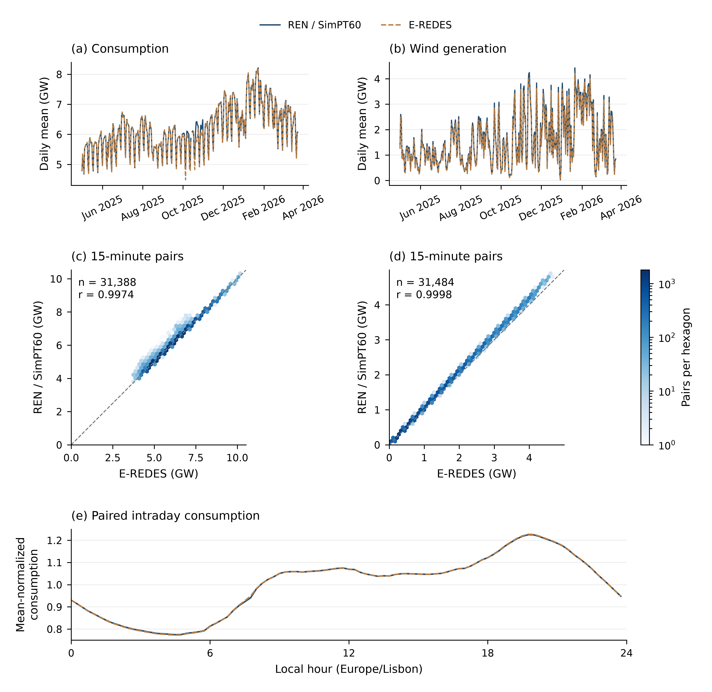
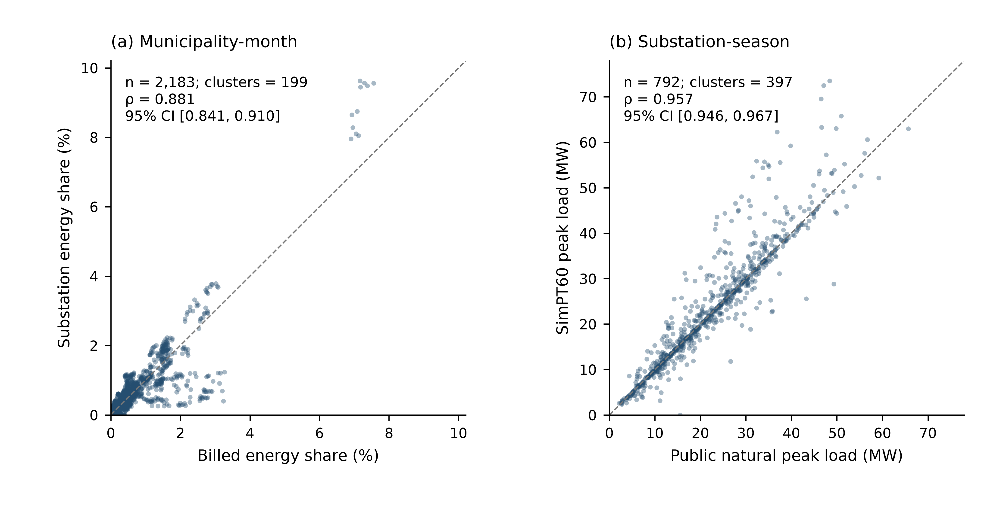
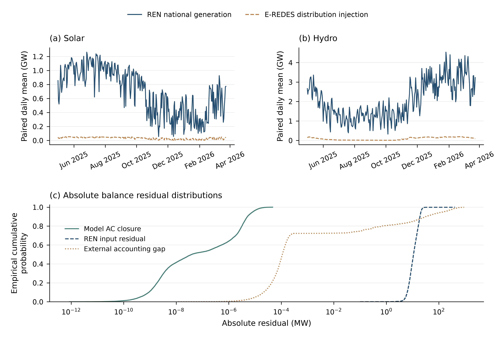
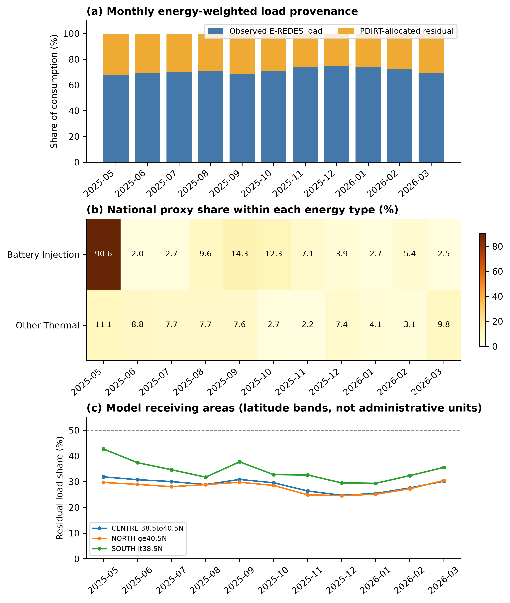

# SimPT60—A Traceable Public-Data-Derived Dataset of the Portuguese High-Voltage Power System with Time-Indexed Power-Flow Cases


# Abstract

公开电网数据往往分别提供网络几何、设备属性或聚合运行量，难以直接形成连续的潮流案例。本文构建 SimPT60，将多源记录整合为覆盖葡萄牙大陆 60–400 kV 网络及葡西互联边界的研究数据集。通过来源归档、网络重建、资产—母线映射、时间对齐和节点功率分配，生成 2025-05-01 至 2026-03-24 的 31,492 个 15 分钟交流潮流案例，并保存输入、处理规则和结果之间的关联。

外部比较使用未参与节点功率构建的 E-REDES 辅助数据产品，检验聚合时间变化和空间分布。全国负荷在 31,388 个配对区间上的 Pearson 系数为 0.997；六个代表时点的全元件 N−1 实验完成 9,894 个案例，其中 9,888 个在既定无功边界下收敛。这些结果支持数据集的聚合时空一致性和计算可用性，为时序潮流、相对风险筛查及情景分析提供数据基础，但不构成设备级准确性验证。

**Keywords：** power system dataset; Portugal; public data; grid reconstruction; power flow; time series; provenance; cross-source validation

------

# 1. Introduction

研究葡萄牙电网的时序潮流和运行风险，需要同时获得网络拓扑、设备资产、运行时序和潮流状态。现有开放数据满足了其中的部分需求：PyPSA-Eur 提供面向欧洲系统优化的输电网模型 ([Hörsch et al., 2018](#ref-Horsch2018))；已有欧洲高压电网重建研究主要覆盖 220 kV 及以上交流网络 ([Xiong et al., 2025](#ref-Xiong2025))；SimBench 联合多电压等级网络和时间序列，但表示的是德国代表性系统 ([Meinecke et al., 2020](#ref-Meinecke2020))。这些数据仍不能直接提供葡萄牙 60–400 kV 地理网络与 15 分钟运行状态之间的对应关系。

**Table 1——与既有公开模型的范围及可追溯性比较。**

| 维度 | PyPSA-Eur | SimBench | SimPT60 |
| --- | --- | --- | --- |
| 地理对象 | 欧洲 ENTSO-E 区域真实网络重建 | 德国代表性基准网络 | 葡萄牙大陆及葡西边界重建 |
| 电压范围 | 交流 ≥220 kV；HVDC | 低压至超高压，多电压等级 | 60、130、150、220、400 kV |
| 时间组织 | 小时级需求/可再生可用率；可聚合 | 全年 15 min 负荷/发电剖面 | 2025-05-01—2026-03-24；15 min |
| 可计算性 | PyPSA 优化与运行研究模型 | 潮流基准与标准化算例 | 31,492 个归档交流潮流案例 |
| 参数证据 | 公开网络/资产与类型假设；流程公开 | 代表性网络设计与类型参数 | 逐字段区分直接来源、转用和工程代理 |
| 来源追踪 | 数据源、版本和构建工作流 | 文档、网络代码、剖面标识 | 原始文件哈希、稳定对象 ID、案例审计包 |
| 用途边界 | 欧洲系统规划；不覆盖葡萄牙 60 kV 配网 | 可比性基准；不表示葡萄牙真实地理 | 聚合一致性与代理筛查；不等于设备遥测 |

比较依据原论文及官方文档：PyPSA-Eur ([Hörsch et al., 2018](#ref-Horsch2018); [官方说明](https://pypsa-eur.readthedocs.io/en/latest/))；SimBench ([Meinecke et al., 2020](#ref-Meinecke2020); [文档 v1.0.0](https://simbench.de/wp-content/uploads/2020/01/simbench_documentation_en_1.0.0.pdf))。官方网页核对日期为 2026-09-21；本表比较用途与数据组织，不作“首次”或完整性排名。

## 1.1 Motivation

葡萄牙的能源与气候规划将可再生能源、储能、电气化和跨境互联列为转型路径 ([DGEG, 2024](#ref-DGEGPNEC2030Revision2024))。新技术、新设备和新政策会改变发电与负荷的时空分布，进而影响线路潮流、节点电压和系统运行风险。评估这些影响，需要同时描述电网结构和连续运行状态的数据基础。

葡萄牙的相关记录分散在 E-REDES、REN、DGEG、ERSE 和开放地理数据平台，来源及用途见第 2.1 节与 Table 3。不同来源的空间范围、时间分辨率和字段定义并不一致；形成可求解案例还需要重建拓扑、补充电气参数、连接资产与母线，并把聚合运行量分配到节点。

因此，本研究的目标是建立一个可追溯、可计算且带有连续时间案例的葡萄牙高压电网数据集，为时序潮流、电网风险筛查和方法比较提供统一的数据基础。

## 1.2 Introducing SimPT60

为弥补上述缺口，本文提出 SimPT60，一个基于多源公开数据重建的葡萄牙大陆高压电网数据集。建模范围覆盖 60、130、150、220 和 400 kV 网络，并保留表示葡西互联所需的边界节点。数据库分层存储原始来源、静态网络、时序输入、潮流结果和验证记录，使用者可以追踪关键字段的来源和处理规则。

该数据集保留来源记录的地理对应；缺失连接、电气参数和节点运行量则由明确记录的规则补充。原始记录、派生对象及验证结果分层保存，支持回溯关键字段的证据。因此，SimPT60 应被理解为重建研究数据集，其用途边界见第 4.6 和 5.7 节。


**Table 2——SimPT60 的范围与数据产品。**

| 维度 | 范围或产品 | 解释边界 |
| --- | --- | --- |
| 空间 | 葡萄牙大陆；葡西边界端点 | 不含岛屿及低于 60 kV 的配网 |
| 电压 | 60、130、150、220、400 kV | 多来源公开数据重建 |
| 时间 | 2025-05-01 至 2026-03-24；15 min | Europe/Lisbon 自然日；UTC 对齐 |
| 静态网络 | 母线、线路、变压器、资产和几何 | 公开连接证据与工程代理并存 |
| 运行案例 | 31,492 个稳态交流潮流案例 | 模型计算状态，不是设备遥测 |
| 分发与追踪 | 主库、11 个月库、原始记录定位与来源哈希 | 来源许可与发布快照需分别管理 |
| 验证与应用 | 外部时空比较、扰动实验、压力情景及 N−1 | 聚合一致性不能证明设备级真值 |

**表注。** 范围、构建规则与数据产品分别见第 1–3 节。

本文其余部分如下：第 2 节介绍 SimPT60 的数据来源与构建方法；第 3 节概述静态网络、时序和潮流案例；第 4 节报告验证结果；第 5 节给出应用示例和 N−1 筛查；第 6 节总结本文。


------

# 2. Methodology

SimPT60 的构建包括五个步骤：归档并标准化公开数据；重建 60–400 kV 静态网络；将资产和运行记录映射到统一的 15 分钟时间轴；逐区间生成并求解交流潮流；分层保存结果并执行质量检查。


## 2.1 Public Data Scope and Standardization

### 2.1.1 Scope and Sources

空间、电压与时间范围见 Table 2。共同建模窗口由已归档且可同步的 E-REDES 与 REN 输入决定；静态资料的版本与运行时序的覆盖日期分别记录。

网络几何主要来自 E-REDES 的 60/130 kV 线路与设施 ([E-REDES, n.d.-f](#ref-EREDESRND2026))，以及 OSM/Geofabrik 的 150/220/400 kV 网络和部分资产 ([OpenStreetMap contributors, n.d.](#ref-OSM2026); [Geofabrik GmbH, n.d.](#ref-GeofabrikPortugal2026))。DGEG 地理记录用于补充发电资产 ([DGEG, n.d.](#ref-DGEGGeo2026))；APA 项目记录用于接入合理性核查：AIA 3403（2021 年 7 月，PDF 第 5 页）记载 Trancoso 的 60 kV、11.4 km 送出线；PPA 421 与 PPA 407 的“项目名称”字段分别记载 Sernancelhe–Moimenta 60 kV 和 Douro Sul–Armamar 400 kV 连接 ([APA, 2021](#ref-APA3403); [APA, n.d.-a](#ref-APAPPA421); [APA, n.d.-b](#ref-APAPPA407))。两份 PPA 网页的投运日期均空缺，不能据此赋予历史可用性；这些证据支撑接入审计变体，不表示核心快照的最近母线映射已经逐项改正。Casal da Cortiça 储能的容量和接入月份依据 DGEG 项目记录 ([DGEG, 2025](#ref-DGEGCasal2025))。

REN 提供全国运行序列 ([REN, n.d.](#ref-RENDataHub2026))，E-REDES 提供变电站电量 ([E-REDES, n.d.-f](#ref-EREDESRND2026))。PDIRT（Plano de Desenvolvimento e Investimento da Rede Nacional de Transporte，国家输电网发展与投资规划）提供交付点参考剖面及输电设备资料 ([REN, 2024](#ref-ERSEPDIRT2024))，PDIRD（Plano de Desenvolvimento e Investimento da Rede Nacional de Distribuição，国家配电网发展与投资规划）提供部分配电回路与参数证据 ([E-REDES and ERSE, 2020](#ref-EREDESPDIRD2020AnnexB))；REE《Interconexiones eléctricas》（2012 年 9 月，第 10 页）仅用于历史互联走廊名称对照，不能证明案例日期的投运、检修状态或全部回路身份 ([REE, 2012](#ref-REE2012))。模型的 7 个边界母线代表 9 回 220/400 kV 回路等值，未纳入的较低电压互联不能算作不存在。

GISCO 用于大陆边界裁剪 ([Eurostat GISCO, 2024](#ref-GISCO2024))。E-REDES 辅助统计用于外部比较，具体产品见第 4 节。OpenInfraMap 与 OSM 同源，仅用于地图显示核对 ([OpenInfraMap contributors, n.d.](#ref-OpenInfraMap2026))。

**Table 3——公开数据来源、覆盖范围与角色。**

| 发布方 / 产品 | 空间或时间覆盖 | 关键内容 | 本研究角色 |
| --- | --- | --- | --- |
| E-REDES / RND AT | 大陆 60/130 kV；归档快照 | 线路、设施、代码、几何 | 网络构建 |
| OSM / Geofabrik | 大陆及葡西边界；归档快照 | 150/220/400 kV 设施、way、relation | 网络与资产构建 |
| DGEG；APA；项目公告 | 电厂、储能及接入记录 | 位置、能源、装机、投运时间 | 资产补充及证据 |
| REN / Data Hub | 共同窗口内 15 min；15 序列 | 消费、发电、储能、进口及出口 | 消费 / 发电为输入；交换留出验证 |
| E-REDES / 变电站电量 | 397 站；15 min；共同窗口 | 设施代码、区间结束标签、kWh | 直接节点负荷 |
| ERSE / PDIRT；PDIRD | 归档规划与设备清册 | 交付点剖面、回路长度、导线与额定值 | 残差空间权重；部分参数证据 |
| REN / REE 地图及统计 | 输电网络与葡西互联；归档版本 | 回路数、线路长度、变压器汇总容量 | 连接清单、校准和背景对照 |
| GISCO / 2024 国界 | 葡萄牙大陆 | 国家边界几何 | 空间裁剪与制图 |
| E-REDES / 辅助统计 | 14 数据集；15 min / 月 / 季节 | 消费、配网注入、市镇及季节负荷等 | 外部比较；不参与节点功率构建 |
| OpenInfraMap | 基于 OSM 的地图显示 | 电网显示图层 | 仅可视核对，与 OSM 非独立来源 |

**表注。** 建模共同窗口为 2025-05-01 至 2026-03-24；静态资料的归档版本以 provenance.raw_files 为准，不能将共同窗口解释为所有静态资料的观测日期。来源入口见 [数据来源说明](PT60_DATA_DOCUMENTATION_CN.md)。

### 2.1.2 Archiving and Standardization

原始文件按来源不可变归档，并保存来源链接、下载时间、文件大小和 SHA-256；处理流程只读访问原始层。坐标统一为 WGS 84，经距离运算时转换到葡萄牙国家投影；电压、功率、电量和距离分别统一为 kV、MW/Mvar、kWh 和 km。E-REDES 的 15 分钟电量按

\[
P_{\mathrm{MW}}=\frac{E_{\mathrm{kWh}}}{250}
\]

转换为区间平均功率。时间同时保存 Europe/Lisbon 本地值和 UTC 值，设备则使用来源编号生成稳定标识符。所有派生对象保留来源键和处理状态。

补充表 [S1：原始字段与标准化](PT60_Sep16_SUPPLEMENTARY_TABLES.md#supplementary-table-s1)。

## 2.2 Static Network Reconstruction

静态网络表示为

\[
G=(B,L,T),
\]

其中 \(B\)、\(L\) 和 \(T\) 分别为母线、线路和变压器。连接按“来源关系—电压一致性—受限空间匹配”的顺序建立，避免把地图上的接近或交叉直接解释为电气连接。

### 2.2.1 Buses and Lines

60/130 kV 线路优先采用 E-REDES，150/220/400 kV 线路和设施主要采用 OSM，并与 REN 线路统计核对。重复 E-REDES 设施、与永久站相距 250 m 内的移动设施，以及同名共址的站点被规范化，并保留归并清单。

线路端点按电压分组，在 EPSG:3763 坐标中将 75 m 内的端点聚为同一节点；不同电压层不会合并。端点簇在同电压下匹配 250 m 内的设施，否则生成派生连接母线。OSM 线路只在 way 端点或显式共享节点处分段，几何交叉不形成连接；`circuit` 和 `line_section` 关系用于恢复回路身份。并行回路被保留，自环和非正长度支路进入阻断清单。

### 2.2.2 Transformers and Parameters

变压器按三类证据生成：OSM 显式变压器在 1 km 内匹配高低压母线；同一 OSM 变电站的相邻电压层生成共址变压器；RARI（Regulamento do Acesso às Redes e às Interligações do Setor Elétrico，电网及互联接入规章）边界名称与设施在 5 km 内匹配，必要时回退到高压站 1 km 内的 60 kV 端点。公开 `rating` 优先作为容量，其余容量和阻抗使用电压组合代理；分电压组合总容量不足时，以 REN 汇总容量向上校准，并保留校准系数 ([REN, n.d.](#ref-RENDataHub2026))。

线路参数包括 \(r\)、\(x\)、\(c\) 和 \(I_{\max}\)。60 kV 支路以长度加权最短路径匹配 PDIRD 公开回路清册 ([E-REDES and ERSE, 2020](#ref-EREDESPDIRD2020AnnexB))，仅接受拓扑长度与来源长度之比为 0.65–1.60 的路径；其余线路采用分电压参数库和电缆修正系数。每个参数分别标记为直接公开值、公开资料推导值、汇总校准值或工程代理值。其中，电阻的部分来源支撑来自导线类型对应的技术参数推导 ([EDP Distribuição, 2019](#ref-Tocha2019))。

生成后检查设备键、端点、正长度、电压一致性、连通分量和葡西边界清单，并将 150/220/400 kV 线路长度与 REN 统计比较。参数完整表示模型可计算，不表示全部参数为运营商实测值。


Figure 1 示意连接判定，Table 4 汇总阈值与未匹配处理。


**Figure 1——静态网络重建中的连接规则。** (a) 同电压端点聚类与设施匹配；(b) 区分几何交叉和显式共享节点；(c) 保留串联分段与并行回路身份；(d) 根据显式资产、同址设施和 RARI 边界证据连接不同电压层。图为抽象电气示意，不表示真实设备坐标；距离阈值及回退规则见 Table 4。


**Table 4——拓扑规则与阈值。**

| 对象 / 步骤 | 规则或阈值 | 约束 / 未匹配处理 |
| --- | --- | --- |
| 距离坐标 | EPSG:3763；单位 m | 经纬度存储采用 WGS 84 |
| 端点聚类 | 同电压内 75 m | 不同电压不合并 |
| 设施绑定 | 同电压设施 250 m | 未匹配则生成派生连接母线 |
| 设施归并 | 重复设施、同名共址；移动设施距永久站 250 m 内 | 保留归并记录 |
| OSM 分段 | way 端点或显式共享节点 | 几何交叉不自动形成连接 |
| 回路身份 | circuit / line_section；保留并行回路 | N−1 按物理回路处理串联分段 |
| 显式变压器 | 高低压母线在 1 km 内匹配 | 保持电压层一致性 |
| 共址变压器 | 同一 OSM 站内相邻电压层 | 派生连接；保留证据等级 |
| RARI 边界 | 名称与设施在 5 km 内匹配 | 可回退到高压站 1 km 内 60 kV 端点 |
| PDIRD 参数路径 | 长度加权最短路；模型 / 来源长度 0.65–1.60 | 路径不符合则使用电压级代理 |
| 阻断检查 | 自环、非正长度、端点或电压冲突 | 记录并阻断无效支路 |

**表注。** 依据第 2.2 节与 model_config.json。所有距离均为投影平面距离；这些是重建规则，非运营商公开精度保证。


补充表 [S2：电气参数库](PT60_Sep16_SUPPLEMENTARY_TABLES.md#supplementary-table-s2)。


### 2.2.3 Evidence Applicability and Historical Availability

四处原缺失引用已形成逐项证据表 `citation_evidence_ledger.csv`，包含文档版本、文件 SHA-256、PDF 页与印刷页、适用设备、字段和未被来源支持的推断。APA AIA 3403 对应 GEN:01017/01018 的 Trancoso 送出走廊；PPA 421 对应 GEN:01099/01100 的 Sernancelhe–Moimenta 接入。将后一接入压缩到 Moimenta 的 400 kV 母线仍是集电网络等值，不能由“60 kV 接入”记录直接证明。

导线电阻依据 2019-02-19 的 PE Tocha II–Tocha 60 kV 项目说明（工程号 2800-19C007374），PDF 第 3、5 页，印刷第 2、4 页。文档给出的 ACSR 导线总截面为 326.1 mm²、铝截面 264.4 mm²、钢截面 61.7 mm²，20°C 电阻为 0.1093 Ω/km。现有代码以名义截面 A 按 R=0.1093×325/(A n) 转用，n 由“2x”前缀取 2，否则取 1，再按串联段长度加权。该截面缩放、前缀解释及向其他导线族的转用均为工程假设；没有逐线验证交流效应、运行温度、材质或束导线含义。核心库中 1,517 行的历史 `CONDUCTOR_DERIVED` 标签因此在发布的 `resistance_evidence_overlay.csv` 中统一降级为“项目参数转用工程假设”，另 3,426 行继续标为工程代理。原始数值和字节哈希不变，不能再将前者计作直接电阻观测。

Estoi 的三台 126 MVA、150/60 kV 设备可在 REN PDIRT 2016–2025 规划附件 6 的 PDF 第 50、52、54、56 页（印刷第 8、10、12、14 页）逐项核对，分别对应计划的 2016、2018、2020、2025 年末清册 ([REN, 2015](#ref-REN2015Estoi))。这支持 378 MVA 的计划库存及电压组合，但同母线、相同参数、同时可用的三台并联等值仍是 N−1 模型假设。没有单位级投运与开关记录，不能把“2025 年末”当作实际投运日期。

静态来源的下载版本与案例历史日期分别管理。仅存在明确日期规则的资产按时点切换；其余静态线路、变压器并未完成逐设备历史回溯。Table 5 列明可用性处理，因此本文应称为“在冻结静态网络上施加历史输入的案例”，而不是历史网络状态的完整重演。
**Table 5——来源版本、有效日期、投运状态和未知处理。**

| 对象 | 来源版本 | 有效日期证据 | 案例处理与限制 |
| --- | --- | --- | --- |
| E-REDES / OSM 线路 | 来源文件哈希冻结 | 多数没有设备有效日期 | 原静态在运标记固定；普通线路不按历史时点回溯 |
| 变压器 / RARI / REN | 核心 228 行；N−1 单列修正 | 缺少单位级历史 | 容量和接入固定；Estoi 三台同时可用是等值假设 |
| Minho–Galicia 新互联 | REE 2026-07-02 公告 | 2026-07-02，日分辨率 | 两行 LINE:009732/009814 在所有研究案例中停用 |
| 其他葡西互联 | 冻结 7 边界、9 回路等值 | 无检修及开关历史 | 保持固定；2012 年地图只核对名称 |
| PDIRD / PDIRT 参考 | 2020-07 / 2024-12 规划资料 | 清册/季节剖面，非实测时点 | 参数和残差权重代理；不据此推断实时投运 |
| 发电/储能 | 冻结 1,190 行清单 | 366 行有日期、824 行缺失 | 已知日期门控；未知按可用并标记 |
| Casal da Cortiça BESS | DGEG 2025-06-18 项目记录 | 仅确认 2025 年 6 月接网 | 6 月 1 日为月初代理；12 MVA→12 MW 假设功率因数 1 |

新互联投运日依据 [REE 官方公告](https://www.ree.es/es/sala-de-prensa/actualidad/nota-de-prensa-interconexiones/2026/07/espana-y-portugal-inauguran-la-nueva-interconexion)。完整字段、规则与版本见 `source_availability_matrix.csv`。BESS 的确切日和实际功率因数未公开，其不确定性最多影响该 12 MW 资产的空间分配及 6 月上旬可用性，不改变强制守恒的全国发电总量。

## 2.3 Asset Mapping and Time-Series Alignment

### 2.3.1 Asset Mapping and Calendar

发电与储能清单由 OSM、DGEG 和项目证据构成。相距 3 km 内且容量一致的电厂—机组重复表示被合并；DGEG 风电替代不完整的 OSM 风电容量，未与 OSM 重复的 DGEG 光伏作为补充。资产优先采用公开接入证据，其次采用声明电压，最后进行受限空间匹配。未声明电压时，容量不低于 100 MW 的资产只搜索 150 kV 及以上母线，其余搜索 60 kV 及以上母线，最大距离为 20 km。超出范围的资产保留但不注入网络。投运日期晚于案例时点的资产不可用；日期缺失的资产视为可用并明确标记。

统一日历以 `interval_start_utc` 为时间键。REN 标签表示区间起点，E-REDES 标签表示区间终点：

\[
t_{\mathrm{E\text{-}REDES}}=t_{\mathrm{REN}}+15\ \mathrm{min}.
\]

日历按 Europe/Lisbon 自然日生成，因此夏令时开始日和结束日分别含 92 和 100 个区间。REN 日内序号可区分重复小时；E-REDES 无折叠标识，重复标签按变电站取平均并标记为歧义。缺失时点不插值。

### 2.3.2 Load, Generation and Storage

E-REDES 电量按设施代码映射到母线，并转换为节点负荷。全国未观测剩余量为

\[
R_t=P^{\mathrm{REN}}_{\mathrm{consumption},t}
-\sum_j P^{\mathrm{EREDES}}_{j,t}.
\]

\(R_t\) 按相应季节中最接近当时全国负荷的 PDIRT 公开参考剖面分配到已映射交付点 ([REN, 2024](#ref-ERSEPDIRT2024))：

\[
w_{j,t}=
\frac{P^{\mathrm{PDIRT}}_{j,r(t)}}
{\sum_{k\in\mathcal{M}}P^{\mathrm{PDIRT}}_{k,r(t)}},
\qquad
P^{\mathrm{res}}_{j,t}=w_{j,t}R_t.
\]

该剖面只提供空间权重，不改变 15 分钟时间分辨率。E-REDES 负荷在无无功观测时采用 0.97 功率因数，剩余负荷保留 PDIRT 的 \(Q/P\) 关系。抽水和电池充电按已映射储能容量分配，剩余量进入显式全国代理。节点负荷之和必须回到 REN 的 `Consumption + Storage`，容差为 0.11 MW。

REN 分能源发电量分配给能源类型一致、已映射且已投运的资产，并限制 \(0\le P_{g,t}\le P_g^{\mathrm{nameplate}}\)。水电和天然气采用确定性的容量优先规则，其余类别按可用容量分配。超过已映射容量的量作为 `UNMAPPED_NATIONAL_RESIDUAL_PROXY` 注入指定 400 kV 代理母线，不解释为缺失电厂的真实位置。

REN 进口与出口在同一日历上对齐，但作为留出验证量，不用于强制设置边界功率。求解前检查时间键、必需序列、映射完整性、负荷与发电守恒以及容量限制。


**Table 6——资产映射与时序转换规则。**

| 处理对象 | 规则 | 审计或保守处理 |
| --- | --- | --- |
| 资产去重 | 3 km 内且容量一致的电厂—机组归并 | 保留层级去重状态 |
| 母线映射 | 公开接入 → 声明电压 → 受限最近母线 | 最大距离 20 km；超出保留但不注入 |
| 无电压声明的资产 | 容量 ≥100 MW 搜索 ≥150 kV；其余 ≥60 kV | 不把空间接近当作连接真值 |
| 投运状态 | 投运日期晚于时点则停用 | 缺失日期视为可用并标记 |
| 时间标签 | REN 为起点；E-REDES 为终点，减去 15 min | 共同逻辑键：UTC 区间起点 |
| 夏令时 / 缺失 | Lisbon 自然日 92 / 96 / 100 区间 | 重复 E-REDES 标签按站平均并标记；不插值 |
| 电量转功率 | P(MW)=E(kWh)/250 | 15 min 区间平均值 |
| 直接负荷与残差 | E-REDES 观测 + PDIRT 加权 REN 消费差额 | 无功缺测时 pf=0.97；残差保留 Q/P |
| 抽水与电池充电 | 正值作为电气负荷；按映射储能容量分配 | 总负荷回到 Consumption + Storage |
| 能源发电分配 | 同能源、已映射、已投运且受装机上限约束 | 水电 / 燃气容量优先；其余容量比例 |
| 未映射发电剩余量 | 显式全国代理母线注入 | 不得解释为真实缺失电厂位置 |
| 跨境交换 | REN 进口 / 出口仅作求解后比较 | 边界注入由初次模型求解确定 |

**表注。** 依据第 2.3–2.4 节。实际 calendar / monthly 字段名是 timestamp_utc；interval_start_utc 是本文对时间语义的描述。


补充表 [S3：映射与分配审计字段](PT60_Sep16_SUPPLEMENTARY_TABLES.md#supplementary-table-s3)。


## 2.4 Time-Indexed Case Generation and AC Power Flow

每个 15 分钟时点构成一个稳态案例

\[
C_t=(G,\theta,X_t,S_t,U_t,B_t),
\]

其中静态网络 \(G\) 和参数 \(\theta\) 在案例间共享，\(X_t\)、设备状态 \(S_t\)、控制 \(U_t\) 和边界等值 \(B_t\) 随时间更新。主数据集逐区间生成案例；第 4–5 节的敏感性与应用实验另行选择代表时点。

### 2.4.1 Case Assembly and Solution

线路热定额相对夏季基准采用月度代理系数：5–9 月为 1.00，3–4 月和 10–11 月为 1.10，12–2 月为 1.15。非电池发电母线在已映射装机不低于 20 MW 且电压不低于 60 kV 时设为 PV 节点，目标为 1.0 p.u.，无功限值为总装机的 \(\pm50\%\)；其余采用 PQ 模式。负荷补偿以功率因数 0.98 为目标，单母线上限为 15 Mvar；五个 400 kV、150 Mvar 电抗器作为明确标记的代理设备。

初始葡西边界均设为 1.0 p.u.、\(0^\circ\) 的外部电网。第一次潮流得到模型初步净交换后，仅保留一个角度参考点，其余边界按

\[
\omega_i=V_iN_i,\qquad
P^{\mathrm{eq}}_{i,t}=
\frac{\omega_i}{\sum_j\omega_j}P_t^{(0)}
\]

转换为固定有功等值，其中 \(N_i\) 为公开回路数。REN 同期交换只用于求解后的误差计算。

交流潮流使用 pandapower 实现的 Newton–Raphson 算法 ([Thurner et al., 2018](#ref-Thurner2018))。本研究采用直流初始化、最大 50 次迭代、容差 \(10^{-6}\) MVA，并执行无功限值。边界重构后再次求解，再以 1.25% 步长、\(-8\) 至 \(+8\) 档调整高压侧分接，使低压侧尽量保持在 0.985–1.015 p.u.，最多 16 轮。输出包括收敛状态、电压范围、线路和变压器负载率、模型交换和分范围损耗；REN 月度 RNT 损耗与交换均作为外部比较量。

### 2.4.2 Monthly Execution

案例按自然月并行计算。工作进程只读挂载输入 DuckDB，独立求解并生成临时压缩数组；父进程作为唯一写入者，在一个事务中保存案例摘要、状态数组和审计包。重新运行时跳过已完成案例并重算失败或缺失案例。

月度清单保存输入数据库、静态模型和资产表的 SHA-256，以及预期、完成和失败案例数。完整月份在本地 SSD 完成并检查点后，才复制到目标数据库；复制计数核对通过后原子发布。存在失败时保留已完成结果，但不发布为完整月份。


**Table 7——案例与求解器设置。**

| 项目 | 数值或规则 | 性质 |
| --- | --- | --- |
| 季节线路定额 | 5–9 月 ×1.00；3–4、10–11 月 ×1.10；12–2 月 ×1.15 | 夏季基值上的工程代理 |
| PV 门槛 | 非电池；母线已映射装机 ≥20 MW 且电压 ≥60 kV | 电压控制代理；其余 PQ |
| PV 电压 / 无功 | 1.0 p.u.；Q 限值为 ±0.50 × 装机 MW（Mvar） | 统一代理，非机组能力曲线 |
| 负荷补偿 | 目标 pf=0.98；单母线上限 15 Mvar | 工程代理 |
| 并联电抗器 | 5 × 150 Mvar；400 kV | 明确标记的代理设备 |
| 初次边界 | 1.0 p.u.，0° 外部电网 | 用于获得模型初步交换 |
| 重构边界 | 单一角度参考；其余按电压 × 公开回路数分配 | 不以 REN 实测交换校准 |
| AC 算法 | pandapower Newton–Raphson；DC 初始化 | 数值设置 |
| 收敛控制 | 最大 50 次；容差 10⁻⁶ MVA；执行 Q 限值 | 数值设置 |
| 变压器分接 | 高压侧 ±8 档；每档 1.25%；最多 16 轮 | 推断控制 |
| 分接目标带 | 低压侧 0.985–1.015 p.u. | 调压目标，非数据筛选门限 |
| 一般风险筛查 | 电压 0.90–1.10 p.u.；负载率 100% | 越限保留；N−1 另用第 5.4 节阈值 |

**表注。** 依据 model_config.json、第 2.4 节与月度执行程序。N−1 诊断和补救搜索属于独立实验，其迭代或控制设置不得替代主案例设置。


## 2.5 Layered Storage, Provenance and Quality Control

### 2.5.1 Database and Provenance

主 DuckDB 按来源保存 `raw_eredes`、`raw_dgeg`、`raw_osm`、`raw_reference`、`raw_documents` 和 `raw_eredes_aux`；`grid` 与 `geo` 保存静态网络和几何，`scenario` 保存资产运行点，`main` 保存统一日历及运行时序，`provenance` 保存文件和实体血缘。

每个月使用独立结果库。`monthly_model.cases` 每时点一行，保存状态、时间、摘要指标和完整结果 JSON；`bus_order`、`line_order` 与 `state_arrays` 以固定设备顺序保存母线电压和线路负载率数组；`audit_bundles` 保存负荷、发电、边界、热点和损耗记录。展开视图可将数组恢复为设备长表。静态模型在月库中只复制一次，而不是随每个案例重复保存。

来源记录包含 URL、归档路径、文件大小和 SHA-256；`table_lineage`、`raw_record_locator` 和 `entity_evidence` 分别提供表级、记录级和证据级追踪。月度 `run_manifest` 保存输入文件指纹和案例计数。

### 2.5.2 Quality Control and Recovery

质量控制包括四层：静态层检查键、端点、电压、长度、连通性和边界清单；时序层检查时间对齐、来源完整性、负荷与发电守恒及容量限制；求解层检查收敛、电压、负载率和有功平衡

\[
\varepsilon_t=
P_t^{\mathrm{gen}}+P_t^{\mathrm{model,net}}
-P_t^{\mathrm{load}}-P_t^{\mathrm{loss}};
\]

外部层使用未参与节点建模的 E-REDES 全国、市镇、变电站、生产和注入统计，并结合 REN 交换与月度损耗进行比较。0.90–1.10 p.u. 和 100% 负载率仅作为风险筛查阈值，越限案例不会被删除。

一个案例的摘要、数组和审计包在同一事务内提交，失败则整体回滚并保留错误记录。月度正式发布前，来源和副本的完成案例数、数组数和审计包数必须一致。上述事务与清单机制支持结果恢复及来源追踪。


**Table 8——主要数据表、粒度与关联字段。**

| 存储层 / 表 | 粒度 | 实际标识或关联字段 | 用途 |
| --- | --- | --- | --- |
| provenance.raw_files | 每归档文件 | artifact_id；source_id；sha256 | 来源与文件指纹 |
| raw_* | 每来源记录 | raw_record_id；来源业务键 | 保留原始证据 |
| grid.buses / lines / transformers | 每模型设备 | model_id；bus_id / line_id / transformer_id | 电气网络 |
| grid.generators / load_points | 每资产或负荷点 | model_id；generator_id / load_id；bus_id | 资产—母线映射 |
| geo.line_geometries / facility_geometries | 每几何对象 | 设备或设施标识 | 空间表达 |
| main.interval_calendar | 每 15 min 区间 | local_date + source_index；timestamp_utc | 统一时间索引 |
| main.ren_dispatch | 每全国序列区间 | source_date + source_index + series_name | 15 个运行序列 |
| main.eredes_load | 每站原始电量记录 | codigo_subestacao；datahora | 终点时间标签的电量输入 |
| scenario.*_operating_points | 快照设备运行点 | model_id；设备标识；适用的时间字段 | 节点输入与边界 |
| monthly_model.cases | 每案例 | case_id（主键）；run_id；timestamp_utc | 案例状态、摘要、结果 JSON |
| monthly_model.state_arrays | 每案例数组 | case_id（主键）；timestamp_utc | bus_vm_pu / line_loading_percent |
| monthly_model.bus_order / line_order | 每设备位置 | position（主键）；bus_id / line_id（唯一） | 恢复数组设备顺序 |
| monthly_model.audit_bundles | 每案例审计包 | case_id（主键）；records | 分配与平衡审计 |
| monthly_model.run_manifest | 每月运行 | run_id（主键）；源文件哈希 | 预期 / 完成 / 失败计数 |
| provenance.table_lineage / raw_record_locator / entity_evidence | 表 / 记录 / 实体 | derived_table；entity_id；raw_record_id 等 | 三层来源追踪 |
| raw_eredes_aux；scenario.annual_nminus1_* | 验证记录 / 故障案例 | 地区、设施或时点—元件键 | 外部比较与 N−1 应用 |

**表注。** 主库字段经只读 DESCRIBE 核对；月库约束见 run_monthly_15min.py。除显式标为主键 / 唯一的月库字段外，本表所列均为逻辑标识，不宣称数据库已施加唯一约束。

补充表 [S4：质量控制与失败规则](PT60_Sep16_SUPPLEMENTARY_TABLES.md#supplementary-table-s4)。

------

# 3. Overview of the SimPT60 Dataset

SimPT60 由一个主数据库和 11 个按月组织的潮流结果库组成。主数据库保存静态网络、统一时序、来源记录和验证观测；月度数据库保存逐 15 分钟案例及其潮流状态。当前静态模型版本为 `PT60-v2.0.0`。

## 3.1 Static Network Data

静态网络包含 675 个设施、3,783 个母线、4,943 条线路、228 台变压器、1,190 个发电或储能单元、468 个负荷点和 7 个葡西互联边界端点。`grid.buses`、`grid.lines` 和 `grid.transformers` 给出网络连接与电气参数；`grid.generators`、`grid.load_points` 和 `grid.interconnectors` 给出资产与母线的对应关系。线路和设施几何分别保存在 `geo.line_geometries` 与 `geo.facility_geometries`，避免在电气表中重复存储空间对象。

各设备表同时保留 `source`、`source_status`、`parameter_status` 或映射规则等字段。因此，使用者既可以直接形成 pandapower 网络，也可以筛选仅含较高证据等级的设备，或识别采用公开资料推导和工程代理参数的部分。


网络空间结构与一个归档运行状态见 Figure 2。地理图件的投影处理与绘制使用 GeoPandas ([Fleischmann et al., 2026](#ref-GeoPandas2026))。


**Figure 2——地理网络与年度峰值求解状态。** (a) 3,783 个母线、4,943 条线路对应的 60–400 kV 地理网络；(b) 线路负载率；(c) 母线电压。三幅地图使用相同 EPSG:3763 投影、空间比例和范围，保留全部原始线路几何及葡西边界端点，比例尺为 100 km。运行状态来自归档的 2026-01-15 12:15 UTC 年度峰值模型（负荷 11,329.2 MW），通过稳定设备 ID 连接；缺失求解状态保留灰色、不填补。色标保留超过 100% 的负载率。结果为模型潮流，不是遥测。

## 3.2 Time-Series Data

`main.interval_calendar` 是各类时序的共同索引，覆盖 2025 年 5 月 1 日至 2026 年 3 月 24 日的 328 个自然日，共 31,492 个本地 15 分钟区间。区间数量考虑 Europe/Lisbon 夏令时变化，因此月份不一定等于天数乘以 96。

`main.eredes_load` 保存 397 个变电站的 12,360,502 条负荷记录；原始记录延伸至 2026 年 3 月 25 日，但与其他输入共同可用的建模窗口截止于 3 月 24 日。`main.ren_dispatch` 含 472,380 条记录和 15 个全国运行序列，覆盖负荷、分能源发电、储能及跨境交换。`main.weather_hourly` 含里斯本、波尔图和法鲁三个位置的 23,616 条逐小时记录；`main.ren_rnt_balance` 含 11 个报告期的 660 条月度平衡记录。

此外，数据库归档了 14 个 E-REDES 辅助数据集，共 2,239,064 条记录，包括全国和市镇消费、合同功率、生产、配网注入、分布式自发自用、变电站季节性负荷、电能质量与供电连续性。这些表不参与节点功率构建，作为第 4 节未参与节点构建的外部公开观测。

## 3.3 Time-Indexed Power-Flow Cases

逐区间结果按自然月拆分，以限制单个文件大小并支持选择性下载。11 个紧凑月库与统一日历一一对应，共包含 31,492 个案例；当前版本中全部案例完成交流潮流计算并标记为收敛。2025 年 10 月因夏令时结束含 2,980 个区间，2026 年 3 月仅覆盖前 24 天，含 2,304 个区间。

每个案例保存摘要、设备状态数组及分配审计包，字段和关联方式见 Table 8。状态数组通过固定的 `bus_order` 和 `line_order` 恢复为设备长表；静态设备顺序每月只保存一次。

主数据库还保存第 5 节的 N−1 应用结果。`scenario.annual_nminus1_snapshots` 记录六个代表时点，`scenario.annual_nminus1_results` 保存 9,894 条故障级结果，`scenario.annual_nminus1_overloads` 保存事故后越限回路明细；`scenario.nminus1_control_policy` 与 `provenance.annual_nminus1_runs` 分别记录控制搜索边界和实验来源。这些应用表与连续 15 分钟潮流案例分开，避免将抽样安全筛查误解为全时段运行观测。

## 3.4 Dataset Coverage and Composition


区间可用性、峰值周变化及月度完整性见 Figure 3。


**Figure 3——时间覆盖与案例完整性。** (a) 每日案例、全国消费配对及风电配对的可用区间比例，分母按 Lisbon 自然日及夏令时计算，显示缺测而不插值；(b) 含最大系统负荷的完整自然周，分别给出总电气负荷、发电及 REN 净进口；(c) 逐月已完成且收敛的 15 分钟案例数，合计 31,492。共同窗口为 2025-05-01 至 2026-03-24；10 月包含夏令时重复小时，3 月为截至 24 日的部分月份。

**Table 9——数据集主要统计。**

| 类别 | 对象 | 数量 | 统计口径 |
| --- | --- | --- | --- |
| 静态 | 设施 | 675 | 归档模型清单 |
| 静态 | 母线 | 3,783 | 2026-09-16 拓扑验证快照 |
| 静态 | 线路 | 4,943 | 分电压覆盖表 |
| 静态 | 变压器 | 228 | 拓扑验证快照 |
| 静态 | 发电 / 储能单元 | 1,190 | 资产清单 |
| 静态 | 负荷点 | 468 | 负荷清单 |
| 静态 | 葡西边界端点 | 7 | 互联清单 |
| 活动网络 | 母线 / 线路 | 3,664 / 4,787 | 连通性统计 |
| 时序 | 共同日期 / 区间 | 328 日 / 31,492 | 统一日历 |
| 时序 | 变电站电量 | 397 站 / 12,360,502 条 | 原始记录延伸至 2026-03-25 |
| 时序 | REN 全国序列 | 15 类 / 472,380 条 | 15 min |
| 上下文 | 天气 | 3 地点 / 23,616 条 | 逐小时 |
| 上下文 | REN 月度平衡 | 11 报告期 / 660 条 | 月度 |
| 验证 | E-REDES 辅助产品 | 14 类 / 2,239,064 条 | 多时间粒度 |
| 潮流 | 紧凑月库 / 案例 | 11 / 31,492 | 完成且收敛 |
| 应用 | 全元件 N−1 | 6 时点 / 9,894 案例 | 1,649 元件 / 时点 |

**表注。** 本表为发布的 CORE-3783 变体；N−1 使用 N1-3787 变体。两者的对象级差异、适用章节和固定哈希见第 3.6 节，不将工作库当作论文唯一网络。


## 3.5 File Organization and Distribution

本次发布冻结了分析就绪输入库、逐月结果、来源与复现材料及审计补充包。输入库的静态层来自历史月库，时序层来自只读工作库，并通过离线重算核验；N−1 修正基准模型单独保存。

**Table 10——冻结发布包的逻辑结构。**

| 逻辑组件 | 发布内容 | 关联方式 | 发布边界 |
| --- | --- | --- | --- |
| 分析就绪主库 | 静态网络、几何、统一日历和输入时序 | 固定 model_id 与内容哈希 | 清理后的不可变 DuckDB 快照 |
| 月度潮流结果 | 11 个紧凑月库；摘要、数组、审计包 | case_id；设备顺序；run_manifest | 每月检查点、计数和哈希一致 |
| 来源与复现包 | 配置、代码、来源 URL、SHA-256、下载说明 | artifact_id 与来源业务键 | 原始文件仅在许可允许时再分发 |
| 验证与应用补充包 | 外部比较、敏感性、压力实验、N−1 明细 | 源快照哈希、实验配置、案例标识 | 与构建输入快照分开版本化 |
| 文档与图表 | 字段字典、规则表、图源、绘图脚本 | 相对路径与图表来源清单 | 不包含缓存、日志、重复或未压缩旧月库 |

**表注。** 实际文件、字节数、哈希与代码提交见发布包清单；历史 run manifest 的绝对路径作为来源记录保留，复现程序只使用包内相对路径。

原始文件仅在允许再分发时随包提供，否则保留来源元数据、哈希和下载脚本。辅助验证表在潮流计算后加入工作主库，导致其文件指纹不同于月度清单中的原建模输入指纹。发布因此单独固定核心输入和验证补充数据；旧 run manifest 不改写，以保留历史证据，另给出相对路径映射。重复月库、可重建缓存和无关运行目录不进入发布包。

------

## 3.6 Frozen Release and Model-Version Reconciliation

论文唯一发布标识为 **SimPT60-2026.09.21-r1**，固定入口为 [GitHub Release](https://github.com/MingLeiZhou/PortugueseOPD/releases/tag/SimPT60-2026.09.21-r1)。发布由一个复现核心包、11 个不可变月库压缩文件、论文 PDF、`release.json` 和 `SHA256SUMS` 共同构成。`release.json` 给出完整代码提交号、环境、输入与输出哈希；月库清单同时保存压缩前后的 SHA-256、案例数和原 run manifest，避免只有压缩包名称而不能验证内容。代码提交是本次复现与审计实现的提交，不冒充未保存的原始计算提交；原计算使用的模型和发电资产文件则由原 run manifest 的哈希固定。环境完整锁定于 `requirements-lock.txt`，本次校验使用 Python 3.13 与 pandapower 3.5.2。

CORE-3783 保留 31,492 个历史案例所用的 3,783 母线、4,943 线路、228 变压器；静态模型 SHA-256 为 `57f3be5e9488bfad43e9c3504c5d703885a14457f0bcbde21994dff942225013`，发电清单为 `3cc22e06f28c35c3d80e530e898a34808eb3e17c6685029c9d0953063e7326bc`。正文第 3、4 节及原参数/分配扰动均对应此核心；第 5.4–5.6 节使用明确单列的 N1-3787 修正模型，六个时点分别归档其完整已求解基准 JSON。

工作库多出的 4 行不是新变电站，而是 Lanheses–Feitosa 的 `PUBLIC_LANHESES_PI_TOPOLOGY_SPLIT` 派生节点：原 `BUS:JUNCTION:60:00479`、`00480`、`00481`、`02655` 分别复制出带 `:PI_FEITOSA` 后缀的同址节点。该操作把此前因共用几何节点而并接的两条回路拆开，使 Deocriste–Lanheses 与 Lanheses–Feitosa 只在 Lanheses 站连接。五行线路 LINE:003195、004799、004800、004820、004821 的八个端点字段改接到新节点；线路数量不增加。发布的 `model_field_diff.csv` 给出每个新增母线和每个改接字段的前后值、经纬度及来源状态。

母线差异并非工作库全部变化：逐字段比较还发现 1,457 个 `max_i_ka`、15 个长度、6 个并联数及 Estoi 接入/容量字段变化。完整差异表同时保留状态和证据标签变更。上述改动没有回写历史月库；任何使用者均须选择明确变体，不能用 3,787 母线的工作库替代核心模板重算并声称与全部历史结果相同。

最小复现命令（解压核心包后，在包根目录执行）为：

```bash
python3.13 -m venv .venv
.venv/bin/pip install -r requirements-lock.txt
.venv/bin/python replay.py
```

重算程序禁止网络请求，从冻结输入库读取数据，比较电压极值、最大线路负载率和净进口；容差为 10⁻⁵（分别采用对应字段单位）。`--case-index 0` 至 `21` 可重算全部 22 个验证断面。本次 22 个基线回归与原存档在上述字段的差值均为 0，另外在提取出的发布包中执行离线单例复现成功。完整月库可直接解压查询；新增审计和消融的协议、脚本、逐案例结果与失败配置记录一并发布。


# 4. Validation

本研究未获得与 SimPT60 同期、同范围的运营商内部网络模型或逐支路状态估计。因此，本文不以设备级误差作为验证目标，而从网络结构、计算一致性、建模假设敏感性和外部公开观测四个层面检验数据集的现实合理性与研究可用性。

## 4.1 Validation Design and Evidence Levels

验证证据分为三类。第一类是外部公开观测：将 SimPT60 中由 REN 构造的全国消费和风电序列，与未参与节点分配的 E-REDES 全国消费和配电网风电注入记录进行比较。第二类是公开来源一致性和敏感性证据，包括分电压等级的网络长度、线路参数来源以及参数和空间分配扰动。第三类是内部计算证据，包括案例完整性、潮流收敛和交流功率闭合。三类证据的含义不同，不能将聚合序列一致或数值闭合解释为设备级真值。

全国负荷比较采用 REN 的 Consumption，排除抽水和电池充电；潮流案例仍以 Consumption + Storage 表示总电气负荷。E-REDES 消费产品的元数据说明其包含各电压层网损，因此上述对齐不表示核算边界完全一致 ([E-REDES, n.d.-b](#ref-EREDESNationalConsumption))。发电比较不使用 E-REDES 全国总量作为独立参考，因为其 DGM（Diagrama de Geração de Mercado，市场发电曲线）分量由 REN 提供 ([E-REDES, n.d.-d](#ref-EREDESNationalProduction))。按能源比较的注入参考来自配电网保证电价特殊制度生产者（PRE）统计 ([E-REDES, n.d.-c](#ref-EREDESDistributionInjection))，并非全部全国发电；风电用于跨范围印证，光伏和水电用于检验时间趋势及揭示覆盖差异。

电量转换遵循第 2.1.2 节。比较使用共同时间戳或地区代码；缺失观测成对排除，不进行插值、平滑或异常值删除。时间指标以自然日为块，空间指标以市镇或变电站为簇，进行 1,000 次自助重采样并报告 95% 置信区间。

## 4.2 Structural and Computational Consistency

完整静态网络包含 3,783 个母线、4,943 条线路和 228 台变压器，其中 3,664 个活动母线和 4,787 条活动线路形成一个连通分量。简单图的环路秩为 501，节点度中位数和 95 分位数分别为 2 和 4。按 route-km 计算，60、130、150、220 和 400 kV 网络与公开背景长度之比分别为 0.992、1.090、0.817、0.819 和 1.033；其中 150、220 和 400 kV 使用 REN 汇总量，60/130 kV 结果不能解释为独立准确率。130 kV 仅有 7 条模型线路，长度比 1.090 的样本量很小，仅供参考，不能据此判断该电压层整体精度。

线路参数是静态模型的主要不确定性。在 4,240 条 60 kV 线路中，1,517 条具有 PDIRD 回路路径的部分来源支撑，其余 2,723 条采用电压等级工程代理。130–400 kV 线路在线路级 `parameter_status` 分类中均为代理；这一整体分类与逐参数字段的来源支撑不同，后者见 Figure 4。

11 个紧凑月库包含 31,492 个完成并收敛的 15 分钟案例。发电、边界交换、负荷与网损之间的交流闭合残差 MAE 为 $1.77\times10^{-6}$ MW，表明发布的状态和审计量在数值容差内一致。

跨电压等级的覆盖模式与各参数字段的来源支撑见 Figure 4。


**Figure 4——结构覆盖与逐参数来源支撑。** (a) 各电压等级的模型 route-km / 公开背景长度比值，虚线为 1；灰色圆点对应非独立 OSM 背景，蓝色方点对应 REN 背景。route-km 与回路长度口径不同，比值不是准确率。(b) 按字段区分项目电阻转用（橙色，工程假设）与有来源定额（绿色），单元格给出对应比例；灰色表示全为工程代理。R 的 35.8% 不是直接参数观测，不能与电流定额的证据等级合并；X、C 均为代理。130 kV 仅 7 条线路，长度比仅供参考。线路级部分支撑计数仍见 Table 11。


**Table 11——网络结构、参数证据与计算完整性。**

| kV | 母线 | 线路 | route-km | 背景 km | 比值 | 线路级参数证据 |
| --- | --- | --- | --- | --- | --- | --- |
| 60 | 3,236 | 4,240 | 9,668.4 | 9,742.0 | 0.992 | 1,517 部分 / 2,723 代理 |
| 130 | 8 | 7 | 41.6 | 38.2 | 1.090 | 7 代理 |
| 150 | 132 | 156 | 2,054.1 | 2,514.0 | 0.817 | 156 代理 |
| 220 | 214 | 294 | 3,206.9 | 3,916.0 | 0.819 | 294 代理 |
| 400 | 193 | 246 | 3,579.5 | 3,465.0 | 1.033 | 246 代理 |

**表注。** 130 kV 仅 7 条线路，样本量小，1.090 比值仅供参考。背景长度：60/130 kV 为非独立 OSM 上下文；150/220/400 kV 为 REN 汇总。route-km 与回路长度口径不同，比值不是准确率。活动网络为 1 个连通分量、简单图环路秩 501、节点度中位数 2、95 分位数 4。31,492/31,492 案例完成并收敛（100%）；区间加权 AC 闭合 MAE = 1.77e-06 MW。线路级“部分来源支撑”不代表全部参数可观测；X、C 均为代理。来源：topology_coverage_by_voltage.csv、parameter_evidence_by_voltage.csv、topology_summary.json 和 scope_matched_validation_timeseries.csv。

## 4.3 Parameter and Spatial-Allocation Sensitivity

参数敏感性使用每个月最大系统负荷和最大风光出力两个时点，共 22 个运行状态；这只是验证抽样，不改变完整 15 分钟数据集。对线路 R/X 与 C 施加反向的 $\pm20\%$ 扰动，对额定电流施加 $\pm20\%$ 扰动，并对变压器容量与阻抗施加反向的 $\pm20\%$ 扰动，154 个基准及参数案例全部收敛。线路阻抗扰动下，线路负载率排序的最小 Spearman 系数为 0.998，前 20 条高负载线路集合的最小 Jaccard 系数为 0.739；变压器扰动对应的最小值分别为 0.993 和 0.538。线路额定电流不改变潮流和线路排序，但使最大负载率最多变化 34.48 个百分点。因此，排序型风险筛查相对稳定，而绝对负载率和阈值超限对额定值假设较敏感。

空间实验保持全国负荷、分能源发电和边界交换总量不变，仅替换节点分配规则。负荷残差分别采用 PDIRT、均匀交付点和变压器容量权重；发电比较当前规则与同能源类型内按装机容量分配；边界交换比较电压—回路数、电压和均匀权重。132 个基准及替代空间案例全部收敛；其中 22 个基准与参数实验共用，合计 264 个独立案例。

所有空间方案的线路负载率排序中位数均不低于 0.9936（最低值四舍五入为 0.994），但局部风险集合更敏感：变压器容量权重的负荷方案使 Top-20 Jaccard 最低降至 0.429，边界均匀分配使最大线路负载率最多变化 17.37 个百分点。结果说明全国尺度趋势对空间规则较稳健，但具体高风险线路和边界附近潮流仍依赖分配假设。

各替代方案的排序稳定性与最不利响应见 Figure 5。


**Figure 5——参数与空间分配敏感性。** (a) 线路负载率排序的 Spearman 系数；(b) Top-20 Jaccard；(c) 最大负载率变化绝对值，单位为百分点。圆点与方点分别表示参数扰动与空间分配方案在 22 个运行状态中的中位数；线段及端帽延伸至最不利值，不是置信区间。R/X 与 C 反向扰动，变压器保守与乐观方案分别为 S −20%、Z +20% 和 S +20%、Z −20%。154 个参数案例与 132 个空间案例共享 22 个基准，合计 264 个独立案例，均收敛。

**Table 12——参数与空间分配敏感性。**

| 方案 | 收敛 / 案例 | ρ 中位 / 最小 | Jaccard 中位 / 最小 | 最大 Δ负载率绝对值（pp） | 损耗率 Δ绝对值中位（pp） |
| --- | --- | --- | --- | --- | --- |
| 共同基准 | 22 / 22 | 1.000 / 1.000 | 1.000 / 1.000 | 0.00 | 0.000 |
| R/X +20%；C −20% | 22 / 22 | 0.9988 / 0.9985 | 0.905 / 0.739 | 6.08 | 0.284 |
| R/X −20%；C +20% | 22 / 22 | 0.9981 / 0.9977 | 0.905 / 0.739 | 6.56 | 0.278 |
| 额定电流 +20% | 22 / 22 | 1.0000 / 1.0000 | 1.000 / 1.000 | 22.98 | 0.000 |
| 额定电流 −20% | 22 / 22 | 1.0000 / 1.0000 | 1.000 / 1.000 | 34.48 | 0.000 |
| 变压器 S −20%、Z +20% | 22 / 22 | 0.9948 / 0.9931 | 0.779 / 0.600 | 17.10 | 0.087 |
| 变压器 S +20%、Z −20% | 22 / 22 | 0.9954 / 0.9950 | 0.818 / 0.538 | 13.78 | 0.058 |
| 边界均匀权重 | 22 / 22 | 0.9971 / 0.9939 | 0.905 / 0.667 | 17.37 | 0.183 |
| 边界电压权重 | 22 / 22 | 0.9967 / 0.9936 | 1.000 / 0.739 | 7.81 | 0.089 |
| 同能源容量分配 | 22 / 22 | 0.9937 / 0.9642 | 1.000 / 0.818 | 1.49 | 0.023 |
| 残差按变压器容量 | 22 / 22 | 0.9962 / 0.9947 | 0.818 / 0.429 | 6.50 | 0.096 |
| 残差按交付点均匀 | 22 / 22 | 0.9963 / 0.9952 | 0.905 / 0.538 | 9.91 | 0.086 |

**表注。** 每个方案 22 个时点。参数组含基准为 154 个，空间组含同一基准为 132 个；去除重复基准后合计 264 个，全部收敛。损耗率定义为网损 / 模型负荷，其变化单位是百分点（pp），并非网损 MW 的相对变化。R/X 与 C 反向扰动，见 parameter_scenarios.json；数值来源 sensitivity_summary.csv。

### 4.3.1 Operational-Proxy Ablations

新增消融固定使用与原敏感性实验完全相同的 22 个时点，每月最大负荷及最大风光合计各一，执行 11 种配置、合计 242 个交流潮流案例。无功限值、PV 目标、负荷补偿、电抗器和分接控制分别扰动；其余注入、线路参数、外边界和求解器保持一致。PV 调整只作用于不与外部平衡源共址的发电机，以免同一母线出现互相冲突的电压目标。全部有效配置均在强制无功限值下收敛；初次设置全部 PV 目标导致的 44 个约束配置冲突保留于 `invalid_configuration_audit`，不算作电网不收敛，也不进入 242 个有效配置统计。

归档模板的 228 台变压器 `tap_changer_type` 为空。在 pandapower 3.5.2 中，只改变 `tap_pos` 的旧调压代理未改变变比，因此“关闭旧分接控制”产生近零变化不能证明物理调压无影响。额外启用 Ratio 类型再运行相同档位搜索，作为独立修正实验；该结果未回写旧案例。基准及固定中性档的可重复性与新的有效控制须分开解释。
**Table 13——运行代理消融；最大绝对变化取 22 个成对时点。**

| 配置 | 收敛/尝试 | 最低电压 Δ（p.u.） | 最高线路负载 Δ（百分点） | 最高变压器负载 Δ（百分点） |
| --- | --- | --- | --- | --- |
| 基线 | 22/22 | 0.00000 | 0.000 | 0.000 |
| 旧模型固定中性档 | 22/22 | 0.00000 | 0.000 | 0.000 |
| 停用补偿/电抗器且固定档位 | 22/22 | 0.00917 | 0.248 | 0.892 |
| 停用负荷补偿 | 22/22 | 0.00956 | 0.182 | 0.890 |
| 停用 5 个电抗器 | 22/22 | 0.00090 | 0.229 | 0.176 |
| PV 目标 0.99 | 22/22 | 0.01120 | 1.370 | 0.762 |
| PV 目标 1.01 | 22/22 | 0.01117 | 1.337 | 0.740 |
| 无功限值 ×1.5 | 22/22 | 0.00975 | 0.351 | 0.489 |
| 无功限值 ×0.5 | 22/22 | 0.02845 | 1.419 | 0.423 |
| 有效 Ratio 分接器及调压 | 22/22 | 0.00903 | 0.032 | 4.305 |
| 有效 Ratio 分接器但固定中性档 | 22/22 | 0.00000 | 0.000 | 0.000 |

无功限值减半使最低电压最大改变 0.02845 p.u.；有效 Ratio 分接控制使最大变压器负载率改变 4.305 个百分点。此处为正常运行断面的局部消融，不能否定第 5.5 节故障状态下更强的无功敏感性，也不证明这些代理范围等于运营商控制能力。


**Figure 6——运行代理消融的成对响应。** 两面板分别表示相对同一时点归档基线的最低电压和最大线路负载率的最大绝对变化，采用 22 个时点与固定的扰动幅度。Table 13 给出全部配置及变压器结果；分接器启用是显式独立变体。

### 4.3.2 Persistence of Ranked Hotspots

对原 264 个扰动结果重新计算每行线路进入 Top-20 的频率。每时点 12 种配置（基线及 11 种扰动）分别排名；并列值按稳定线路 ID 排序。定义 f(i,t)=入选次数/该时点成功配置数，f≥0.8 为“该时点持续热点”，0<f<0.8 为“依赖假设的热点”；未入选为 0。跨时点总频率另报，避免把季节变化误当参数不稳定。

4,943 条线路中 74 条至少入选一次；其中 56 条在至少一个时点达到持续热点阈值，18 条从未达到。最高的跨实验入选率为 207/264=78.4%（LINE:004925 与 LINE:000799），因此不能声称存在跨全年所有时点均稳定的热点集合。Top-20 Jaccard 最低 0.429 仍是重要限制；全网 Spearman 较高不能替代热点成员的稳定性证据。完整逐线路、逐时点频率和原入选成员表随发布提供。


**Figure 7——热点线路在不同假设下的入选频率。** 从全部线路按持续热点时点数、总入选次数排序展示前 20 条；每格为一个时点的 12 个配置中进入 Top-20 的比例，未入选为零。该图的“持续”以固定时点为条件，不等于跨时间持续过载，也不说明这些分段是 20 条独立物理回路。


## 4.4 External Temporal Agreement

全国负荷比较包含 31,388 个配对区间。SimPT60 消费序列与 E-REDES 公开消费的均值比为 1.003，按日块重采样的 95% 置信区间为 $[1.002,1.005]$；15 分钟 Pearson 系数为 0.997，区间为 $[0.996,0.999]$，MAE 为 30.9 MW。按日平均后，327 个配对日的 Pearson 系数为 0.995，归一化 RMSE 为 0.013。2025 年 10 月存在 E-REDES 缺失和局部偏差，但验证未删除该月份。

风电比较包含 31,484 个配对区间。SimPT60 与 E-REDES 配电网风电注入的均值比为 1.056，区间为 $[1.055,1.058]$；Pearson 系数为 0.9998，区间为 $[0.9997,0.9998]$。日平均序列的 Pearson 系数同样为 0.9998。光伏的时间相关系数为 0.982，但 SimPT60 全国光伏均值约为 E-REDES 配电网注入的 21.2 倍；水电相关系数为 0.536。后两项反映全国生产与配电网注入的范围差异，因此不作为绝对规模验证。

成对日均、区间密度和日内形状共同展示时间一致性（Figure 8）。



**Figure 8——聚合输入的外部时间验证。** (a–b) 全国消费与风电的成对日平均；(c–d) 对应 31,388 与 31,484 个 15 分钟配对，六边形密度共用对数计数色标，虚线为一比一线，r 为 Pearson 系数；(e) 同一消费配对集合按 Lisbon 当地时刻聚合后、各自除以日内均值的曲线。各比较仅排除所需字段缺失的区间，不删除异常月份、不平滑或插值。消费不含抽水和电池充电，与案例总电气负荷区分；风电为全国生产与配网注入的跨范围印证。该图验证聚合输入，不验证节点分配或支路潮流；重采样 CI 见 Table 14。

## 4.5 External Spatial Agreement

市镇尺度以 E-REDES 月度计费消费为参考 ([E-REDES, n.d.-e](#ref-EREDESMunicipalityConsumption))，包含 2,183 个市镇—月份配对，负荷份额的 Spearman 系数为 0.881，按 199 个市镇聚类重采样的 95% 置信区间为 $[0.841,0.910]$，覆盖同期计费电量的 94.8%。变电站尺度包含 792 个季节配对，Spearman 系数为 0.957，按 397 个变电站聚类的区间为 $[0.946,0.967]$；均值比为 1.044，MAE 为 2.45 MW。

市镇比较以变电站所在市镇近似供电区域，因此只提供弱空间证据。季节性变电站负荷来自 E-REDES 的容量与负荷数据产品 ([E-REDES, n.d.-a](#ref-EREDESSubstationCapacity))，能够检验设施排序和规模，但与 15 分钟负荷图共享运营商来源，不能视为完全独立的节点真值。

空间配对的分布与偏离一比一关系的结构见 Figure 9。



**Figure 9——市镇与变电站空间一致性。** (a) 2,183 个市镇—月份负荷份额配对；(b) 792 个变电站季节峰值配对。坐标等比例，虚线为一比一线。标注为 Spearman 系数及归档的 1,000 次聚类自助重采样 95% CI，分别使用 199 个市镇和 397 个变电站簇，不是回归带。市镇归属是供电区的弱代理；同运营商的跨数据产品证据不等同于完全独立的节点真值。


**Table 14——跨来源验证汇总。**

| 验证对象 | 样本或独立块 | 结果（95% CI） | 证据层级 |
|---|---:|---|---|
| 全国消费负荷 | 31,388 区间 / 327 日 | 均值比 1.003 $[1.002,1.005]$；$r=0.997$ $[0.996,0.999]$ | REN–E-REDES 消费比较；参考含网损 |
| 风电 | 31,484 区间 / 328 日 | 均值比 1.056 $[1.055,1.058]$；$r=0.9998$ $[0.9997,0.9998]$ | REN–E-REDES 配网注入印证 |
| 光伏时间变化 | 31,484 区间 / 328 日 | $r=0.982$ $[0.979,0.984]$；绝对规模不可比 | 全国生产–配网注入，不同范围 |
| 市镇负荷份额 | 2,183 配对 / 199 市镇 | $\rho=0.881$ $[0.841,0.910]$ | 同运营商跨数据集，弱空间代理 |
| 变电站季节峰值 | 792 配对 / 397 站 | $\rho=0.957$ $[0.946,0.967]$ | 同运营商跨数据集 |
| AC 功率闭合 | 31,492 案例 | MAE $1.77\times10^{-6}$ MW | 内部物理一致性 |

### 4.5.1 Station-Held-Out Spatial Reconstruction Test

新增验证以整座变电站为留出单元。按固定 SHA-256 规则分成 5 折，某站在所有时点均只作测试，不以其负荷或季节峰值校准权重。394 个可匹配已装容量与活动母线的站，在原 22 个代表时点产生 8,541 个非负、非缺失观测对。每次只用其他折同一时点的观测功率和公开安装容量推断留出站负荷，比较全局容量比例、地理距离和重建网络最短路径三种分配。

邻站方法固定 k=5，权重为 1/max(d,0.1 km)；网络距离使用在运线路长度、变压器边赋 0.001 km，仅表示连接邻近性而非电气阻抗。预测为留出站容量乘以训练邻站加权功率/容量比。全部折、邻域规则与逐对预测公开，95% MAE 区间对变电站作 1,000 次簇自助重采样。
**Table 15——整站留出的空间分配结果。**

| 方法 | 站数/观测对 | MAE（MW）及 95% CI | RMSE（MW） | WAPE |
| --- | --- | --- | --- | --- |
| 容量比例 | 394/8541 | 4.729 [4.412, 5.063] | 6.357 | 38.4% |
| 地理距离 5 邻站 | 394/8541 | 4.249 [3.972, 4.544] | 5.675 | 34.5% |
| 网络路径 5 邻站 | 394/8541 | 4.262 [3.971, 4.545] | 5.702 | 34.6% |

网络路径方法 MAE 比全局容量比例下降约 9.9%，但未优于地理距离基准，且区间重叠。该实验直接检验未观测节点的空间分配可恢复性及重建连接的邻近信息，证据强于全国聚合相关；结果同时说明仅靠公开位置、连接和容量仍不足以获得精确节点负荷。它不是对 PDIRT 残差分配本身的独立检验，也不是线路潮流或开关拓扑真值验证。

## 4.6 Validation Scope

验证结果表明，SimPT60 能够复现公开观测中的全国负荷规模、时间变化和风电运行趋势，市镇与变电站尺度也保持较强的空间排序一致性。参数与空间扰动实验进一步表明，系统级趋势和线路风险排序总体稳定，但绝对负载率、局部 Top-20 线路集合和边界附近潮流仍受工程代理与分配规则影响。

这些结果不能证明 SimPT60 与运营商内部网络逐设备一致，也不能给出具体线路潮流的真实误差。设备级验证仍需要同期节点电压、逐回路潮流、机组出力、开关状态和状态估计结果。因此，SimPT60 适合时序潮流、相对风险筛查、情景分析和机器学习研究，而不应作为运行调度或保护整定的数字孪生。

------

全国发电与配网注入的范围差异，以及不同平衡定义的残差分布，见 Figure 10。



**Figure 10——发电统计范围与平衡定义。** (a–b) 光伏和水电在成对可用时间戳上的日平均值，区分 REN 全国生产与 E-REDES 配网注入；风电已在 Figure 8 展示，不重复。(c) 三种绝对平衡残差的经验累积分布，分别为模型 AC 闭合（n = 31,492）、REN 输入残差（n = 31,492）及外部会计差（n = 31,388）。横轴为对数 MW；REN 残差中 1 个精确零值保留在分母内，不赋予人为正值。三种定义不同，不能作为同一误差排行榜；曲线仅由归档区间值计算，没有拟合或平滑。

### 4.6.1 Quantified Dependence on Spatial Proxies

逐一读取全部 31,492 个审计包，对直接观测负荷、PDIRT 分配残差和 `UNMAPPED_NATIONAL_RESIDUAL_PROXY` 分别统计。前两项是消费侧分解，分母为 REN Consumption；发电代理的分母为全国发电或对应能源类型发电，不能将供给侧代理与需求侧两项相加成一个百分比。月占比采用能量权重，即各 15 min MW 的和之比；抽水与电池充电另列在逐区间表，不混入消费占比。
**Table 16——月度功率来源占比，以区间能量加权（%）。**

| 月份 | 观测负荷/消费 | PDIRT/消费 | 代理/全国发电 | 代理/电池发电 | 代理/其他火电 |
| --- | --- | --- | --- | --- | --- |
| 2025-05 | 67.93 | 32.07 | 0.063 | 90.58 | 11.07 |
| 2025-06 | 69.25 | 30.75 | 0.053 | 1.96 | 8.82 |
| 2025-07 | 70.25 | 29.75 | 0.045 | 2.70 | 7.67 |
| 2025-08 | 70.78 | 29.22 | 0.049 | 9.56 | 7.68 |
| 2025-09 | 68.82 | 31.18 | 0.045 | 14.31 | 7.57 |
| 2025-10 | 70.56 | 29.44 | 0.017 | 12.27 | 2.67 |
| 2025-11 | 73.72 | 26.28 | 0.010 | 7.14 | 2.22 |
| 2025-12 | 74.93 | 25.07 | 0.032 | 3.91 | 7.41 |
| 2026-01 | 74.35 | 25.65 | 0.015 | 2.70 | 4.09 |
| 2026-02 | 72.13 | 27.87 | 0.010 | 5.35 | 3.14 |
| 2026-03 | 69.21 | 30.79 | 0.044 | 2.55 | 9.78 |

其余水电、光伏、风电、天然气和生物质的代理功率仅为浮点舍入误差；波浪发电为零，比例未定义而非验证通过。全国发电代理月占比仅 0.010%–0.063%，但 2025 年 5 月电池发电代理占 90.58%，同月其他火电为 11.07%；2025 年 9、10 月电池类别分别为 14.31%、12.27%。因此低全国代理占比不保证小能源类别的空间可靠性。

预先固定“消费残差 ≥50%”及“能源类别代理 ≥10%”作为标记阈值，完整时间清单在 CSV 中保留。2026 年 3 月有 59 个时点的消费残差超过 50%，最高为 52.88%；全国总发电代理无时点达到 10%，但类别级高代理时段明显存在。地域统计使用明确纬度分带：北部 ≥40.5°N、中部 38.5°–40.5°N、南部 <38.5°N，不冒称行政区域。南部月残差占比为 29.35%–42.69%，北部 24.57%–30.46%，中部 24.68%–31.86%。71 个接收母线在至少一个月的本地消费中代理占比达到 50%；完整母线表提供 ID，避免仅报告全国平均。

所有非舍入的全国发电代理均注入 `BUS:OSM:way:131715746:400`，位于上述中部纬度带。这个位置只是模型接收点，不是未映射电厂真实分布的证据；附近线路热点需连同这一集中注入假设解释。逐月八能源类型表、逐区间功率、区域/母线份额和高代理时段均可复算。



**Figure 11——观测与代理功率的时间和空间分布。** (a) 消费侧观测/PDIRT 残差分解；(b) 电池和其他火电各自的发电代理占比，使用各自能源发电量作分母；(c) 模型接收母线按纬度分带后的负荷残差占比。三面板不得跨分母求和，区域是模型分配位置而非缺失资产真实位置。Table 16 和逐区间 CSV 保留数值。


# 5. Application Example and Interactive Visualization

本节以网络压力情景、定向故障筛查和代表时点全元件 N−1 实验检验数据集的分析用途，并通过 Web 地图解释设备级模型响应。

## 5.1 Analysis and Visualization Workflow

用户首先从 SimPT60 选择一个历史时刻或构造新的情景输入。静态网络、节点负荷、分能源发电和边界交换随后被转换为 pandapower 案例，并通过交流潮流得到母线电压、线路负载率、变压器负载率和网损。求解结果以稳定设备标识写入结果文件，平台据此恢复地理图层和状态图层。使用者可以切换日期、时刻和空间分配方案，检索设备，并定位当前最高负载线路。

现有演示页面包含夏季周和冬季周各 168 个逐小时样本；每个样本对应一个 15 分钟区间，并提供主要空间分配方案及两个替代方案。网页展示的是 SimPT60 的交流潮流计算值。完整的 31,492 个 15 分钟案例仍通过数据库和月度结果库提供，网页仅选取较小子集用于交互浏览。


## 5.2 Planning-Oriented Grid-Stress Scenario

应用案例选取 2026 年 1 月 20 日 19:45 UTC 的公开输入断面作为基准。该断面的模型负荷为 10,268.8 MW。为保持注入与用电结构不变，实验将节点负荷、分能源发电和跨境交换同时乘以比例系数

$$
s\in\{0.90,1.00,1.05,1.10,1.15\},
$$

并对每个情景独立执行交流潮流。这里的统一缩放只用于检验既定网络在不同系统压力下的响应，不代表对未来负荷、发电结构或交换计划的预测。五个情景均使用相同拓扑、季节额定值和节点分配规则，因此差异仅来自输入规模。

实验由 `paper/scripts/run_application_example.py` 生成。脚本保存每个情景的规范化输入、pandapower 求解结果、逐设备表、汇总表和面向 Web 的情景曲线。五个确定性情景全部收敛，没有进行随机重复，因此不报告统计置信区间。

## 5.3 Results and Interactive Presentation

基准情景的最高线路负载率为 96.10%；输入提高到 1.05 倍时，最高值达到 100.50%，出现 3 条超过模型额定值的线路。1.15 倍情景的最高线路负载率进一步增至 109.41%。所有情景的最低母线电压均高于 0.90 p.u.；完整的电压、变压器负载率及越限计数见 Table 17。

负载率和电压对输入缩放的响应见 Figure 12。


**Figure 12——确定性网络压力响应。** (a) 最高线路与变压器负载率，虚线为 100% 连续定额；(b) 最低与最高母线电压，虚线为 0.90–1.10 p.u. 筛查范围。2026-01-20 19:45 UTC 基准下负荷、发电与交换共同缩放，每个标记对应一次实际 AC 求解，连接线仅引导阅读，不代表额外求解、预测或置信区间。越限线路数量见 Table 17。

**Table 17——网络压力情景结果。**

| 输入比例 | 模型负荷（MW） | 最低电压（p.u.） | 最高线路负载率 | 超过 100% 的线路 | 最高变压器负载率 |
|---:|---:|---:|---:|---:|---:|
| 0.90 | 9,241.9 | 0.942 | 87.39% | 0 | 69.37% |
| 1.00 | 10,268.8 | 0.933 | 96.10% | 0 | 77.64% |
| 1.05 | 10,782.2 | 0.928 | 100.50% | 3 | 81.97% |
| 1.10 | 11,295.7 | 0.922 | 104.94% | 9 | 86.36% |
| 1.15 | 11,809.1 | 0.916 | 109.41% | 9 | 90.84% |

网页可以将该结果表示为基准与情景之间的切换：地图负责定位新增高负载线路，趋势面板展示负载率和电压随输入比例的变化，摘要卡片报告越限数量。相同接口也可接收外部预测模型产生的未来输入，但预测模型的训练和准确率验证不属于本文实验。

## 5.4 Audited Targeted N−1 Contingency Screening

为检验 SimPT60 对单一元件故障的计算能力，本文首先在第 5.2 节的基准断面上执行定向交流 N−1 筛查。故障集包含正常状态负载率较高的 50 个唯一物理线路回路和 20 台在运变压器。属于同一物理回路的串联模型分段同时停运；模型行表示多回线路时仅退出一回，并联变压器仅退出一台。筛查采用 0.90–1.10 p.u. 电压范围、60 kV 线路 110% 短时阈值、缺少公开事故额定值的高压线路 100% 保守阈值，以及变压器 120% 短时阈值。上述阈值用于本研究的代理筛查，不作为运营商事故定额或合规标准。

静态网络核查重点覆盖 Deocriste–Lanheses、Lanheses–Feitosa 和 Vila Nova de Cerveira–Valença 三个北部 60 kV 回路。前两个回路构成彼此独立的进出线段，仅在 Lanheses 变电站连接；第三个回路包含公开限流值不同的串联段，因此采用较小的 544 A 冬季限流 ([E-REDES and ERSE, 2020](#ref-EREDESPDIRD2020AnnexB))。公开清册总长度按比例分配到模型分段后，三个回路的模型总长度分别为 6.75、12.55 和 10.14 km，均与公开清册一致（PDIRD-E 2020 Annex B，PDF 第 93–95 页），且不存在跨回路的模型线路重复。该清册是规划资料，不表示案例时点的设备状态。

修正后的 70 个案例均获得诊断性交流潮流解，其中 67 个在既定发电机无功边界下收敛。66 个案例通过全部筛查；3 个北部线路案例在既定无功边界下不收敛，但取消无功边界后的诊断潮流收敛并出现热越限；另有 1 个径向回路形成 0.81 MW 的实质失供孤岛。20 个变压器故障全部通过，其中 Estoi 一台变压器退出时仅移除三台并联设备中的一台，没有再出现整体退出造成的低电压假象。上述计划库存依据 REN PDIRT 2016–2025 附件 6（PDF 第 50、56 页）；实际同时在运状态及并联等值的限制见第 2.2.3 节 ([REN, 2015](#ref-REN2015Estoi))。

设备级响应与主解、诊断解和孤岛类别的区分见 Figure 13。


**Figure 13——审计后的定向交流 N−1 响应。** (a) 被停运元件 N−0 负载率与事故后最高线路负载率；(b) 事故后最高负载率与最低电压。圆点与方点分别为通过筛查的线路和变压器停运案例；叉号为取消无功限值后的诊断解，不计作通过；三角形为实质孤岛。虚线表示 100% 连续定额和 0.90 p.u. 电压下限，点线为仅适用于相应 60 kV 线路的 110% 应急参考，不能据全网最大值单独重判案例类别。70 个案例中 67 个主解收敛，3 个仅有诊断解；数量汇总见 Table 18。归档结果包含 2 个负荷调整、1 个风电削减及 1 个基于公开容量的转供代理案例，不是完全无操作的 N−1 实验。

**Table 18——审计后的定向 N−1 筛查结果。**

| 结果类别 | 线路停运 | 变压器停运 | 合计 |
|---|---:|---:|---:|
| 通过全部筛查 | 46 | 20 | 66 |
| 无功限值敏感并伴随热越限 | 3 | 0 | 3 |
| 实质失供孤岛 | 1 | 0 | 1 |
| 合计 | 50 | 20 | 70 |

## 5.5 Post-Contingency Control and Island Interpretation

为区分可由运行控制缓解的异常与结构性异常，本文对三个北部案例进一步执行有边界的事故后控制搜索。搜索保留既定无功边界，并组合测试 1.00–1.03 p.u. 发电机电压目标、附近变压器 ±2 档调压、已有电抗器投切、最大 200 MW 且保持总发电不变的有功重调度，以及 0–100 Mvar 候选并联补偿。候选补偿仅用于敏感性分析，不作为已安装设备写入静态网络；所有控制范围及其证据等级保存在 `scenario.nminus1_control_policy`。

三个案例均可在部分控制组合或扩大代理无功范围后获得数值解，但没有一个同时满足电压和热约束。Deocriste–Lanheses、Lanheses–Feitosa 和 Cerveira–Valença 分别至少需要将当前代理无功范围扩大至 4.0、3.0 和 1.5 倍才开始收敛。当无功范围扩大到足以恢复可接受电压时，最高线路负载率仍分别约为 175.4%、154.9% 和 128.3%。因此，放宽无功代理边界不足以消除这些模型异常。有功空间分配、实际开关状态、缺失并行路径及 60 kV 网络等值方式仍是未辨识因素，当前实验不能区分各因素的贡献。

**Table 19——北部三个案例的无功代理范围敏感性。**

| 停运回路 | 首次收敛倍数 | 首次电压合格倍数 | 该次最低电压（p.u.） | 该次最高负载率 | 判断 |
| --- | --- | --- | --- | --- | --- |
| Deocriste–Lanheses | 4.0× | 6.0× | 0.928 | 175.4% | 仍有热越限 |
| Lanheses–Feitosa | 3.0× | 4.0× | 0.921 | 154.9% | 仍有热越限 |
| Cerveira–Valença | 1.5× | 4.0× | 0.911 | 128.3% | 仍有热越限 |

**表注。** 仅在所测试离散倍数集合中识别“首次”；不推断连续精确临界值。开始数值收敛与满足 0.90–1.10 p.u. 电压范围不同。来源 nminus1_controls_v17/nminus1_results.csv 的 q_capability_sensitivity_trials_json；扩大代理限值不代表真实机组能力。

Godigana 案例依据公开容量记录中的 10 MW 保证容量，设定 10 MW 配网转供上限代理 ([E-REDES, n.d.-a](#ref-EREDESSubstationCapacity))；该记录本身不能确认实际备用路径或可执行的转供能力。应用此代理后，压力断面仍有 0.81 MW 负荷位于径向孤岛。公开记录的冬季自然峰值非保证负荷为 1.474 MW，与该模型残余属于不同口径。本文保留 0.81 MW 残余，并将归档结果中的“公开转供已应用”解释为转供代理已应用，不据此认定实际转供完成。在第 5.6 节的年度峰值断面中，相应残余为 0.27 MW；其他五个代表时点为 0 MW。

## 5.6 Full-Element Annual N−1 Panel

**Table 20——六个代表时点共同的 N−1 故障集合与排除规则。**

| 层次 | 数量 | 规则 |
| --- | --- | --- |
| 原模型线路分段 | 4,943 | 保留几何串联分段，不能按行等同物理回路 |
| 停运线路排除 | 156 | in_service=False |
| 活动站内母排排除 | 2 | Rio Maior 两条 OSM 母排不是独立输电回路 |
| 活动非母排且无有效基准结果 | 14 | 缺失/NaN 负载结果；并非数值为零 |
| 入选线路模型分段 | 4,771 | 在运、非母排且结果有限；本面板恰有 0 行严格零电流 |
| 线路故障组 | 1,421 | 1,356 来源回路 ID；58 仅 OSM way 分段；7 其他身份 |
| 含并行等值的线路故障组 | 282 | 单回退出：parallel 减 1；串联分段按同组操作 |
| 变压器故障等值组 | 228 | 0 停运、0 缺失结果；并联组 1 个 |
| 变压器单位数（等值） | 230 | Estoi 3 台以 1 个对称故障代表，其他 227 台各 1 |
| 每时点故障数 | 1,649 | 1,421 + 228；不将对称并联单位重复加权 |

“无基准电流”应理解为无有效求解结果，不能与“零电流”或“未带电”画等号：零值是合法状态；是否带电还需在运标记、端点状态、供电连通性和解状态共同判断。归档筛选器实际按非缺失结果筛选，14 行的具体 ID 和端点状态见 `nminus1_exclusions.csv`。58 个 OSM way 组及 7 个其他身份组仍缺少运营商完整回路确认，因此不用“全部物理回路身份已恢复”的措辞。串联分段同时退出；等值并行元件每次仅减一回/一台。六个时点使用相同成员，停运操作并不意味着整个等值并行组退出。

定向实验便于解释重点案例，但不能代表整个网络。本文进一步从连续 15 分钟时序中按预先声明的规则选取六个代表时点：最大系统负荷、最低系统负荷、最大风电、最大光伏、最大净进口和最大净出口。每个时点使用归档 N1-3787 修正基准，对同一组 1,649 个可求解候选元件逐一停运。故障集合的精确成员 SHA-256 在六个时点均为 `d9edd18f63382b16f967a090661b35fbc462e17fea565631ba3554724af44ce8`，不只是案例数量相同。这里的“全元件”严格指下述规则得到的可建模集合，不表示完整运营商物理故障清单。额外的事故后补救控制搜索在这一全量首轮中关闭；第 5.5 节所述转供代理仍须随结果解释。这里的“年度”指共同窗口内代表时点的面板，不表示完整日历年或全部区间的 N−1 覆盖。

六个时点共形成 9,894 个交流 N−1 案例，其中 9,888 个在既定无功边界下收敛。按绝对电压、线路和变压器阈值判断，6,048 个案例通过。最大风电和最大负荷断面的 N−0 基准本身已存在代理额定值越限，因此仅使用绝对判据会把同一基准偏差重复计入大量故障。为此，数据库同时保存一个辅助的 N−0 增量指标：在要求主潮流收敛且不产生实质孤岛的前提下，9,064 个案例没有相对于本时点 N−0 状态新增电压或热违规。该历史指标只识别新出现的违规，不能排除已有违规恶化；第 5.6.1 节给出判定公式和新增恶化统计，不替代绝对安全判据。

绝对判据与增量诊断的差别及跨时点重点元件见 Figure 14。


**Figure 14——代表时点全元件 N−1 筛查。** (a) 绝对通过、仅通过相对 N−0 增量诊断及其余案例；(b) 非互斥的实质孤岛、新增线路热违规、新增电压违规、新增变压器违规及主解失败计数；(c) 按主潮流收敛解最大线路负载率选出的前五个停运元件（%）；(d) 按失供负荷最大值选出的前五个停运元件（MW）。后两面板各自排序、分别着色，NA 表示该元件—时点无主潮流收敛值，不等于零。ER 与 OSM 为来源前缀缩写，完整 ID 与单元格值保存在随图数据中。数值按整数显示，总量见 Table 21；增量诊断不替代绝对安全判据。

**Table 21——六个代表时点的全元件 N−1 结果。**

| 代表时点 | 案例数 | 主潮流收敛 | 绝对筛查通过 | 无新增违规且无实质孤岛 | 实质孤岛 |
|---|---:|---:|---:|---:|---:|
| 最大净出口 | 1,649 | 1,649 | 1,527 | 1,527 | 114 |
| 最大净进口 | 1,649 | 1,648 | 1,455 | 1,455 | 102 |
| 最大光伏 | 1,649 | 1,649 | 1,526 | 1,526 | 109 |
| 最大风电 | 1,649 | 1,647 | 0 | 1,502 | 115 |
| 最低负荷 | 1,649 | 1,649 | 1,538 | 1,538 | 110 |
| 最大负荷 | 1,649 | 1,646 | 2 | 1,516 | 110 |
| 合计 | 9,894 | 9,888 | 6,048 | 9,064 | 660 |

全量结果包含 116 个在至少一个时点产生实质孤岛的唯一元件、131 个产生新增热违规的唯一元件、6 个产生新增电压违规的唯一元件，以及 1 个产生新增变压器违规的唯一元件。部分大容量孤岛对应 Alqueva 和 Baixo Sabor 等径向电站或抽水负荷连接，不能直接解释为主网拓扑错误。另有两个 Alqueva–Ferreira do Alentejo 400 kV 案例在最大负荷和最大净进口时点的带限值与诊断潮流均不收敛，应作为后续拓扑和运行状态核查对象。

### 5.6.1 Incremental Criterion and Worsening of Existing Violations

令 L(c,t) 为物理回路 c 的各在运分段最大负载率，门限 τ(c) 对 60 kV 为 110%，其余为 100%。基准违规集 O₀(t)={c:L₀(c,t)>τ(c)}，故障 k 的新增热违规数为 |Oₖ(t)\O₀(t)|。原增量通过还要求主潮流收敛、无实质孤岛；当基准电压全部在 0.90–1.10 p.u. 内时，故障电压亦须在范围内；当基准最大变压器负载 ≤120% 时，故障值亦须 ≤120%。若基准电压或变压器已经违规，原相应布尔指标不会识别恶化。六个时点的基准电压及变压器值均合格，因此本面板的实际盲点是既有线路热越限。

对主解收敛案例，新增指标为 W(k,t)=max{max[0,Lₖ(c,t)−L₀(c,t)]:c∈O₀(t)}，单位为负载率百分点；不存在原违规回路时定义为 0，主解失败为 NA。这是同一物理回路的成对变化，不是全网最大值相减。被停运或故障后下降到 100% 以下的原违规回路不会产生正恶化；归档超过 100% 的逐回路结果足以精确恢复正 W。另输出电压/变压器的极值越限幅度，但它们仅为全网包络，不能冒充逐设备恶化统计。
**Table 22——已有线路违规的恶化；百分点阈值为研究诊断容差。**

| 时点 | 原违规回路 | W>1 pp 案例 | 最大 W（pp） | 旧增量通过但 W>1 pp | 增量通过且 W≤1 pp |
| --- | --- | --- | --- | --- | --- |
| 最大净出口 | 0 | 0 | 0.000 | 0 | 1527 |
| 最大净进口 | 0 | 0 | 0.000 | 0 | 1455 |
| 最大光伏 | 0 | 0 | 0.000 | 0 | 1526 |
| 最大风电 | 3 | 23 | 114.924 | 17 | 1485 |
| 最低负荷 | 0 | 0 | 0.000 | 0 | 1538 |
| 最大负荷 | 1 | 20 | 15.023 | 15 | 1501 |

最大风电断面原有 3 条违规回路，故障后的最大恶化达 114.924 个百分点；23 个主解案例恶化超过 1 个百分点，其中 17 个曾被旧增量指标判为通过。最大负荷断面对应 1 条、15.023 个百分点、20 个案例和 15 个旧通过案例。加上 W≤1 pp 条件后，辅助通过数由 9,064 降为 9,032；阈值 0.1/1/5 pp 的完整计数随 CSV 报告。该辅助指标仍不替代绝对通过数 6,048，更不代表在既有过载下安全运行。

## 5.7 Interpretation and Scope

应用实验支持相对容量筛查、故障响应比较和交互式结果解释。定向审计表明，物理回路识别、公开额定值和事故后控制会改变异常分类，因此结果须与参数证据及实验假设共同发布。

这些实验不证明葡萄牙真实电网存在相同数量的过载或孤岛。线路额定值、发电机 P–Q 能力曲线、开关状态、保护逻辑和运营商事故后措施仍不完整；60 kV 径向配网也不应与输电网采用相同的合规解释。SimPT60 适合比较运行状态、筛选候选风险和测试分析方法，但不适用于实时调度、保护整定、动态稳定或具体投资决策。正式的 N−1 合规评价仍需要运营商认可的网络模型、故障清单和设备能力数据。

------

# 6. Conclusions

静态网络与连续运行输入之间的可追踪关联，是 SimPT60 的主要贡献。数据集覆盖葡萄牙大陆及西班牙互联边界端点，连接 60、130、150、220 和 400 kV 电压层级；归档网络包含 3,783 个母线、4,943 条线路和 228 台变压器。在这一结构上，2025-05-01 至 2026-03-24 的运行输入形成 31,492 个按时间索引组织的 15 分钟交流潮流案例。来源记录、分配规则、工程代理和求解状态一并保留，使研究者能够复算既有断面、识别假设的影响，并在共同数据基础上比较方法。

验证支持的是聚合时空一致性与数值自洽性。全国负荷在 31,388 个配对区间上的 Pearson 系数约为 0.997，风电跨范围比较的系数约为 0.9998；市镇负荷份额与变电站季节峰值的 Spearman 系数分别为 0.881 和 0.957。全部主案例完成并收敛，交流功率闭合残差的 MAE 为 1.77 × 10⁻⁶ MW。参数和空间分配扰动下，线路负载率排序总体稳定，但绝对负载率、局部高风险线路集合及边界附近潮流对额定值和分配规则更敏感。因此，排序一致性与数值收敛应和绝对阈值判断分开解释。

压力情景、定向 N−1 筛查及代表时点全元件年度 N−1 面板展示了数据集从运行输入到故障响应的计算用途。六个代表时点共包含 9,894 个故障案例，其中 9,888 个在既定无功限值下主潮流收敛；该面板覆盖共同窗口内的代表运行状态，并非逐区间安全评价。实验支持利用 SimPT60 开展时序潮流、相对风险筛查、情景分析及机器学习方法研究，同时表明故障分类需要结合物理回路身份、参数证据和控制假设解释，不能从模型异常数量直接推断真实电网的过载或失供数量。

SimPT60 的定位是由公开数据重建的研究数据集（public-data-derived reconstructed research dataset）。它不具备运营商内部模型、状态估计模型或数字孪生的验证基础，也不构成可直接用于实际运行规划或保护整定的模型。外部比较仅支持聚合时间与空间一致性及研究可用性，不能证明设备级真值或实际支路潮流准确性。同期设备状态、机组 P–Q 能力、开关配置和事故后措施的不完整性仍限制其解释范围；后续改进需要优先补充这些证据并验证设备级响应，而非仅以更高相关性或更多收敛案例替代真实性检验。

------

新增整站留出与运行代理消融进一步限定了结论：连接邻近性支持一定程度的空间预测，但未胜过地理距离基准；热点成员会随假设变化；旧模板的分接器实现不产生有效变比控制；已有越限会被单纯“无新增违规”判据漏掉。发布保留这些限制、完整结果和历史模型，后续模型改进必须使用新变体和新的校验记录。

# References

<a id="ref-DGEGPNEC2030Revision2024"></a>

DGEG (2024). [Portugal: Plano Nacional Energia e Clima 2021–2030, atualização/revisão](https://www.dgeg.gov.pt/media/54fldci3/pnec2030_para_aprov_ar.pdf). DGEG.

<a id="ref-DGEGGeo2026"></a>

DGEG (n.d.). [Informação Geográfica de Energia Elétrica](https://www.dgeg.gov.pt/pt/servicos-online/setor-energetico/). Official geographic data portal. Accessed 2026-09-21.

<a id="ref-EREDESPDIRD2020AnnexB"></a>

E-REDES; Entidade Reguladora dos Serviços Energéticos (2020). [PDIRD-E 2020, Anexo B](https://www.erse.pt/media/340hrot0/proposta-pdird-e-2020_anexo_b.pdf). ERSE. July version; northern circuit records: PDF pp. 93–95.

<a id="ref-EREDESSubstationCapacity"></a>

E-REDES (n.d.-a). [Carga na subestação](https://e-redes.opendatasoft.com/explore/dataset/carga-na-subestacao/). E-REDES Open Data Portal. Accessed 2026-09-21.

<a id="ref-EREDESNationalConsumption"></a>

E-REDES (n.d.-b). [Consumo total nacional](https://e-redes.opendatasoft.com/explore/dataset/consumo-total-nacional/). E-REDES Open Data Portal. Accessed 2026-09-21.

<a id="ref-EREDESDistributionInjection"></a>

E-REDES (n.d.-c). [Energia injetada na rede de distribuição](https://e-redes.opendatasoft.com/explore/dataset/energia-injetada-na-rede-de-distribuicao/). E-REDES Open Data Portal. Accessed 2026-09-21.

<a id="ref-EREDESNationalProduction"></a>

E-REDES (n.d.-d). [Energia produzida total nacional](https://e-redes.opendatasoft.com/explore/dataset/energia-produzida-total-nacional/). E-REDES Open Data Portal. Accessed 2026-09-21.

<a id="ref-EREDESMunicipalityConsumption"></a>

E-REDES (n.d.-e). [Monthly consumption by municipality](https://e-redes.opendatasoft.com/explore/dataset/3-consumos-faturados-por-municipio-ultimos-10-anos/). E-REDES Open Data Portal. Accessed 2026-09-21.

<a id="ref-EREDESRND2026"></a>

E-REDES (n.d.-f). [Rede Nacional de Distribuição: Dados da Rede AT e Cargas de Subestação](https://e-redes.opendatasoft.com/pages/rnd/). Open data portal. Accessed 2026-09-21.

<a id="ref-GISCO2024"></a>

Eurostat GISCO (2024). [Countries 2024: Portugal Boundary, 1:1 Million, EPSG:4326](https://gisco-services.ec.europa.eu/distribution/v2/countries/). Geospatial dataset. Accessed 2026-09-21.

<a id="ref-GeoPandas2026"></a>

Fleischmann, Martin; Van den Bossche, Joris; Jordahl, Kelsey; Richards, Matthew John; McBride, James; Wasserman, Jacob; Ward, Brendan; Wolf, Levi John (2026). [GeoPandas: Fundamental Data Structures for Vector Spatial Data in Python](https://doi.org/10.1016/j.compenvurbsys.2026.102495). *Computers, Environment and Urban Systems*, 130, 102495. Author/year/DOI verified against the official GeoPandas CITATION.md and Crossref on 2026-09-21; assigned issue December 2026, not asserted as the online publication date.

<a id="ref-GeofabrikPortugal2026"></a>

Geofabrik GmbH (n.d.). [OpenStreetMap Data Extract for Portugal](https://download.geofabrik.de/europe/portugal.html). Geospatial data extract. Accessed 2026-09-21.

<a id="ref-Horsch2018"></a>

Hörsch, Jonas; Hofmann, Fabian; Schlachtberger, David; Brown, Tom (2018). [PyPSA-Eur: An Open Optimisation Model of the European Transmission System](https://doi.org/10.1016/j.esr.2018.08.012). *Energy Strategy Reviews*, 22, 207-215.

<a id="ref-Meinecke2020"></a>

Meinecke, Steffen; Sarajlić, Džanan; Drauz, Simon Ruben; Klettke, Annika; Lauven, Lars-Peter; Rehtanz, Christian; Moser, Albert; Braun, Martin (2020). [SimBench—A Benchmark Dataset of Electric Power Systems to Compare Innovative Solutions Based on Power Flow Analysis](https://doi.org/10.3390/en13123290). *Energies*, 13(12), 3290.

<a id="ref-OpenInfraMap2026"></a>

OpenInfraMap contributors (n.d.). [OpenInfraMap](https://openinframap.org/about). Web map of infrastructure data derived from OpenStreetMap. Accessed 2026-09-21.

<a id="ref-OSM2026"></a>

OpenStreetMap contributors (n.d.). [OpenStreetMap](https://www.openstreetmap.org/copyright). Collaborative geospatial database. Accessed 2026-09-21.

<a id="ref-ERSEPDIRT2024"></a>

REN (2024). [PDIRT 2025–2034, Proposta Inicial, Volume I, Anexos 1 a 16](https://www.erse.pt/media/lx5n5kao/pdirt-2025-2034-proposta-inicial-vol-i-anexos-1-a-16.pdf). ERSE (public consultation archive). December 2024 proposal; archived by ERSE.

<a id="ref-RENDataHub2026"></a>

REN (n.d.). [Electrical Grid Data Hub](https://datahub.ren.pt/en/networks/electrical-grid/). Official data portal. Accessed 2026-09-21.

<a id="ref-Thurner2018"></a>

Thurner, Leon; Scheidler, Alexander; Schäfer, Florian; Menke, Jan-Hendrik; Dollichon, Julian; Meier, Friederike; Meinecke, Steffen; Braun, Martin (2018). [pandapower—An Open-Source Python Tool for Convenient Modeling, Analysis, and Optimization of Electric Power Systems](https://doi.org/10.1109/TPWRS.2018.2829021). *IEEE Transactions on Power Systems*, 33(6), 6510-6521.

<a id="ref-Xiong2025"></a>

Xiong, Bobby; Fioriti, Davide; Neumann, Fabian; Riepin, Iegor; Brown, Tom (2025). [Modelling the High-Voltage Grid Using Open Data for Europe and Beyond](https://doi.org/10.1038/s41597-025-04550-7). *Scientific Data*, 12(1), 277.


<a id="ref-APA3403"></a>

APA (2021). [Sobreequipamento do Parque Eólico de Trancoso: Parecer da Comissão de Avaliação, AIA 3403](https://siaia.apambiente.pt/AIADOC/AIA3403/parecerca_3403202192134944.pdf). July; PDF p. 5.


<a id="ref-APAPPA421"></a>

APA (n.d.-a). [PPA 421: Sub-Parque Eólico de Sernancelhe e ligação a Moimenta](https://siaia.apambiente.pt/PosAvaliacao/DetalhesPosAvaliacao/421). AIA 2009; project-name and operation-date fields; archived 2026-09-21.


<a id="ref-APAPPA407"></a>

APA (n.d.-b). [PPA 407: Ligação do Douro Sul à Subestação de Armamar e Subestação de Moimenta](https://siaia.apambiente.pt/PosAvaliacao/DetalhesPosAvaliacao/407). AIA 2009; archived 2026-09-21.


<a id="ref-DGEGCasal2025"></a>

DGEG (2025). [Visita técnica a unidade de armazenamento de Casal da Cortiça, 18 de junho](https://www.dgeg.gov.pt/pt/areas-setoriais/energia/energia-eletrica/atividades-eventos/). Project announcement; archived 2026-09-21.


<a id="ref-REE2012"></a>

Red Eléctrica de España (2012). [Interconexiones eléctricas: un paso para el mercado único de la energía en Europa](https://www.ree.es/sites/default/files/jgk4byy3ukct.pdf). September; PDF p. 10.


<a id="ref-Tocha2019"></a>

EDP Distribuição (2019). [Memória Descritiva e Justificativa: Linha a 60 kV PE Tocha II–Tocha](https://siaia.apambiente.pt/AIADOC/AIA3274/projeto%20linha%20eletrica%20pe%20tocha%20ii2019729153214.pdf). 19 February; process 2800-19C007374; PDF pp. 3, 5.


<a id="ref-REN2015Estoi"></a>

REN (2015). [PDIRT 2016–2025, Anexo 6: Equipamento em serviço previsto em finais de 2016, 2018, 2020 e 2025](https://www.erse.pt/media/b1edmm30/proposta_pdirt_e_2015_anexos.pdf). Proposal archive; PDF pp. 50, 52, 54, 56. Year follows archive label, not a newly inferred issue date.
